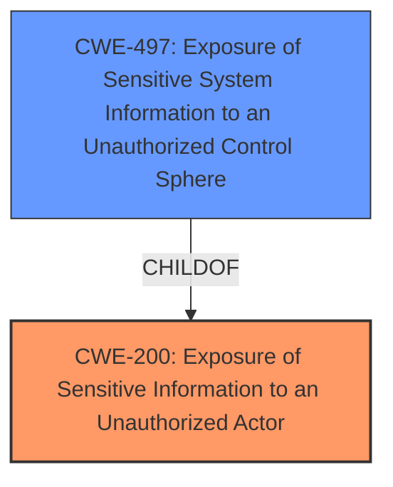

# Analysis for CVE-2024-42179

# Summary
| CWE ID    | CWE Name                                                               | Confidence | CWE Abstraction Level | CWE Vulnerability Mapping Label | CWE-Vulnerability Mapping Notes |
| --------- | ---------------------------------------------------------------------- | ---------- | --------------------- | ------------------------------- | ------------------------------- |
| CWE-200   | Exposure of Sensitive Information to an Unauthorized Actor             | 0.9        | Class                 | Primary                         | Discouraged                   |
| CWE-497   | Exposure of Sensitive System Information to an Unauthorized Control Sphere | 0.7        | Base                 | Secondary                        | Allowed                         |

## Evidence and Confidence

*   **Confidence Score:** 0.8
*   **Evidence Strength:** MEDIUM

## Relationship Analysis
The primary CWE is CWE-200, which is a Class-level CWE. CWE-497 is a base level CWE and a more specific child of CWE-200 which makes it a good secondary candidate. The relationship between CWE-200 and CWE-497 is a parent-child relationship.

## Vulnerability Chain
The **information disclosure vulnerability** leads to the exposure of the Microsoft-HTTP API version in the HTTP response header. This allows unauthorized actors to gain knowledge about the system, which can potentially be used for further attacks. The chain is: **Information Disclosure** -> Exposure of System Information.

## Summary of Analysis
The vulnerability description states that "HCL MyXalytics is affected by sensitive **information disclosure vulnerability**. The HTTP response header exposes the Microsoft-HTTP API2.0 as the servers name & version." The primary **weakness** is the **information disclosure**.

CWE-200 (Exposure of Sensitive Information to an Unauthorized Actor) is a Class-level CWE that describes the **exposure of sensitive information** to an actor that is not explicitly authorized to have access to that information. This CWE aligns with the general description of the vulnerability, where the Microsoft-HTTP API version is exposed in the HTTP response header. Although CWE-200 is discouraged, it's the highest-scored and most applicable Class-level CWE.

CWE-497 (Exposure of Sensitive System Information to an Unauthorized Control Sphere) is a Base-level CWE that describes the product not properly preventing sensitive system-level information from being accessed by unauthorized actors who do not have the same level of access to the underlying system as the product does. This is a more specific case of information exposure, as it focuses on system-level information.

The relationship between CWE-200 and CWE-497 is that CWE-497 is a child of CWE-200. This means that CWE-497 is a more specific type of CWE-200. The evidence supports using CWE-497 as a secondary CWE because the exposed information (Microsoft-HTTP API version) can be classified as sensitive system information.

I considered other CWEs, such as CWE-201, CWE-212, and CWE-319, but they are not as applicable as CWE-200 and CWE-497. CWE-201 (Insertion of Sensitive Information Into Sent Data) is about sending sensitive data, but the vulnerability is about exposing existing information. CWE-212 (Improper Removal of Sensitive Information Before Storage or Transfer) is about not removing sensitive information before making it available, which is not the case here. CWE-319 (Cleartext Transmission of Sensitive Information) is about transmitting sensitive data in cleartext, which is also not the case here.