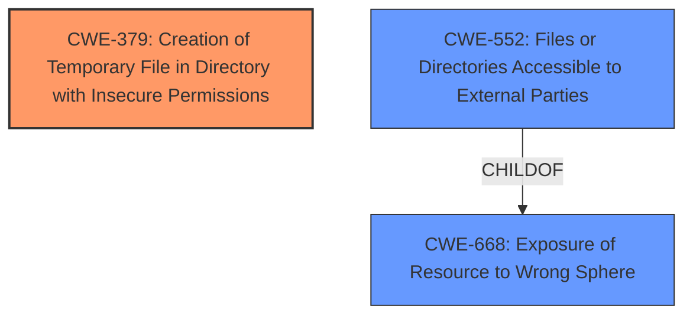

# Raw Analyzer Response for CVE-2024-42213

# Summary
| CWE ID | CWE Name | Confidence | CWE Abstraction Level | CWE Vulnerability Mapping Label | CWE-Vulnerability Mapping Notes |
|---|---|---|---|---|---|
| CWE-379 | Creation of Temporary File in Directory with Insecure Permissions | 0.8 | Base | Allowed | Primary CWE. The vulnerability involves temporary files being left in a production environment with insecure permissions. |
| CWE-552 | Files or Directories Accessible to External Parties | 0.7 | Base | Allowed | Secondary candidate. The temporary files were accessible to external parties due to indexing, predictable URLs, or misconfigured permissions. |
| CWE-668 | Exposure of Resource to Wrong Sphere | 0.6 | Class | Discouraged | Secondary candidate. The files were exposed to the wrong control sphere. |

## Evidence and Confidence

*   **Confidence Score:** 0.7
*   **Evidence Strength:** MEDIUM

## Relationship Analysis
The primary CWE is CWE-379, which focuses on the creation of temporary files in directories with insecure permissions. CWE-552, a peer CWE, addresses files accessible to external parties. CWE-668, a parent of CWE-552, describes the exposure of resources to the wrong sphere. The selection of CWE-379 is based on its specific focus on the creation of temporary files with insecure permissions as the root cause, while CWE-552 and CWE-668 describe the resulting impact.

## Vulnerability Chain
The vulnerability chain starts with the **creation of temporary files** (CWE-379) with **insecure permissions**. This leads to the **files being accessible to external parties** (CWE-552), resulting in **information disclosure**.

## Summary of Analysis
The analysis is based on the provided vulnerability description, which indicates that temporary files were left in the production environment with insecure permissions, leading to potential information disclosure.

The primary CWE, CWE-379, is selected because it directly addresses the root cause of the vulnerability: the **creation of temporary files in a directory with insecure permissions**. The vulnerability description states: "HCL BigFix Compliance is affected by inclusion of temporary files left in the production environment."

CWE-552 is considered as a secondary CWE because it describes the consequence of the insecure permissions: "An attacker might gain access to these files...leading to information disclosure."

CWE-668 is also considered as a secondary CWE because it describes the broader issue of exposing resources to the wrong control sphere, but it is less specific than CWE-379 and CWE-552.

The selected CWEs are at the optimal level of specificity because they accurately represent the root cause and the resulting impact of the vulnerability. CWE-379 pinpoints the specific issue of insecure temporary files, while CWE-552 and CWE-668 describe the broader consequences of this issue.

Relevant CWE Information:
*   CWE-379: Creation of Temporary File in Directory with Insecure Permissions
*   CWE-552: Files or Directories Accessible to External Parties
*   CWE-668: Exposure of Resource to Wrong Sphere