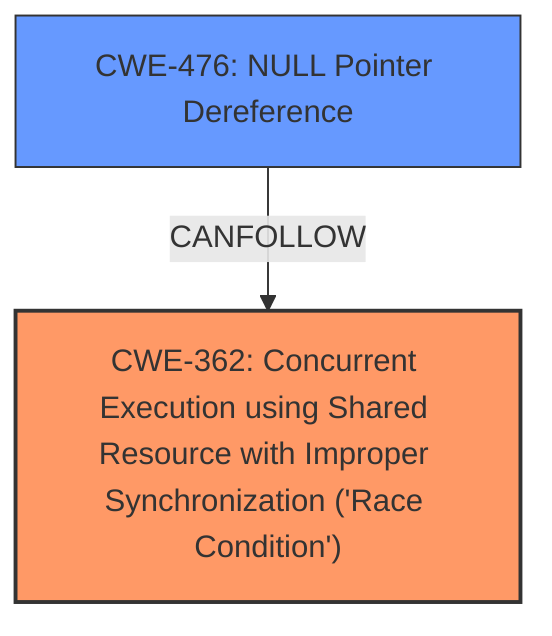

# Analysis Report for CVE-2024-42287

# Vulnerability Analysis Report: CVE-2024-42287

## Description

In the Linux kernel, the following vulnerability has been resolved scsi qla2xxx Complete command early within lock A crash was observed while performing NPIV and FW reset, BUG kernel NULL pointer dereference, address 000000000000001c #PF supervisor read access in kernel mode #PF error_code(0x0000) - not-present page PGD 0 P4D 0 Oops 0000 1 PREEMPT_RT SMP NOPTI RIP 0010dma_direct_unmap_sg+0x51/0x1e0 RSP 0018ffffc90026f47b88 EFLAGS 00010246 RAX 0000000000000000 RBX 0000000000000021 RCX 0000000000000002 RDX 0000000000000021 RSI 0000000000000000 RDI ffff8881041130d0 RBP ffff8881041130d0 R08 0000000000000000 R09 0000000000000034 R10 ffffc90026f47c48 R11 0000000000000031 R12 0000000000000000 R13 0000000000000000 R14 ffff8881565e4a20 R15 0000000000000000 FS 00007f4c69ed3d00(0000) GSffff889faac80000(0000) knlGS0000000000000000 CS 0010 DS 0000 ES 0000 CR0 0000000080050033 CR2 000000000000001c CR3 0000000288a50002 CR4 00000000007706e0 DR0 0000000000000000 DR1 0000000000000000 DR2 0000000000000000 DR3 0000000000000000 DR6 00000000fffe0ff0 DR7 0000000000000400 PKRU 55555554 Call Trace ? __die_body+0x1a/0x60 ? page_fault_oops+0x16f/0x4a0 ? do_user_addr_fault+0x174/0x7f0 ? exc_page_fault+0x69/0x1a0 ? asm_exc_page_fault+0x22/0x30 ? dma_direct_unmap_sg+0x51/0x1e0 ? preempt_count_sub+0x96/0xe0 qla2xxx_qpair_sp_free_dma+0x29f/0x3b0 [qla2xxx] qla2xxx_qpair_sp_compl+0x60/0x80 [qla2xxx] __qla2x00_abort_all_cmds+

## Vulnerability Description Key Phrases

- **Impact:** ['Oops', 'crash', 'read access']
- **Vector:** performing NPIV and FW reset
- **Product:** Linux kernel
- **Component:** scsi qla2xxx

## Analysis (with Relationship Data)

# Summary
| CWE ID  | CWE Name                                                                                                    | Confidence | CWE Abstraction Level | CWE Vulnerability Mapping Label | CWE-Vulnerability Mapping Notes |
| :-------- | :---------------------------------------------------------------------------------------------------------- | :---------- | :---------------------- | :------------------------------ | :------------------------------ |
| CWE-362   | Concurrent Execution using Shared Resource with Improper Synchronization ('Race Condition')                  | 0.95        | Class                   | Primary                         | Allowed-with-Review           |
| CWE-476   | NULL Pointer Dereference                                                                                    | 0.85        | Base                    | Secondary                       | Allowed                       |

## Evidence and Confidence

*   **Confidence Score:** 0.90
*   **Evidence Strength:** HIGH

## Relationship Analysis
The primary weakness is a race condition (CWE-362), which can lead to a null pointer dereference (CWE-476). CWE-362 is a Class-level weakness, while CWE-476 is a Base-level weakness and a potential consequence of the race condition. Selecting the Class for the primary weakness aligns with guidance to use the most specific level for the root cause.



## Vulnerability Chain
The vulnerability chain starts with a **race condition** (CWE-362) due to **incorrect lock handling**. This leads to the potential for memory corruption, and in this specific instance, a **NULL pointer dereference** (CWE-476) causing a kernel crash.

## Summary of Analysis
The analysis indicates a clear race condition within the `qla2xxx` SCSI driver as the root cause of the vulnerability. The driver attempts to complete commands early outside of a spinlock during the unload path, leading to potential concurrent access to shared resources. The observed kernel crash, characterized by a NULL pointer dereference, is a direct consequence of this race condition.

The evidence supporting this assessment includes the vulnerability description key phrases, which highlight the **impact** as a crash and the **vector** as involving NPIV and FW reset. The CVE Reference Links Content Summary further elaborates on the root cause as a **race condition** due to the early completion of commands outside the spinlock. The summary also specifically mentions the **NULL pointer dereference** as the cause of the kernel crash.

The Retriever Results also indicate CWE-362 and CWE-476 as potential candidates. While CWE-476 has a higher initial score, the detailed analysis of the vulnerability description and CVE summary points to CWE-362 as the underlying root cause.

The selection of CWE-362 as the primary CWE is further supported by the MITRE mapping guidance, which suggests using the most specific level of abstraction for the root cause. The analysis also considered other CWEs, such as CWE-667 (Improper Locking), but determined that CWE-362 more accurately captures the concurrent execution aspect of the vulnerability. The high confidence is due to the direct link between the described **race condition** and the resulting **NULL pointer dereference**, as well as the confirmation from multiple evidence sources.

Relevant CWE Information:

# Enhanced Context (25 CWEs)
The following CWEs were identified as potentially relevant to this vulnerability:

## CWE-362: Concurrent Execution using Shared Resource with Improper Synchronization ('Race Condition')
**Abstraction Level**: Class
**Similarity Score**: 0.79
**Source**: dense

**Description**:
The product contains a concurrent code sequence that requires temporary, exclusive access to a shared resource, but a timing window exists in which the shared resource can be modified by another code sequence operating concurrently.

**Mapping Guidance**:
- Usage: Allowed-with-Review
- Rationale: This CWE entry is a Class and might have Base-level children that would be more appropriate

## CWE-667: Improper Locking
**Abstraction Level**: Class
**Similarity Score**: 0.79
**Source**: dense

**Description**:
The product does not properly acquire or release a lock on a resource, leading to unexpected resource state changes and behaviors.

**Mapping Guidance**:
- Usage: Allowed-with-Review
- Rationale: This CWE entry is a Class and might have Base-level children that would be more appropriate

## CWE-1285: Improper Validation of Specified Index, Position, or Offset in Input
**Abstraction Level**: Base
**Similarity Score**: 0.78
**Source**: dense

**Description**:
The product receives input that is expected to specify an index, position, or offset into an indexable resource such as a buffer or file, but it does not validate or incorrectly validates that the specified index/position/offset has the required properties.

**Mapping Guidance**:
- Usage: Allowed
- Rationale: This CWE entry is at the Base level of abstraction, which is a preferred level of abstraction for mapping to the root causes of vulnerabilities.

## CWE-824: Access of Uninitialized Pointer
**Abstraction Level**: Base
**Similarity Score**: 0.77
**Source**: dense

**Description**:
The product accesses or uses a pointer that has not been initialized.

**Mapping Guidance**:
- Usage: Allowed
- Rationale: This CWE entry is at the Base level of abstraction, which is a preferred level of abstraction for mapping to the root causes of vulnerabilities.

## CWE-476: NULL Pointer Dereference
**Abstraction Level**: Base
**Similarity Score**: 0.77
**Source**: dense

**Description**:
The product dereferences a pointer that it expects to be valid but is NULL.

**Mapping Guidance**:
- Usage: Allowed
- Rationale: This CWE entry is at the Base level of abstraction, which is a preferred level of abstraction for mapping to the root causes of vulnerabilities.

## CWE-755: Improper Handling of Exceptional Conditions
**Abstraction Level**: Class
**Similarity Score**: 0.77
**Source**: dense

**Description**:
The product does not handle or incorrectly handles an exceptional condition.

**Mapping Guidance**:
- Usage: Discouraged
- Rationale: This CWE entry is a level-1 Class (i.e., a child of a Pillar). It might have lower-level children that would be more appropriate

## CWE-367: Time-of-check Time-of-use (TOCTOU) Race Condition
**Abstraction Level**: Base
**Similarity Score**: 0.76
**Source**: dense

**Description**:
The product checks the state of a resource before using that resource, but the resource's state can change between the check and the use in a way that invalidates the results of the check. This can cause the product to perform invalid actions when the resource is in an unexpected state.

**Mapping Guidance**:
- Usage: Allowed
- Rationale: This CWE entry is at the Base level of abstraction, which is a preferred level of abstraction for mapping to the root causes of vulnerabilities.

## CWE-909: Missing Initialization of Resource
**Abstraction Level**: Class
**Similarity Score**: 0.76
**Source**: dense

**Description**:
The product does not initialize a critical resource.

**Mapping Guidance**:
- Usage: Allowed-with-Review
- Rationale: This CWE entry is a Class and might have Base-level children that would be more appropriate

## CWE-822: Untrusted Pointer Dereference
**Abstraction Level**: Base
**Similarity Score**: 0.76
**Source**: dense

**Description**:
The product obtains a value from an untrusted source, converts this value to a pointer, and dereferences the resulting pointer.

**Mapping Guidance**:
- Usage: Allowed
- Rationale: This CWE entry is at the Base level of abstraction, which is a preferred level of abstraction for mapping to the root causes of vulnerabilities.

## CWE-119: Improper Restriction of Operations within the Bounds of a Memory Buffer
**Abstraction Level**: Class
**Similarity Score**: 0.76
**Source**: dense

**Description**:
The product performs operations on a memory buffer, but it reads from or writes to a memory location outside the buffer's intended boundary. This may result in read or write operations on unexpected memory locations that could be linked to other variables, data structures, or internal program data.

**Mapping Guidance**:
- Usage: Discouraged
- Rationale: CWE-119 is commonly misused in low-information vulnerability reports when lower-level CWEs could be used instead, or when more details about the vulnerability are available.

## CWE-362: Concurrent Execution using Shared Resource with Improper Synchronization ('Race Condition')
**Abstraction Level**: Class
**Similarity Score**: 1198.49
**Source**: sparse

**Description**:
The product contains a concurrent code sequence that requires temporary, exclusive access to a shared resource, but a timing window exists in which the shared resource can be modified by another code sequence operating concurrently.

**Mapping Guidance**:


## CWE Relationship Analysis

Current CWEs represent these abstraction levels: .


### Vulnerability Chain Analysis

**Chain starting from CWE-476:**
- 476 (NULL Pointer Dereference) - ROOT


**Chain starting from CWE-667:**
- 667 (Improper Locking) - ROOT


### CWE Relationship Diagram

```mermaid
graph TD
    classDef primary fill:#f96,stroke:#333,stroke-width:2px
    classDef secondary fill:#69f,stroke:#333
    classDef tertiary fill:#9e9,stroke:#333
```


*Report generated on 2025-07-13 13:53:32*
