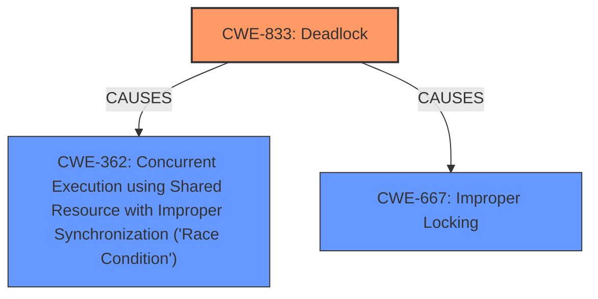

# Raw Analyzer Response for CVE-2024-42294

# Summary
| CWE ID | CWE Name | Confidence | CWE Abstraction Level | CWE Vulnerability Mapping Label | CWE-Vulnerability Mapping Notes |
|---|---|---|---|---|---|
| CWE-833 | Deadlock | 1.0 | Base | Primary | Allowed |
| CWE-362 | Concurrent Execution using Shared Resource with Improper Synchronization ('Race Condition') | 0.8 | Class | Secondary | Allowed-with-Review |
| CWE-667 | Improper Locking | 0.7 | Class | Secondary | Allowed-with-Review |

## Evidence and Confidence

*   **Confidence Score:** 0.9
*   **Evidence Strength:** HIGH

## Relationship Analysis
The primary weakness is CWE-833 Deadlock, which occurs due to the interaction of concurrent operations. The conditions necessary for the deadlock involve a race condition (CWE-362) where timing of the concurrent processes leads to inconsistent lock states, and an improper locking strategy (CWE-667) that allows the circular dependency to form. While CWE-833 is the root cause, CWE-362 and CWE-667 represent contributing factors.

## Vulnerability Chain
The vulnerability chain starts with concurrent execution and improper locking leading to a deadlock and ultimately causing a system hang.

1.  **Concurrent Execution:** `sd_remove` and `sd_release` executing concurrently.
2.  **Improper Locking:** Incorrect mutex acquisition order after queue freezing.
3.  **Deadlock:** Circular dependency between the locks acquired by `sd_remove` and `sd_release`.
4.  **System Hang:** Tasks blocked indefinitely, leading to denial of service.

The **Primary CWE** is CWE-833 because it represents the actual **deadlock** that halts system operations.

## Summary of Analysis
The analysis is primarily based on the provided vulnerability description and the supporting CVE reference content. The key evidence is the description of the **deadlock** between `sd_remove` and `sd_release`, which arises from the **incorrect locking order** and concurrent execution.

The Retriever results and graph relationships support the selection of CWE-833 as the primary cause, with CWE-362 and CWE-667 as contributing factors.

The selected CWEs are at the optimal level of specificity as they directly address the root cause and contributing factors of the vulnerability. CWE-833 is a Base level CWE, offering a clear description of the **deadlock** condition.

Relevant CWE Information:

# Enhanced Context (25 CWEs)
The following CWEs were identified as potentially relevant to this vulnerability:

## CWE-833: Deadlock
**Abstraction Level**: Base
**Similarity Score**: 0.79
**Source**: dense

**Description**:
The product contains multiple threads or executable segments that are waiting for each other to release a necessary lock, resulting in **deadlock**.

**Mapping Guidance**:
- Usage: Allowed
- Rationale: This CWE entry is at the Base level of abstraction, which is a preferred level of abstraction for mapping to the root causes of vulnerabilities.

## CWE-667: Improper Locking
**Abstraction Level**: Class
**Similarity Score**: 0.77
**Source**: dense

**Description**:
The product does not properly acquire or release a lock on a resource, leading to unexpected resource state changes and behaviors.

**Mapping Guidance**:
- Usage: Allowed-with-Review
- Rationale: This CWE entry is a Class and might have Base-level children that would be more appropriate

## CWE-362: Concurrent Execution using Shared Resource with Improper Synchronization ('Race Condition')
**Abstraction Level**: Class
**Similarity Score**: 0.73
**Source**: dense

**Description**:
The product contains a concurrent code sequence that requires temporary, exclusive access to a shared resource, but a timing window exists in which the shared resource can be modified by another code sequence operating concurrently.

**Mapping Guidance**:
- Usage: Allowed-with-Review
- Rationale: This CWE entry is a Class and might have Base-level children that would be more appropriate

### CWE Selection Details:

*   **CWE-833 Deadlock:** The vulnerability description explicitly mentions a **deadlock** between `sd_remove` and `sd_release`. The call trace provided in the vulnerability description clearly shows tasks blocked while waiting for mutexes, which aligns with the definition of a **deadlock**. The "Vulnerability Description Key Phrases" section also explicitly mentions a **deadlock** as a root cause. Confidence: 1.0

*   **CWE-362 Concurrent Execution using Shared Resource with Improper Synchronization ('Race Condition'):** The vulnerability occurs due to the concurrent execution of `sd_remove` and `sd_release`. The timing of these operations leads to the **deadlock** because of **improper synchronization**. The "CVE Reference Links Content Summary" identifies a **race condition** as a contributing factor. Confidence: 0.8

*   **CWE-667 Improper Locking:** The root cause involves **incorrect mutex acquisition order**, which falls under **improper locking**. The "Vulnerability Description Key Phrases" section mentions **incorrect locking order** as a weakness. Confidence: 0.7

### CWEs Considered But Not Used:

*   **CWE-404 Improper Resource Shutdown or Release:** While the vulnerability involves the removal of a device, the core issue is the **deadlock**, not the improper release of resources in general.

*   **CWE-770 Allocation of Resources Without Limits or Throttling:** This CWE is not relevant as the vulnerability does not involve resource allocation issues.

*   **CWE-119 Improper Restriction of Operations within the Bounds of a Memory Buffer:** There is no indication of memory buffer issues.

*   **CWE-367 Time-of-check Time-of-use (TOCTOU) Race Condition:** While there is a race condition involved, it's not specifically a TOCTOU issue.

*   **CWE-789 Memory Allocation with Excessive Size Value:** This is not relevant because the vulnerability is not related to memory allocation sizes.

*   **CWE-908 Use of Uninitialized Resource:** There is no indication of using uninitialized resources in this vulnerability.