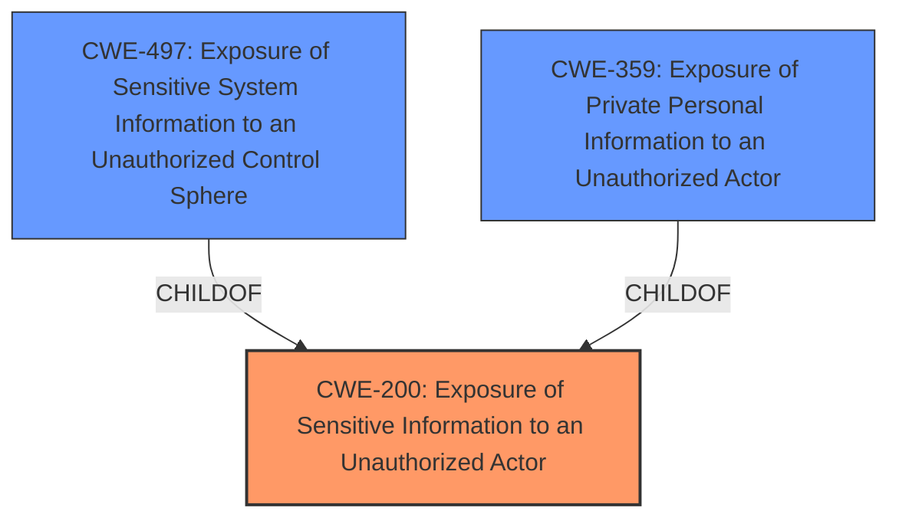

# Analysis for CVE-2024-42339

# Summary
| CWE ID | CWE Name | Confidence | CWE Abstraction Level | CWE Vulnerability Mapping Label | CWE-Vulnerability Mapping Notes |
|---|---|---|---|---|---|
| CWE-200 | Exposure of Sensitive Information to an Unauthorized Actor | 1.0 | Class | Primary | Allowed |
| CWE-497 | Exposure of Sensitive System Information to an Unauthorized Control Sphere | 0.7 | Base | Secondary | Allowed |
| CWE-359 | Exposure of Private Personal Information to an Unauthorized Actor | 0.6 | Base | Secondary | Allowed |

## Evidence and Confidence

*   **Confidence Score:** 0.8
*   **Evidence Strength:** HIGH

## Relationship Analysis
The primary CWE, CWE-200 **Exposure of Sensitive Information to an Unauthorized Actor**, is a class-level CWE. The analysis also considered CWE-497 **Exposure of Sensitive System Information to an Unauthorized Control Sphere** and CWE-359 **Exposure of Private Personal Information to an Unauthorized Actor**, both of which are more specific base-level CWEs and children of CWE-200. While the description does not provide enough information to definitively choose one of these child CWEs, they are relevant secondary considerations. The hierarchical relationship indicates a progression from a general exposure to more specific types of sensitive information exposure.

## Vulnerability Chain
The vulnerability chain starts with the **improper restriction of access to sensitive information**, leading to the **exposure of sensitive information to unauthorized users**. The root cause is the **lack of proper access control**, and the impact is **unauthorized disclosure of sensitive information**.

## Summary of Analysis
The analysis is based on the provided vulnerability description, which explicitly states the **weakness** as **CWE-200 Exposure of Sensitive Information to an Unauthorized Actor**. The description also includes the root cause: 'The software does not properly restrict access to sensitive information', and 'potentially allowing unauthorized users to view it.'. Given this information and the high scores for CWE-200, CWE-497, and CWE-359, the primary mapping is to CWE-200, with secondary consideration given to CWE-497 and CWE-359 as more specific manifestations of the same underlying problem.

The evidence supporting CWE-200 is primarily from the "**WEAKNESS**: 'CWE-200 **Exposure of Sensitive Information to an Unauthorized Actor**'" section, as well as the "**ROOTCAUSE**: 'The software does not properly restrict access to sensitive information' and 'potentially allowing unauthorized users to view it.'" sections. All these sections have CWE-200 listed as the top result.

CWE-200 is chosen as the primary CWE because it aligns directly with the stated weakness. While more specific CWEs like CWE-497 and CWE-359 are considered, the information provided is not detailed enough to determine whether the exposed information is specifically system-level or private personal information. Therefore, the broader CWE-200 is more appropriate.