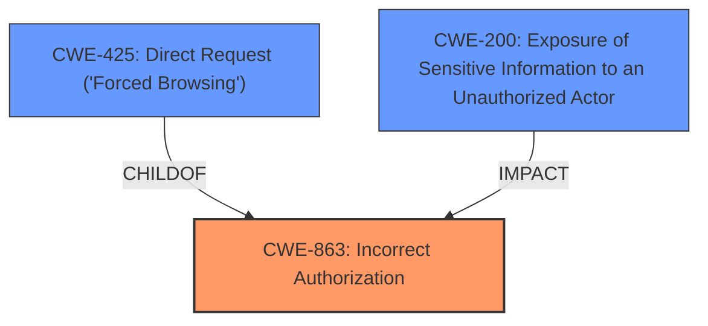

# Analysis Report for CVE-2024-42354

# Vulnerability Analysis Report: CVE-2024-42354

## Description

Shopware is an open commerce platform. The store-API works with regular entities and not expose all fields for the public API fields need to be marked as ApiAware in the EntityDefinition. So only ApiAware fields of the EntityDefinition will be encoded to the final JSON. Prior to versions 6.6.5.1 and 6.5.8.13, the processing of the Criteria did not considered ManyToMany associations and so they were not considered properly and the protections didnt get used. This issue cannot be reproduced with the default entities by Shopware, but can be triggered with extensions. Update to Shopware 6.6.5.1 or 6.5.8.13 to receive a patch. For older versions of 6.2, 6.3, and 6.4, corresponding security measures are also available via a plugin.

## Vulnerability Description Key Phrases

- **Rootcause:** improper processing of ManyToMany associations
- **Product:** Shopware
- **Version:** prior to versions 6.6.5.1 and 6.5.8.13

## Analysis (with Relationship Data)

# Summary
| CWE ID | CWE Name | Confidence | CWE Abstraction Level | CWE Vulnerability Mapping Label | CWE-Vulnerability Mapping Notes |
|---|---|---|---|---|---|
| CWE-863 | Incorrect Authorization | 0.9 | Class | Primary CWE | Allowed-with-Review |
| CWE-200 | Exposure of Sensitive Information to an Unauthorized Actor | 0.7 | Class | Secondary Candidate | Discouraged |
| CWE-425 | Direct Request ('Forced Browsing') | 0.6 | Base | Secondary Candidate | Allowed |

## Evidence and Confidence

*   **Confidence Score:** 0.8
*   **Evidence Strength:** MEDIUM

## Relationship Analysis
The primary CWE selected is CWE-863, "Incorrect Authorization," which is a class-level CWE. While more specific base-level CWEs exist under it, the provided information doesn't pinpoint the exact mechanism of authorization failure, making the class-level CWE the most appropriate. CWE-200, "Exposure of Sensitive Information to an Unauthorized Actor," is considered a secondary candidate as it represents the impact of the authorization failure. CWE-425, "Direct Request ('Forced Browsing')," is another potential candidate as it relates to bypassing authorization checks on restricted resources.



## Vulnerability Chain
The vulnerability chain starts with the **improper processing of ManyToMany associations**, leading to **incorrect authorization**, and ultimately resulting in the **exposure of sensitive information**.

Initial Flaw: **Improper processing of ManyToMany associations** in store-API criteria.
|
Leads to: Incorrect Authorization (CWE-863) due to bypassed `ApiAware` field protections.
|
Results in: Exposure of Sensitive Information (CWE-200) through the store-API.

## Summary of Analysis
The analysis indicates that the root cause is related to **improper processing of ManyToMany associations** in the Shopware store-API, as stated in the "Vulnerability Description Key Phrases". The "CVE Reference Links Content Summary" also highlights that "The store-API was not properly considering ManyToMany associations when processing criteria, leading to potential exposure of non-ApiAware fields." This **rootcause** leads to an authorization bypass because the intended protections for `ApiAware` fields are not applied correctly. This bypass, in turn, leads to the exposure of sensitive information.

CWE-863, "Incorrect Authorization," is chosen as the primary CWE because it directly reflects the core issue of the vulnerability. The system is intended to authorize access based on the `ApiAware` designation, but this authorization process fails due to the **improper processing of ManyToMany associations**. The retriever results also list CWE-863 as the top candidate.

CWE-200, "Exposure of Sensitive Information to an Unauthorized Actor," is a secondary consideration because it represents the impact of the vulnerability rather than the **rootcause**. While the vulnerability ultimately leads to information exposure, the underlying problem is the authorization failure. The mapping guidance for CWE-200 discourages its use as a primary CWE when a more specific cause is identifiable.

CWE-425, "Direct Request ('Forced Browsing')," is considered because the vulnerability can be seen as a failure to adequately enforce authorization on restricted resources (the `ApiAware` fields). However, the **rootcause** is more precisely described by the **improper processing** that leads to the authorization failure captured by CWE-863.

The selected CWEs are at an appropriate level of specificity. CWE-863 is a class-level CWE, but it's the most accurate representation of the authorization problem given the available information. More specific base-level CWEs under CWE-863 might exist, but the vulnerability description lacks the detail needed to pinpoint the exact authorization mechanism that is failing.

Relevant CWE Information:

# Enhanced Context (25 CWEs)
The following CWEs were identified as potentially relevant to this vulnerability:

## CWE-209: Generation of Error Message Containing Sensitive Information
**Abstraction Level**: Base
**Similarity Score**: 0.73
**Source**: dense

**Description**:
The product generates an error message that includes sensitive information about its environment, users, or associated data.

**Mapping Guidance**:
- Usage: Allowed
- Rationale: This CWE entry is at the Base level of abstraction, which is a preferred level of abstraction for mapping to the root causes of vulnerabilities.

*Not Used:* This CWE doesn't fit the vulnerability description, as the issue is not about error messages.

## CWE-425: Direct Request ('Forced Browsing')
**Abstraction Level**: Base
**Similarity Score**: 0.72
**Source**: dense

**Description**:
The web application does not adequately enforce appropriate authorization on all restricted URLs, scripts, or files.

**Mapping Guidance**:
- Usage: Allowed
- Rationale: This CWE entry is at the Base level of abstraction, which is a preferred level of abstraction for mapping to the root causes of vulnerabilities.

*Secondary Candidate:* As mentioned above, this is a candidate since the store-API doesn't adequately enforce authorization of `ApiAware` fields.

## CWE-639: Authorization Bypass Through User-Controlled Key
**Abstraction Level**: Base
**Similarity Score**: 0.72
**Source**: dense

**Description**:
The system's authorization functionality does not prevent one user from gaining access to another user's data or record by modifying the key value identifying the data.

**Mapping Guidance**:
- Usage: Allowed
- Rationale: This CWE entry is at the Base level of abstraction, which is a preferred level of abstraction for mapping to the root causes of vulnerabilities.

*Not Used:* This CWE doesn't fit the vulnerability description, as the issue is not about user-controlled keys.

## CWE-497: Exposure of Sensitive System Information to an Unauthorized Control Sphere
**Abstraction Level**: Base
**Similarity Score**: 0.72
**Source**: dense

**Description**:
The product does not properly prevent sensitive system-level information from being accessed by unauthorized actors who do not have the same level of access to the underlying system as the product does.

**Mapping Guidance**:
- Usage: Allowed
- Rationale: This CWE entry is at the Base level of abstraction, which is a preferred level of abstraction for mapping to the root causes of vulnerabilities.

*Not Used:* This CWE is too broad, as it is not about sensitive system information, rather it is about sensitive information due to authorization bypass of store-API entities.

## CWE-116: Improper Encoding or Escaping of Output
**Abstraction Level**: Class
**Similarity Score**: 0.71
**Source**: dense

**Description**:
The product prepares a structured message for communication with another component, but encoding or escaping of the data is either missing or done incorrectly. As a result, the intended structure of the message is not preserved.

**Mapping Guidance**:
- Usage: Allowed-with-Review
- Rationale: This CWE entry is a Class and might have Base-level children that would be more appropriate

*Not Used:* This CWE doesn't fit the vulnerability description, as the issue is not about encoding or escaping of data.

## CWE-303: Incorrect Implementation of Authentication Algorithm
**Abstraction Level**: Base
**Similarity Score**: 0.71
**Source**: dense

**Description**:
The requirements for the product dictate the use of an established authentication algorithm, but the implementation of the algorithm is incorrect.

**Mapping Guidance**:
- Usage: Allowed
- Rationale: This CWE entry is at the Base level of abstraction, which is a preferred level of abstraction for mapping to the root causes of vulnerabilities.

*Not Used:* This CWE doesn't fit the vulnerability description, as the issue is not about authentication.

## CWE-212: Improper Removal of Sensitive Information Before Storage or Transfer
**Abstraction Level**: Base
**Similarity Score**: 0.71
**Source**: dense

**Description**:
The product stores, transfers, or shares a resource that contains sensitive information, but it does not properly remove that information before the product makes the resource available to unauthorized actors.

**Mapping Guidance**:
- Usage: Allowed
- Rationale: This CWE entry is at the Base level of abstraction, which is a preferred level of abstraction for mapping to the root causes of vulnerabilities.

*Not Used:* This CWE doesn't fit the vulnerability description, as the issue is not about removing sensitive information.

## CWE-204: Observable Response Discrepancy
**Abstraction Level**: Base
**Similarity Score**: 0.71
**Source**: dense

**Description**:
The product provides different


## CWE Relationship Analysis

Current CWEs represent these abstraction levels: .


### Vulnerability Chain Analysis

**Chain starting from CWE-863:**
- 863 (Incorrect Authorization) - ROOT


**Chain starting from CWE-116:**
- 116 (Improper Encoding or Escaping of Output) - ROOT


### CWE Relationship Diagram

```mermaid
graph TD
    classDef primary fill:#f96,stroke:#333,stroke-width:2px
    classDef secondary fill:#69f,stroke:#333
    classDef tertiary fill:#9e9,stroke:#333
```


*Report generated on 2025-07-13 13:57:41*
