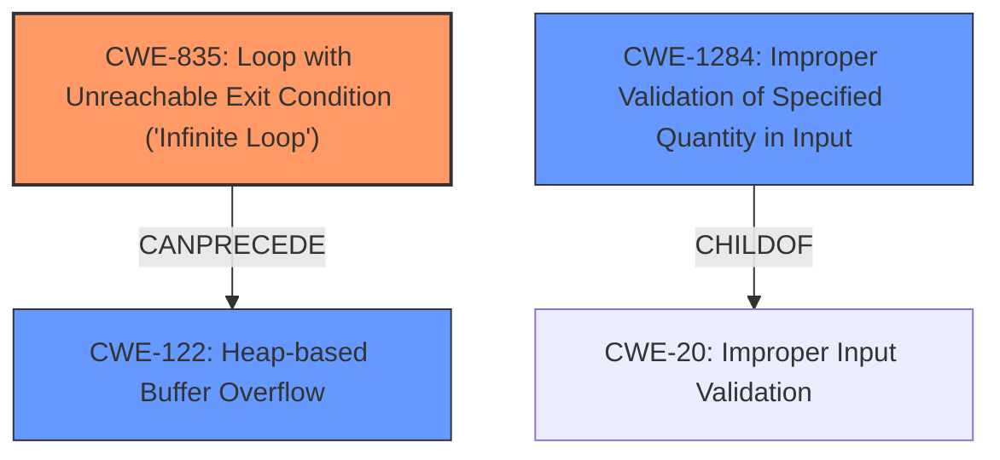

# Analysis Report for CVE-2024-42358

# Vulnerability Analysis Report: CVE-2024-42358

## Description

PDFio is a simple C library for reading and writing PDF files. There is a denial of service (DOS) vulnerability in the TTF parser. Maliciously crafted TTF files can cause the program to utilize 100% of the Memory and enter an infinite loop. This can also lead to a heap-buffer-overflow vulnerability. An infinite loop occurs in the read_camp function by nGroups value. The ttf.h library is vulnerable. A value called nGroups is extracted from the file, and by changing that value, you can cause the program to utilize 100% of the Memory and enter an infinite loop. If the value of nGroups in the file is small, an infinite loop will not occur. This library, whether used as a standalone binary or as part of another application, is vulnerable to DOS attacks when parsing certain types of files. Automated systems, including web servers that use this code to convert PDF submissions into plaintext, can be DOSed if an attacker uploads a malicious TTF file. This issue has been addressed in release version 1.3.1. All users are advised to upgrade. There are no known workarounds for this vulnerability.

## Vulnerability Description Key Phrases

- **Rootcause:** infinite loop in read_camp function
- **Impact:** denial of service
- **Vector:** maliciously crafted TTF files
- **Product:** PDFio
- **Version:** before 1.3.1
- **Component:** TTF parser

## Analysis (with Relationship Data)

# Summary
| CWE ID | CWE Name | Confidence | CWE Abstraction Level | CWE Vulnerability Mapping Label | CWE-Vulnerability Mapping Notes |
|---|---|---|---|---|---|
| CWE-835 | Loop with Unreachable Exit Condition ('Infinite Loop') | 0.9 | Base | Allowed | Primary CWE. The **infinite loop** is the root cause. |
| CWE-1284 | Improper Validation of Specified Quantity in Input | 0.8 | Base | Allowed | Secondary CWE. The **lack of input validation** on nGroups allows the **infinite loop** to occur. |
| CWE-122 | Heap-based Buffer Overflow | 0.7 | Variant | Allowed | Secondary CWE. A heap overflow condition is a buffer overflow. |

## Evidence and Confidence

*   **Confidence Score:** 0.8
*   **Evidence Strength:** HIGH

## Relationship Analysis
The primary CWE is CWE-835, representing the infinite loop. CWE-1284 is included because the loop occurs due to **improper validation** of the `nGroups` value from the TTF file. CWE-122 is the heap-based buffer overflow.



## Vulnerability Chain
The vulnerability chain starts with **improper validation** of the nGroups value (CWE-1284). This leads to an **infinite loop** (CWE-835) and a **heap-based buffer overflow** (CWE-122).

## Summary of Analysis
The analysis identified CWE-835 as the primary weakness because the core issue is an **infinite loop**. The vulnerability description and CVE details explicitly mention the **infinite loop** in the `read_cmap` function. The `nGroups` value from the TTF file is not properly validated, allowing the **infinite loop** to occur, hence the inclusion of CWE-1284. The heap-buffer-overflow (CWE-122) is a consequence of a large cmap table size, which is also related to the **lack of input validation**. The selected CWEs are at the appropriate level of specificity, with CWE-835 and CWE-1284 being Base level and CWE-122 being a Variant.

CWEs considered but not used:

*   CWE-674: Uncontrolled Recursion - While recursion can cause resource exhaustion, the description specifically mentions a loop, making CWE-835 more appropriate.
*   CWE-190: Integer Overflow or Wraparound - Integer overflow might contribute to the excessive iteration, but the **lack of input validation** leading to the **infinite loop** is the main issue.
*   CWE-789: Memory Allocation with Excessive Size Value - While a large `nGroups` value can cause excessive memory allocation, the core issue is the **infinite loop**, making CWE-835 more appropriate.
*   CWE-131: Incorrect Calculation of Buffer Size - This is related to the heap overflow condition, but CWE-122 is a more direct description of the vulnerability.


## CWE Relationship Analysis

Current CWEs represent these abstraction levels: .


### Vulnerability Chain Analysis

**Chain starting from CWE-1284:**
- 1284 (Improper Validation of Specified Quantity in Input) - ROOT


**Chain starting from CWE-131:**
- 131 (Incorrect Calculation of Buffer Size) - ROOT


### CWE Relationship Diagram

```mermaid
graph TD
    classDef primary fill:#f96,stroke:#333,stroke-width:2px
    classDef secondary fill:#69f,stroke:#333
    classDef tertiary fill:#9e9,stroke:#333
```


*Report generated on 2025-07-13 13:57:55*
