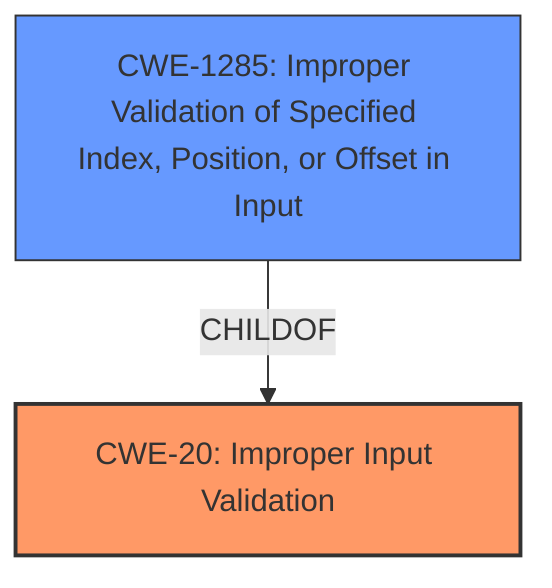

# Analysis Report for CVE-2024-42410

# Vulnerability Analysis Report: CVE-2024-42410

## Description

**Improper input validation** in some Intel(R) Graphics Drivers may allow an authenticated user to potentially enable denial of service via local access.

## Vulnerability Description Key Phrases

- **Rootcause:** Improper input validation
- **Impact:** denial of service
- **Attacker:** authenticated user
- **Product:** Intel(R) Graphics Drivers

## Analysis (with Relationship Data)

# Summary
| CWE ID | CWE Name | Confidence | CWE Abstraction Level | CWE Vulnerability Mapping Label | CWE-Vulnerability Mapping Notes |
|---|---|---|---|---|---|
| CWE-20 | Improper Input Validation | 0.8 | Class | Primary | Discouraged |
| CWE-1285 | Improper Validation of Specified Index, Position, or Offset in Input | 0.6 | Base | Secondary Candidate | Allowed |

## Evidence and Confidence

*   **Confidence Score:** 0.7
*   **Evidence Strength:** MEDIUM

## Relationship Analysis
The primary relationship that influenced my decision was the parent-child relationship between CWE-20 and more specific input validation CWEs. While CWE-20 is a high-level class, the available evidence doesn't strongly support a more specific base CWE. However, CWE-1285 is a possible child of CWE-20 that may be a better fit with further information.



## Vulnerability Chain
The vulnerability chain begins with **improper input validation** (CWE-20), leading to a denial-of-service (DoS) impact. The chain is relatively simple:

Improper Input Validation (CWE-20) -> Denial of Service

## Summary of Analysis
The initial assessment identified **improper input validation** as the root cause, leading to a denial-of-service vulnerability in Intel Graphics Drivers. The selection of CWE-20 is based on the vulnerability description and the CVE reference summary, which explicitly mention **improper input validation** as the weakness.

The retriever results suggest several other CWEs related to input validation and control flow management. While CWE-1285 (Improper Validation of Specified Index, Position, or Offset in Input) is considered, the current evidence is not detailed enough to confirm that the **improper input validation** specifically relates to index, position, or offset validation.

CWE-20 is a Class-level CWE, and the mapping guidance discourages its use when more specific CWEs are available. However, without more detailed information about the specific type of **improper input validation**, it's challenging to select a more specific Base-level CWE. Given the available evidence, CWE-20 is the most appropriate choice, but with the understanding that it may be refined with additional details.

The assessment is primarily based on the provided evidence, specifically the vulnerability description key phrases and the CVE reference links content summary. The graph relationships highlight the potential for more specific CWEs related to input validation.

Relevant CWE Information:

# Enhanced Context (25 CWEs)
The following CWEs were identified as potentially relevant to this vulnerability:

## CWE-1285: Improper Validation of Specified Index, Position, or Offset in Input
**Abstraction Level**: Base
**Similarity Score**: 0.76
**Source**: dense

**Description**:
The product receives input that is expected to specify an index, position, or offset into an indexable resource such as a buffer or file, but it does not validate or incorrectly validates that the specified index/position/offset has the required properties.

**Mapping Guidance**:
- Usage: Allowed
- Rationale: This CWE entry is at the Base level of abstraction, which is a preferred level of abstraction for mapping to the root causes of vulnerabilities.

## CWE-20: Improper Input Validation
**Abstraction Level**: Class
**Similarity Score**: 0.75
**Source**: dense

**Description**:
The product receives input or data, but it does
        not validate or incorrectly validates that the input has the
        properties that are required to process the data safely and
        correctly.

**Mapping Guidance**:
- Usage: Discouraged
- Rationale: CWE-20 is commonly misused in low-information vulnerability reports when lower-level CWEs could be used instead, or when more details about the vulnerability are available [REF-1287]. It is not useful for trend analysis. It is also a level-1 Class (i.e., a child of a Pillar).

## CWE-755: Improper Handling of Exceptional Conditions
**Abstraction Level**: Class

## CWE-119: Improper Restriction of Operations within the Bounds of a Memory Buffer
**Abstraction Level**: Class

## CWE-824: Access of Uninitialized Pointer
**Abstraction Level**: Base

## CWE-252: Unchecked Return Value
**Abstraction Level**: Base

## CWE-1286: Improper Validation of Syntactic Correctness of Input
**Abstraction Level**: Base

## CWE-843: Access of Resource Using Incompatible Type ('Type Confusion')
**Abstraction Level**: Base

## CWE-345: Insufficient Verification of Data Authenticity
**Abstraction Level**: Class

## CWE-807: Reliance on Untrusted Inputs in a Security Decision
**Abstraction Level**: Base

## CWE-347: Improper Verification of Cryptographic Signature
**Abstraction Level**: Base

## CWE-22: Improper Limitation of a Pathname to a Restricted Directory ('Path Traversal')
**Abstraction Level**: Base

## CWE-73: External Control of File Name or Path
**Abstraction Level**: base

## CWE-190: Integer Overflow or Wraparound
**Abstraction Level**: base

## CWE-787: Out-of-bounds Write
**Abstraction Level**: base

## CWE-1288: Improper Validation of Consistency within Input
**Abstraction Level**: base

## CWE-1173: Improper Use of Validation Framework
**Abstraction Level**: base

## CWE-170: Improper Null Termination
**Abstraction Level**: base

## CWE-823: Use of Out-of-range Pointer Offset
**Abstraction Level**: base

## CWE-611: Improper Restriction of XML External Entity Reference
**Abstraction Level**: base

### CWEs Considered but Not Used:

*   **CWE-755, CWE-119, CWE-824, CWE-252, CWE-1286, CWE-843, CWE-345, CWE-807, CWE-347, CWE-22, CWE-73, CWE-190, CWE-787, CWE-1288, CWE-1173, CWE-170, CWE-823, CWE-611:** These CWEs were considered but deemed less relevant as they either represent different types of weaknesses or are too specific given the limited information available in the vulnerability description.

### Justification for Selected CWEs:

*   **CWE-20:** The vulnerability description explicitly states "**Improper input validation**" as the root cause. This aligns directly with the definition of CWE-20. While the mapping guidance discourages its use when more specific CWEs are available, the lack of detailed information prevents a more precise classification.
*   **CWE-1285:** This CWE was considered as a possibility since it is a child of CWE-20, but there wasn't enough detail in the vulnerability description to support it.


## CWE Relationship Analysis

Current CWEs represent these abstraction levels: .


### Vulnerability Chain Analysis

**Chain starting from CWE-611:**
- 611 (Improper Restriction of XML External Entity Reference) - ROOT


**Chain starting from CWE-345:**
- 345 (Insufficient Verification of Data Authenticity) - ROOT


### CWE Relationship Diagram

```mermaid
graph TD
    classDef primary fill:#f96,stroke:#333,stroke-width:2px
    classDef secondary fill:#69f,stroke:#333
    classDef tertiary fill:#9e9,stroke:#333
```


*Report generated on 2025-07-13 14:01:38*
