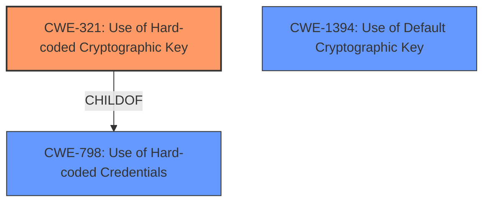

# Enhanced Analysis for CVE-2024-42418

# Summary
| CWE ID | CWE Name | Confidence | CWE Abstraction Level | CWE Vulnerability Mapping Label | CWE-Vulnerability Mapping Notes |
|---|---|---|---|---|---|
| CWE-321 | Use of Hard-coded Cryptographic Key | 1.0 | Variant | Allowed | Primary CWE. The vulnerability is caused by the use of a hard-coded cryptographic key which can be used to decrypt sensitive information. |
| CWE-798 | Use of Hard-coded Credentials | 0.7 | Base | Allowed | Secondary candidate. The root cause is the use of hard-coded credentials, specifically a cryptographic key. |
| CWE-1394 | Use of Default Cryptographic Key | 0.6 | Base | Allowed | Secondary candidate. The vulnerability is due to the use of a default cryptographic key. |

## Evidence and Confidence

*   **Confidence Score:** 0.9
*   **Evidence Strength:** HIGH

## Relationship Analysis
The primary weakness is CWE-321 (Use of Hard-coded Cryptographic Key), which is a variant of CWE-798 (Use of Hard-coded Credentials). CWE-798 is a broader category that encompasses hard-coded passwords and cryptographic keys. CWE-321 is a more specific case of using a hard-coded cryptographic key. CWE-1394 (Use of Default Cryptographic Key) is similar to CWE-321 and could be considered since the hard-coded key is also a default key. The hierarchical relationship influenced the selection of CWE-321 as the primary CWE because it is more specific than CWE-798 and CWE-1394.



## Vulnerability Chain
The vulnerability chain starts with the **use of a hard-coded cryptographic key** (CWE-321). This allows an attacker to decrypt sensitive information, leading to potential unauthorized access or control of the affected devices. The root cause is the **hard-coded key**, and the impact is the decryption of sensitive information.

## Summary of Analysis
The analysis is based on the provided evidence, which clearly states that Avtec Outpost uses a default cryptographic key that can be used to decrypt sensitive information. The CVE reference links content summary confirms that the root cause is the **use of a hard-coded cryptographic key** (CWE-321). The retriever results also list CWE-321 as a potential match. The relationship analysis shows that CWE-321 is a variant of CWE-798, which is a broader category of using hard-coded credentials. CWE-321 is at the optimal level of specificity because it accurately describes the vulnerability as the **use of a hard-coded cryptographic key**.

Relevant CWE Information:

# Enhanced Context (25 CWEs)
The following CWEs were identified as potentially relevant to this vulnerability:

## CWE-1391: Use of Weak Credentials
**Abstraction Level**: Class
**Similarity Score**: 0.71
**Source**: dense

**Description**:
The product uses weak credentials (such as a default key or hard-coded password) that can be calculated, derived, reused, or guessed by an attacker.

**Mapping Guidance**:
- Usage: Allowed-with-Review
- Rationale: This CWE entry is a Class and might have Base-level children that would be more appropriate

## CWE-321: Use of Hard-coded Cryptographic Key
**Abstraction Level**: Variant
**Similarity Score**: 0.71
**Source**: dense

**Description**:
The use of a hard-coded cryptographic key significantly increases the possibility that encrypted data may be recovered.

**Mapping Guidance**:
- Usage: Allowed
- Rationale: This CWE entry is at the Variant level of abstraction, which is a preferred level of abstraction for mapping to the root causes of vulnerabilities.

## CWE-798: Use of Hard-coded Credentials
**Abstraction Level**: Base
**Similarity Score**: 0.69
**Source**: dense

**Description**:
The product contains hard-coded credentials, such as a password or cryptographic key.

**Mapping Guidance**:
- Usage: Allowed
- Rationale: This CWE entry is at the Base level of abstraction, which is a preferred level of abstraction for mapping to the root causes of vulnerabilities.

## CWE-1394: Use of Default Cryptographic Key
**Abstraction Level**: Base
**Similarity Score**: 0.69
**Source**: dense

**Description**:
The product uses a default cryptographic key for potentially critical functionality.

**Mapping Guidance**:
- Usage: Allowed
- Rationale: This CWE entry is at the Base level of abstraction, which is a preferred level of abstraction for mapping to the root causes of vulnerabilities.

### Detailed Analysis of Selected CWEs:

*   **CWE-321: Use of Hard-coded Cryptographic Key**
    *   **Explanation:** The vulnerability description explicitly states that Avtec Outpost uses a default cryptographic key that can be used to decrypt sensitive information. This matches the description of CWE-321, which focuses on the **use of a hard-coded cryptographic key**.
    *   **Security Implications:** The use of a hard-coded key allows attackers to decrypt sensitive information, potentially leading to unauthorized access or control of the affected devices.
    *   **Relationships:** CWE-321 is a variant of CWE-798 (Use of Hard-coded Credentials).
    *   **Mapping Guidance:** The mapping guidance for CWE-321 allows its use at the variant level of abstraction.
*   **CWE-798: Use of Hard-coded Credentials**
    *   **Explanation:** The root cause is the **use of hard-coded credentials**, specifically a cryptographic key. While CWE-321 is more specific, CWE-798 is still relevant as it represents the broader issue of using hard-coded credentials.
    *   **Security Implications:** Similar to CWE-321, the use of hard-coded credentials can lead to unauthorized access or control of the system.
    *   **Relationships:** CWE-798 is a parent of CWE-321.
    *   **Mapping Guidance:** The mapping guidance for CWE-798 allows its use at the base level of abstraction.
*   **CWE-1394: Use of Default Cryptographic Key**
    *   **Explanation:** The vulnerability is due to the **use of a default cryptographic key**. This is closely related to CWE-321 as the hard-coded key is also a default key.
    *   **Security Implications:** Using a default key makes it easier for attackers to compromise the system.
    *   **Relationships:** No direct relationship to CWE-321 in terms of parent-child.
    *   **Mapping Guidance:** The mapping guidance for CWE-1394 allows its use at the base level of abstraction.

### CWEs Considered but Not Used as Primary:

*   **CWE-327: Use of a Broken or Risky Cryptographic Algorithm:** This CWE was considered but not chosen as the primary because the vulnerability is not about the algorithm itself being broken or risky, but rather the fact that the key is hard-coded.
*   **CWE-1391: Use of Weak Credentials:** This CWE was considered but is less specific than CWE-321, as the issue is not just the weakness of the credentials, but the fact that they are hard-coded.
*   **CWE-338: Use of Cryptographically Weak Pseudo-Random Number Generator (PRNG):** This CWE is not applicable because the vulnerability is not related to the randomness of number generation.
*   **CWE-203: Observable Discrepancy and CWE-208: Observable Timing Discrepancy:** These CWEs are not relevant because the vulnerability does not involve observable discrepancies or timing issues.
*   **CWE-1240: Use of a Cryptographic Primitive with a Risky Implementation:** Similar to CWE-327, this CWE is not about a risky implementation, but about the hard-coded key itself.


## CWE Relationship Analysis

Current CWEs represent these abstraction levels: .


### Vulnerability Chain Analysis

**Chain starting from CWE-321:**
- 321 (Use of Hard-coded Cryptographic Key) - ROOT


**Chain starting from CWE-338:**
- 338 (Use of Cryptographically Weak Pseudo-Random Number Generator (PRNG)) - ROOT


### CWE Relationship Diagram

```mermaid
graph TD
    classDef primary fill:#f96,stroke:#333,stroke-width:2px
    classDef secondary fill:#69f,stroke:#333
    classDef tertiary fill:#9e9,stroke:#333
```