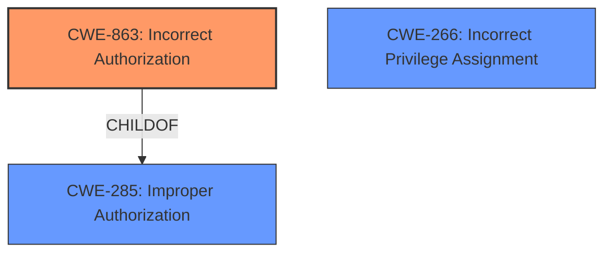

# Enhanced Analysis for CVE-2024-42453

# Summary
| CWE ID  | CWE Name                                                     | Confidence | CWE Abstraction Level | CWE Vulnerability Mapping Label | CWE-Vulnerability Mapping Notes |
| :-------- | :----------------------------------------------------------- | :--------- | :-------------------- | :------------------------------ | :------------------------------ |
| CWE-863   | Incorrect Authorization                                      | 0.9        | Class                 | Allowed-with-Review             |                                 |
| CWE-266   | Incorrect Privilege Assignment                               | 0.6        | Base                  | Allowed                         |                                 |
| CWE-285   | Improper Authorization                                       | 0.5        | Class                 | Discouraged                     |                                 |

- The Primary CWE should be first and noted as the Primary CWEs
- The secondary candidate CWEs should be next and noted as secondary candidates.
- The confidence is a confidence score 0 to 1 to rate your confidence in your assessment for that CWE.
- The CWE Abstraction Level as one of these values: Base, Variant, Pillar, Class, Compound
- The Mapping Notes Usage as one of these values: Allowed, Allowed-with-Review, Prohibited, Discouraged

## Evidence and Confidence

*   **Confidence Score:** 0.7
*   **Evidence Strength:** HIGH

## Relationship Analysis
The primary relationship influencing the selection was the parent-child relationship between CWE-285 (Improper Authorization) and CWE-863 (Incorrect Authorization). While CWE-285 is a broader class, the vulnerability description and supporting evidence suggest the authorization check exists but is performed incorrectly, making CWE-863 a more precise fit. CWE-266 (Incorrect Privilege Assignment) was considered because the **improper permission checks** could stem from misconfigured privileges, however, the description emphasizes the faulty logic in authorization checks, making it a secondary concern.



## Vulnerability Chain
The vulnerability chain begins with **improper permission checks** (CWE-863 or CWE-285), allowing low-privileged users to modify configurations on virtual infrastructure hosts. This leads to the ability to power off virtual machines, delete files in storage, and make configuration changes, ultimately resulting in Denial of Service (DoS) and data integrity issues.

Root Cause: **Improper permission checks** (CWE-863)
Impact: Power off VMs, delete files, modify configurations (DoS, data integrity)

## Summary of Analysis
The initial assessment pointed towards CWE-863 (Incorrect Authorization) due to the explicit mention of **improper permission checks** in the vulnerability description and the CVE Reference Links Content Summary. The retriever results also list CWE-863 as a candidate CWE. The "Privileges vs Permissions Guidance" helped differentiate between privilege and permission issues. The vulnerability description indicates the existence of an authorization mechanism that is flawed. Therefore, CWE-863 is more appropriate than CWE-862 (Missing Authorization). The evidence "Authenticated users with specific roles (assigned via "Users and Roles settings") on the backup server are able to modify the configuration of connected virtual infrastructure hosts. This indicates an improper authorization mechanism that allows users with limited roles to perform actions that should require higher privileges." supports this.

CWE-266 (Incorrect Privilege Assignment) was also considered, given that the **improper permission checks** could be rooted in misconfigured privileges. However, the primary issue appears to be the logic within the authorization checks themselves, making CWE-863 the more direct representation of the **root cause**.

CWE-285 (Improper Authorization) is a parent of CWE-863. Given the evidence, CWE-863 is a better and more specific match.

All selected CWEs are at the appropriate level of specificity based on the available evidence.

Relevant CWE Information:

# Enhanced Context (25 CWEs)
The following CWEs were identified as potentially relevant to this vulnerability:

## CWE-266: Incorrect Privilege Assignment
**Abstraction Level**: Base
**Similarity Score**: 0.78
**Source**: dense

**Description**:
A product incorrectly assigns a privilege to a particular actor, creating an unintended sphere of control for that actor.

**Mapping Guidance**:
- Usage: Allowed
- Rationale: This CWE entry is at the Base level of abstraction, which is a preferred level of abstraction for mapping to the root causes of vulnerabilities.

Technical Explanation for CWE Selection:

*   **CWE-863 Incorrect Authorization:** The vulnerability description states that **improper permission checks** in methods accessed via management services cause the issue. The CVE Reference Links Content Summary further emphasizes the insufficient access controls and improper authorization mechanism. This aligns with CWE-863, which describes a scenario where the product performs an authorization check but does not correctly perform the check. The security implication is that low-privileged users can perform actions they are not authorized to do, leading to DoS and data integrity issues. CWE-863 is a child of CWE-285, indicating a more specific form of improper authorization. The MITRE mapping guidance allows for its use with review, suggesting that it's appropriate when the authorization check exists but is flawed.
*   **CWE-266 Incorrect Privilege Assignment:** This CWE was considered because the **improper permission checks** could potentially stem from incorrect assignment of privileges to users. The vulnerability description mentions that low-privileged users are able to perform actions they should not be able to. If the root cause was that low-privileged users were assigned to high-privileged roles, this would be a better fit, but the emphasis is on the flawed logic of authorization checks. Confidence is lower here (0.6) due to the lack of explicit evidence for privilege misconfiguration.
*   **CWE-285 Improper Authorization:** This CWE represents a broader class of authorization failures, where the product does not perform or incorrectly performs an authorization check. While applicable, CWE-863 provides a more precise description of the vulnerability, as the authorization check exists but is implemented incorrectly. The MITRE mapping guidance discourages the use of CWE-285 when more specific CWEs are available. Confidence is low here (0.5) due to the availability of a more specific child CWE.

Other CWEs Considered but Not Used:

*   CWE-862 (Missing Authorization): This was considered but ruled out because the description indicates the existence of permission checks, albeit **improper permission checks**.
*   CWE-732 (Incorrect Permission Assignment for Critical Resource): This was considered, but the emphasis is on the authorization process itself rather than the assignment of permissions to specific resources.
*   CWE-284 (Improper Access Control): This is a very general CWE and less specific than CWE-863.
*   CWE-306 (Missing Authentication for Critical Function): Authentication is not the primary issue here, so this CWE is not applicable.
*   CWE-20 (Improper Input Validation): While input validation could be a contributing factor, the **root cause** is the **improper permission checks**.
*   CWE-250 (Execution with Unnecessary Privileges): The focus is on authorization, not the privileges under which a process executes.


## CWE Relationship Analysis

Current CWEs represent these abstraction levels: .


### Vulnerability Chain Analysis

**Chain starting from CWE-863:**
- 863 (Incorrect Authorization) - ROOT


**Chain starting from CWE-732:**
- 732 (Incorrect Permission Assignment for Critical Resource) - ROOT


### CWE Relationship Diagram

```mermaid
graph TD
    classDef primary fill:#f96,stroke:#333,stroke-width:2px
    classDef secondary fill:#69f,stroke:#333
    classDef tertiary fill:#9e9,stroke:#333
```