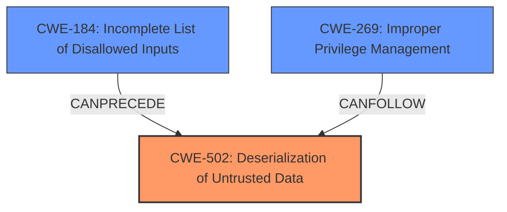

# Analysis Report for CVE-2024-42455

# Vulnerability Analysis Report: CVE-2024-42455

## Description

A vulnerability in Veeam Backup & Replication allows a low-privileged user to connect to remoting services and exploit **insecure deserialization** by sending a serialized temporary file collection. This exploit allows the attacker to delete any file on the system with service account privileges. The vulnerability is caused by an **insufficient blacklist** during the deserialization process.

## Vulnerability Description Key Phrases

- **Rootcause:** ['insecure deserialization', 'insufficient blacklist']
- **Impact:** delete any file on the system
- **Vector:** sending a serialized temporary file collection
- **Attacker:** low-privileged user
- **Product:** Veeam Backup & Replication

## Analysis (with Relationship Data)

# Summary
| CWE ID  | CWE Name                                                                  | Confidence | CWE Abstraction Level | CWE Vulnerability Mapping Label | CWE-Vulnerability Mapping Notes |
| :-------- | :------------------------------------------------------------------------ | :--------- | :---------------------- | :------------------------------ | :------------------------------ |
| CWE-502 | Deserialization of Untrusted Data                                       | 1.0        | Base                    | Primary                       | Allowed                       |
| CWE-184 | Incomplete List of Disallowed Inputs                                      | 0.9        | Base                    | Secondary                     | Allowed                       |
| CWE-269 | Improper Privilege Management                                       | 0.7       | Base                    | Secondary                     | Allowed                       |

## Evidence and Confidence

*   **Confidence Score:** 0.9
*   **Evidence Strength:** HIGH

## Relationship Analysis
The primary weakness is **CWE-502 Deserialization of Untrusted Data**, a base-level CWE, which directly reflects the **insecure deserialization** root cause. Supporting this, both the 'insecure deserialization' and 'insufficient blacklist' keyphrases map to this CWE. **CWE-184 Incomplete List of Disallowed Inputs** is included as a secondary weakness because the vulnerability is caused by an **insufficient blacklist** during the deserialization process. **CWE-269 Improper Privilege Management** is listed because the low-privileged user can delete files using service account privileges, showing incorrect assignment, modification, tracking or checking of privileges for the attacker.



## Vulnerability Chain
The vulnerability chain starts with **CWE-502 Deserialization of Untrusted Data** due to the **insecure deserialization** of the serialized temporary file collection. The **insufficient blacklist** during deserialization (**CWE-184 Incomplete List of Disallowed Inputs**) allows a low-privileged user to exploit the **insecure deserialization**. This leads to the attacker deleting any file on the system with service account privileges, indicating **CWE-269 Improper Privilege Management**.

## Summary of Analysis
The primary focus of this vulnerability lies in the **insecure deserialization** aspect, making **CWE-502 Deserialization of Untrusted Data** the most appropriate primary CWE. The evidence for this includes the explicit mention of **insecure deserialization** in the vulnerability description and the high relevance scores in the keyphrase analysis. The **insufficient blacklist** further supports the inclusion of **CWE-184 Incomplete List of Disallowed Inputs**. The fact that the low-privileged user can delete files with service account privileges leads to the inclusion of **CWE-269 Improper Privilege Management**. The selected CWEs are at the optimal level of specificity, with **CWE-502 Deserialization of Untrusted Data** being a base-level CWE.

Relevant CWE Information:

# Enhanced Context (25 CWEs)
The following CWEs were identified as potentially relevant to this vulnerability:

## CWE-497: Exposure of Sensitive System Information to an Unauthorized Control Sphere
**Abstraction Level**: Base
**Similarity Score**: 0.75
**Source**: dense

**Description**:
The product does not properly prevent sensitive system-level information from being accessed by unauthorized actors who do not have the same level of access to the underlying system as the product does.

**Mapping Guidance**:
- Usage: Allowed
- Rationale: This CWE entry is at the Base level of abstraction, which is a preferred level of abstraction for mapping to the root causes of vulnerabilities.

*Not Selected:* While the vulnerability does lead to unauthorized actions, the root cause is not primarily about exposing sensitive information. The core issue is the **insecure deserialization** process that then allows for unauthorized file deletion.

## CWE-1391: Use of Weak Credentials
**Abstraction Level**: Class
**Similarity Score**: 0.75
**Source**: dense

**Description**:
The product uses weak credentials (such as a default key or hard-coded password) that can be calculated, derived, reused, or guessed by an attacker.

**Mapping Guidance**:
- Usage: Allowed-with-Review
- Rationale: This CWE entry is a Class and might have Base-level children that would be more appropriate

*Not Selected:* The vulnerability does not involve weak credentials being directly used or exploited.

## CWE-345: Insufficient Verification of Data Authenticity
**Abstraction Level**: Class
**Similarity Score**: 0.74
**Source**: dense

**Description**:
The product does not sufficiently verify the origin or authenticity of data, in a way that causes it to accept invalid data.

**Mapping Guidance**:
- Usage: Discouraged
- Rationale: This CWE entry is a level-1 Class (i.e., a child of a Pillar). It might have lower-level children that would be more appropriate

*Not Selected:* While the deserialization process does involve data, the lack of verification isn't the primary issue. The main problem is the **insecure deserialization** of the untrusted data, which allows for arbitrary code execution or other malicious actions.

## CWE-668: Exposure of Resource to Wrong Sphere
**Abstraction Level**: Class
**Similarity Score**: 0.74
**Source**: dense

**Description**:
The product exposes a resource to the wrong control sphere, providing unintended actors with inappropriate access to the resource.

**Mapping Guidance**:
- Usage: Discouraged
- Rationale: CWE-668 is high-level and is often misused as a catch-all when lower-level CWE IDs might be applicable. It is sometimes used for low-information vulnerability reports [REF-1287]. It is a level-1 Class (i.e., a child of a Pillar). It is not useful for trend analysis.

*Not Selected:* This CWE is too generic. **CWE-502 Deserialization of Untrusted Data** is a more specific and appropriate classification.

## CWE-303: Incorrect Implementation of Authentication Algorithm
**Abstraction Level**: Base
**Similarity Score**: 0.74
**Source**: dense

**Description**:
The requirements for the product dictate the use of an established authentication algorithm, but the implementation of the algorithm is incorrect.

**Mapping Guidance**:
- Usage: Allowed
- Rationale: This CWE entry is at the Base level of abstraction, which is a preferred level of abstraction for mapping to the root causes of vulnerabilities.

*Not Selected:* Authentication algorithms are not mentioned or implicated in the vulnerability.

## CWE-59: Improper Link Resolution Before File Access ('Link Following')
**Abstraction Level**: Base
**Similarity Score**: 0.74
**Source**: dense

**Description**:
The product attempts to access a file based on the filename, but it does not properly prevent that filename from identifying a link or shortcut that resolves to an unintended resource.

**Mapping Guidance**:
- Usage: Allowed
- Rationale: This CWE entry is at the Base level of abstraction, which is a preferred level of abstraction for mapping to the root causes of vulnerabilities.

*Not Selected:* While file deletion is the impact, the vulnerability isn't related to improper link resolution.

## CWE-41: Improper Resolution of Path Equivalence
**Abstraction Level**: Base
**Similarity Score**: 0.73
**Source**: dense

**Description**:
The product is vulnerable to file system contents disclosure through path equivalence. Path equivalence involves the use of special characters in file and directory names. The associated manipulations are intended to generate multiple names for the same object.

**Mapping Guidance**:
- Usage: Allowed
- Rationale: This CWE entry is at the Base level of abstraction, which is a preferred level of abstraction for mapping to the root causes of vulnerabilities.

*Not Selected:* Path equivalence is not mentioned or implicated in the vulnerability.

## CWE-330: Use of Insufficiently Random Values
**Abstraction Level**: Class
**Similarity Score**: 0.73
**Source**: dense

**Description**:
The product uses insufficiently random numbers or values in a security context that depends on unpredictable numbers.

**Mapping Guidance**:
- Usage: Discouraged
- Rationale: This CWE entry is a level-1 Class (i.e., a child of a Pillar). It might have lower-level children that would be more appropriate

*Not Selected:* Random values are not mentioned or implicated in the vulnerability.

## CWE-74: Improper Neutralization of Special Elements in Output Used by a Downstream Component ('Injection')
**Abstraction Level**: Class
**Similarity Score**: 0.73
**Source**: dense

**Description**:
The product constructs all or part of a command, data structure, or record using externally-influenced input from an upstream component, but it


## CWE Relationship Analysis

Current CWEs represent these abstraction levels: .


### Vulnerability Chain Analysis

**Chain starting from CWE-502:**
- 502 (Deserialization of Untrusted Data) - ROOT


**Chain starting from CWE-345:**
- 345 (Insufficient Verification of Data Authenticity) - ROOT


### CWE Relationship Diagram

```mermaid
graph TD
    classDef primary fill:#f96,stroke:#333,stroke-width:2px
    classDef secondary fill:#69f,stroke:#333
    classDef tertiary fill:#9e9,stroke:#333
```


*Report generated on 2025-07-13 14:05:57*
