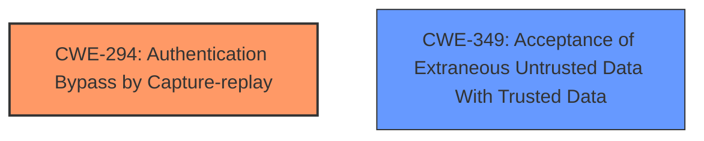

# Analysis Report for CVE-2024-42483

# Vulnerability Analysis Report: CVE-2024-42483

## Description

ESP-NOW Component provides a connectionless Wi-Fi communication protocol. An replay attacks vulnerability was discovered in the implementation of the ESP-NOW because the **caches is not differentiated by message types**, it is a single, shared resource for all kinds of messages, whether they are broadcast or unicast, and regardless of whether they are ciphertext or plaintext. This can result an attacker to clear the cache of its legitimate entries, there by creating an opportunity to re-inject previously captured packets. This vulnerability is fixed in 2.5.2.

## Vulnerability Description Key Phrases

- **Rootcause:** caches is not differentiated by message types
- **Impact:** ['clear the cache of its legitimate entries', 'replay attacks']
- **Attacker:** attacker
- **Version:** 2.5.2
- **Component:** ESP-NOW Component

## Analysis (with Relationship Data)

# Summary

| CWE ID  | CWE Name                                                                    | Confidence | CWE Abstraction Level | CWE Vulnerability Mapping Label | CWE-Vulnerability Mapping Notes |
|---------|-----------------------------------------------------------------------------|------------|-----------------------|---------------------------------|---------------------------------|
| CWE-294 | Authentication Bypass by Capture-replay                                     | 0.8        | Base                  | Primary                           | Allowed                         |
| CWE-349 | Acceptance of Extraneous Untrusted Data With Trusted Data                  | 0.6        | Base                  | Secondary                         | Allowed                         |

## Evidence and Confidence

*   **Confidence Score:** 0.7
*   **Evidence Strength:** MEDIUM

## Relationship Analysis

The primary relationship that impacted the decision was the direct identification of a replay attack, pointing towards CWE-294. Although other CWEs were considered, the core weakness involves the ability to re-inject captured packets due to a lack of cache separation, making CWE-294 the most relevant. CWE-349 is included as the shared cache doesn't distinguish between trusted and untrusted data, so both weaknesses contribute to the attack.



## Vulnerability Chain

The vulnerability chain starts with the **caches is not differentiated by message types**. This leads to the ability for an attacker to clear legitimate cache entries and then replay captured packets.

1.  **Root Cause:** Cache not differentiated by message types.
2.  **Weakness:** Replay attack vulnerability due to shared cache.
3.  **Impact:** Attacker replays packets, leading to unauthorized actions or denial of service.

## Summary of Analysis

The initial analysis identified CWE-294 as the primary candidate based on the description of a replay attack. This was supported by the "CVE Reference Links Content Summary" section which explicitly mentioned the **replay attack vulnerability** due to the shared cache. The **root cause** is the "caches is not differentiated by message types". The Retriever Results listed many CWEs, but the evidence strongly supports CWE-294.

The selection of CWE-294 is at the Base level of abstraction, which is appropriate given the specific nature of the vulnerability. The shared cache allows attackers to replay captured packets.
The choice of CWE-349 is due to the caches accepting different message types.

Relevant CWE Information:

# Enhanced Context (25 CWEs)
The following CWEs were identified as potentially relevant to this vulnerability:

## CWE-294: Authentication Bypass by Capture-replay
**Abstraction Level**: Base
**Similarity Score**: 0.74
**Source**: dense

**Description**:
A capture-replay flaw exists when the design of the product makes it possible for a malicious user to sniff network traffic and bypass authentication by replaying it to the server in question to the same effect as the original message (or with minor changes).

**Mapping Guidance**:
- Usage: Allowed
- Rationale: This CWE entry is at the Base level of abstraction, which is a preferred level of abstraction for mapping to the root causes of vulnerabilities.
### Technical Explanation for CWE-294

*   **How the vulnerability's details match the CWE's characteristics:** The vulnerability description explicitly describes a scenario where an attacker can capture and replay packets due to the lack of cache separation for different message types. This directly aligns with the definition of CWE-294, which involves bypassing authentication (or other security mechanisms) by replaying captured network traffic.
*   **The security implications and potential impact:** The primary security implication is the potential for unauthorized actions or denial of service, as an attacker can replay previously captured packets to impersonate a legitimate user or disrupt network services.
*   **Any parent-child relationships or chain patterns that influenced your mapping:** N/A
*   **Whether the weakness is primary or secondary in the vulnerability:** Primary.
*   **How the official MITRE mapping guidance influenced your decision:** The MITRE mapping guidance allows for the use of CWE-294 and is at the Base level of abstraction, which is preferred.

### Technical Explanation for CWE-349

*   **How the vulnerability's details match the CWE's characteristics:** The vulnerability involves the acceptance of both plaintext and ciphertext messages in the same cache without proper differentiation. This aligns with CWE-349, where extraneous untrusted data (e.g., plaintext messages) is accepted along with trusted data (e.g., ciphertext messages), leading to a vulnerability.
*   **The security implications and potential impact:** The security implication is that an attacker can manipulate the cache by injecting plaintext messages to clear legitimate ciphertext entries, facilitating a replay attack.
*   **Any parent-child relationships or chain patterns that influenced your mapping:** N/A
*   **Whether the weakness is primary or secondary in the vulnerability:** Secondary.
*   **How the official MITRE mapping guidance influenced your decision:** The MITRE mapping guidance allows for the use of CWE-349 and is at the Base level of abstraction, which is preferred.

### CWEs Considered But Not Used

*   **CWE-203, CWE-204, CWE-208:** These CWEs relate to observable discrepancies, but the core issue is not simply an observable difference in behavior.
*   **CWE-319:** While sensitive information is transmitted, the primary issue is not the cleartext transmission itself but the ability to replay packets due to the lack of cache separation.
*   **CWE-327:** This CWE relates to broken cryptographic algorithms, which is not the core issue in this vulnerability.
*   **CWE-770:** This CWE relates to resource allocation without limits, not the core issue.
*   **CWE-113:** This CWE relates to HTTP request/response splitting, which is not relevant to this vulnerability.
*   **CWE-941:** This CWE relates to incorrectly specified destinations in a communication channel, which is not the core issue.


## CWE Relationship Analysis

Current CWEs represent these abstraction levels: .


### Vulnerability Chain Analysis

**Chain starting from CWE-203:**
- 203 (Observable Discrepancy) - ROOT


**Chain starting from CWE-327:**
- 327 (Use of a Broken or Risky Cryptographic Algorithm) - ROOT


### CWE Relationship Diagram

```mermaid
graph TD
    classDef primary fill:#f96,stroke:#333,stroke-width:2px
    classDef secondary fill:#69f,stroke:#333
    classDef tertiary fill:#9e9,stroke:#333
```


*Report generated on 2025-07-13 14:09:32*
