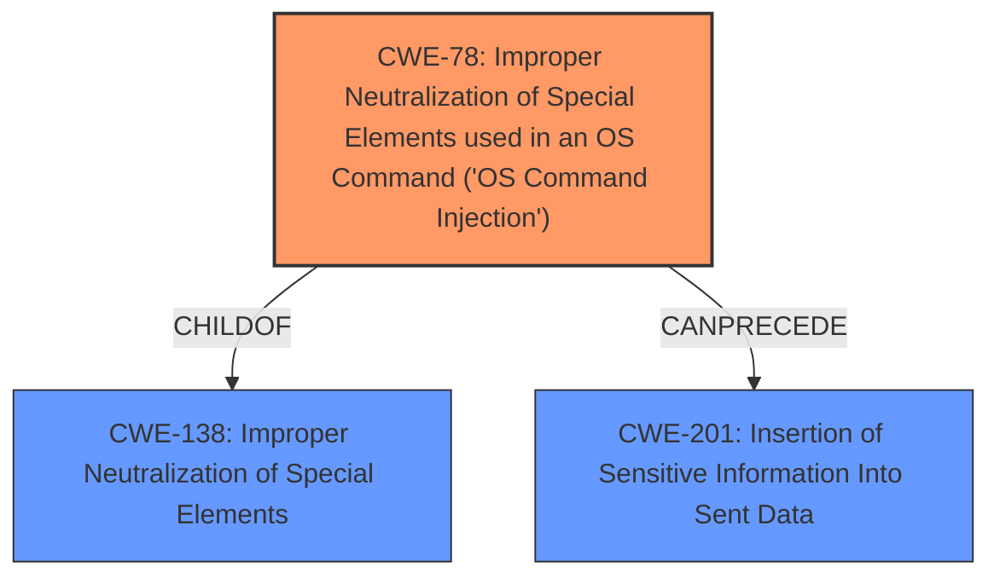

# Analysis Report for CVE-2024-4253

# Vulnerability Analysis Report: CVE-2024-4253

## Description

A **command injection** vulnerability exists in the gradio-app/gradio repository, specifically within the test-functional.yml workflow. The vulnerability arises due to **improper neutralization of special elements** used in a command, allowing for unauthorized modification of the base repository or secrets exfiltration. The issue affects versions up to and including @gradio/video@0.6.12. The flaw is present in the workflows handling of GitHub context information, where it echoes the full name of the head repository, the head branch, and the workflow reference without adequate sanitization. This could potentially lead to the exfiltration of sensitive secrets such as GITHUB_TOKEN, COMMENT_TOKEN, and CHROMATIC_PROJECT_TOKEN.

## Vulnerability Description Key Phrases

- **Rootcause:** ['improper input sanitization', 'improper neutralization of special elements']
- **Weakness:** command injection
- **Impact:** unauthorized modification of the base repository or secrets exfiltration
- **Product:** @gradio/video
- **Version:** up to and including 0.6.12
- **Component:** test-functional.yml workflow

## Analysis (with Relationship Data)

# Summary
| CWE ID   | CWE Name                                                                                                | Confidence | CWE Abstraction Level | CWE Vulnerability Mapping Label | CWE-Vulnerability Mapping Notes |
| :-------- | :------------------------------------------------------------------------------------------------------- | :---------- | :--------------------- | :------------------------------ | :------------------------------ |
| CWE-78    | Improper Neutralization of Special Elements used in an OS Command ('OS Command Injection')              | 0.9         | Base                  | Primary                         | Allowed                         |
| CWE-138    | Improper Neutralization of Special Elements                                                           | 0.7         | Class                  | Secondary                       | Discouraged                        |
| CWE-201    | Insertion of Sensitive Information Into Sent Data                                                        | 0.6         | Base                  | Secondary                       | Allowed                        |

## Evidence and Confidence

*   **Confidence Score:** 0.8
*   **Evidence Strength:** HIGH

## Relationship Analysis
The primary weakness is **CWE-78**, which is a specific type of **CWE-138**. The vulnerability also leads to the potential leakage of sensitive information (**CWE-201**). **CWE-78** is a child of **CWE-138** which indicates a more specific form of improper neutralization. **CWE-201** can follow **CWE-78** in a vulnerability chain, showing the progression from command injection to information exposure. The abstraction levels guide the selection to the most specific and relevant CWE.



## Vulnerability Chain
The vulnerability chain starts with **improper neutralization of special elements**, leading to **command injection**, which results in potential **unauthorized modification** or **secrets exfiltration**.

1.  **Root Cause:** **Improper neutralization of special elements** in commands.
2.  **Weakness:** Command Injection (**CWE-78**)
3.  **Impact:** Unauthorized modification of the base repository or secrets exfiltration (potential information disclosure **CWE-201**).

## Summary of Analysis
The initial analysis focused on identifying the **root cause** and the resulting impact. The primary **root cause** is the **improper neutralization of special elements** leading to a **command injection** vulnerability. The vulnerability description explicitly mentions "**command injection**" and "**improper neutralization of special elements** used in a command". This directly aligns with **CWE-78 (Improper Neutralization of Special Elements used in an OS Command ('OS Command Injection'))**. The potential exfiltration of secrets also suggests **CWE-201 (Insertion of Sensitive Information Into Sent Data)** as a secondary concern. The retriever results consistently highlighted **CWE-138 (Improper Neutralization of Special Elements)**, which serves as a broader category encompassing **CWE-78**, but since we have a more specific match, **CWE-78** is more appropriate.
The provided evidence and the hierarchical relationships between CWEs strongly support the selection of **CWE-78** as the primary CWE, with **CWE-138** and **CWE-201** as secondary CWEs. The chosen CWEs are at the optimal level of specificity, providing a clear and accurate representation of the vulnerability.

Relevant CWE Information:

# Enhanced Context (25 CWEs)
The following CWEs were identified as potentially relevant to this vulnerability:

## CWE-74: Improper Neutralization of Special Elements in Output Used by a Downstream Component ('Injection')
**Abstraction Level**: Class
**Similarity Score**: 0.75
**Source**: dense

**Description**:
The product constructs all or part of a command, data structure, or record using externally-influenced input from an upstream component, but it does not neutralize or incorrectly neutralizes special elements that could modify how it is parsed or interpreted when it is sent to a downstream component.

**Mapping Guidance**:
- Usage: Discouraged
- Rationale: CWE-74 is high-level and often misused when lower-level weaknesses are more appropriate.


## CWE-138: Improper Neutralization of Special Elements
**Abstraction Level**: Class
**Similarity Score**: 0.75
**Source**: dense

**Description**:
The product receives input from an upstream component, but it does not neutralize or incorrectly neutralizes special elements that could be interpreted as control elements or syntactic markers when they are sent to a downstream component.

**Mapping Guidance**:
- Usage: Discouraged
- Rationale: This CWE entry is a level-1 Class (i.e., a child of a Pillar). It might have lower-level children that would be more appropriate


## CWE-212: Improper Removal of Sensitive Information Before Storage or Transfer
**Abstraction Level**: Base
**Similarity Score**: 0.75
**Source**: dense

**Description**:
The product stores, transfers, or shares a resource that contains sensitive information, but it does not properly remove that information before the product makes the resource available to unauthorized actors.

**Mapping Guidance**:
- Usage: Allowed
- Rationale: This CWE entry is at the Base level of abstraction, which is a preferred level of abstraction for mapping to the root causes of vulnerabilities.


## CWE-345: Insufficient Verification of Data Authenticity
**Abstraction Level**: Class
**Similarity Score**: 0.74
**Source**: dense

**Description**:
The product does not sufficiently verify the origin or authenticity of data, in a way that causes it to accept invalid data.

**Mapping Guidance**:
- Usage: Discouraged
- Rationale: This CWE entry is a level-1 Class (i.e., a child of a Pillar). It might have lower-level children that would be more appropriate


## CWE-1391: Use of Weak Credentials
**Abstraction Level**: Class
**Similarity Score**: 0.74
**Source**: dense

**Description**:
The product uses weak credentials (such as a default key or hard-coded password) that can be calculated, derived, reused, or guessed by an attacker.

**Mapping Guidance**:
- Usage: Allowed-with-Review
- Rationale: This CWE entry is a Class and might have Base-level children that would be more appropriate


## CWE-116: Improper Encoding or Escaping of Output
**Abstraction Level**: Class
**Similarity Score**: 0.73
**Source**: dense

**Description**:
The product prepares a structured message for communication with another component, but encoding or escaping of the data is either missing or done incorrectly. As a result, the intended structure of the message is not preserved.

**Mapping Guidance**:
- Usage: Allowed-with-Review
- Rationale: This CWE entry is a Class and might have Base-level children that would be more appropriate


## CWE-668: Exposure of Resource to Wrong Sphere
**Abstraction Level**: Class
**Similarity Score**: 0.73
**Source**: dense

**Description**:
The product exposes a resource to the wrong control sphere, providing unintended actors with inappropriate access to the resource.

**Mapping Guidance**:
- Usage: Discouraged
- Rationale: CWE-668 is high-level and is often misused as a catch-all when lower-level CWE IDs might be applicable. It is sometimes used for low-information vulnerability reports [REF-1287]. It is a level-1 Class (i.e., a child of a Pillar). It is not useful for trend analysis.


## CWE-472: External Control of Assumed-Immutable Web Parameter
**Abstraction Level**: Base
**Similarity Score**: 0.73
**Source**: dense

**Description**:
The web application does not sufficiently verify inputs that are assumed to be immutable but are actually externally controllable, such as hidden form fields.

**Mapping Guidance**:
- Usage: Allowed
- Rationale: This CWE entry is at the Base level of abstraction, which is a preferred level of abstraction for mapping to the root causes of vulnerabilities.


## CWE-497: Exposure of Sensitive System Information to an Unauthorized Control Sphere
**Abstraction Level**: Base
**Similarity Score**: 0.73
**Source**: dense

**Description**:
The product does not properly prevent sensitive system-level information from being accessed by unauthorized actors who do not have the same level of access to the underlying system as the product does.

**Mapping Guidance**:
- Usage: Allowed
- Rationale: This CWE entry is at the Base level of abstraction, which is a preferred level of abstraction for mapping to the root causes of vulnerabilities.


## CWE-209: Generation of Error Message Containing Sensitive Information
**Abstraction Level**: Base
**


## CWE Relationship Analysis

Current CWEs represent these abstraction levels: .


### Vulnerability Chain Analysis

**Chain starting from CWE-1391:**
- 1391 (Use of Weak Credentials) - ROOT


**Chain starting from CWE-116:**
- 116 (Improper Encoding or Escaping of Output) - ROOT


### CWE Relationship Diagram

```mermaid
graph TD
    classDef primary fill:#f96,stroke:#333,stroke-width:2px
    classDef secondary fill:#69f,stroke:#333
    classDef tertiary fill:#9e9,stroke:#333
```


*Report generated on 2025-07-13 14:14:09*
