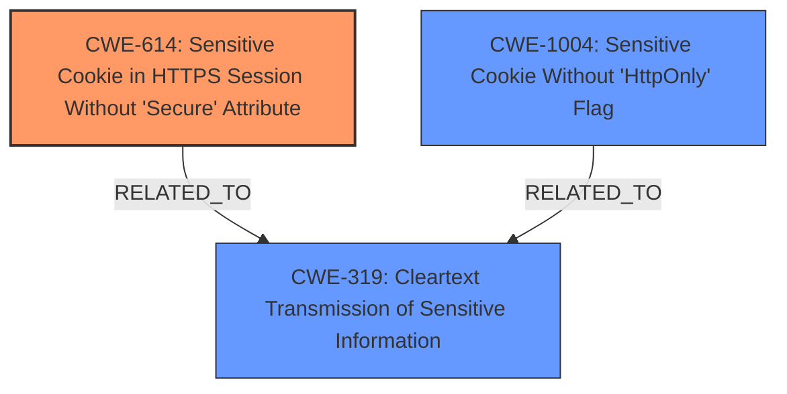

# Analysis Report for CVE-2024-42658

# Vulnerability Analysis Report: CVE-2024-42658

## Description

An issue in wishnet Nepstech Wifi Router NTPL-XPON1GFEVN v1.0 allows a remote attacker to obtain sensitive information via the cookies parameter

## Vulnerability Description Key Phrases

- **Impact:** obtain sensitive information
- **Vector:** cookies parameter
- **Attacker:** remote attacker
- **Product:** wishnet Nepstech Wifi Router NTPL-XPON1GFEVN
- **Version:** v1.0

## Analysis (with Relationship Data)

# Summary

| CWE ID    | CWE Name                                                                    | Confidence | CWE Abstraction Level | CWE Vulnerability Mapping Label | CWE-Vulnerability Mapping Notes |
| --------- | --------------------------------------------------------------------------- | ---------- | ----------------------- | ------------------------------- | ------------------------------- |
| CWE-614   | Sensitive Cookie in HTTPS Session Without 'Secure' Attribute                | 0.9        | Variant                 | Primary                         | Allowed                       |
| CWE-1004  | Sensitive Cookie Without 'HttpOnly' Flag                                    | 0.8        | Variant                 | Secondary                       | Allowed                       |
| CWE-319   | Cleartext Transmission of Sensitive Information                             | 0.7        | Base                    | Secondary                       | Allowed                       |

## Evidence and Confidence

*   **Confidence Score:** 0.8
*   **Evidence Strength:** HIGH

## Relationship Analysis
The primary weakness identified is the **lack of the 'Secure' attribute for sensitive cookies in HTTPS sessions (CWE-614)**, a variant-level weakness. This is related to the broader issue of **transmitting sensitive information in cleartext (CWE-319)**, as the absence of the 'Secure' attribute can lead to cookies being sent over HTTP. Another contributing factor is the **absence of the 'HttpOnly' flag (CWE-1004)**, making cookies accessible to client-side scripts, potentially increasing the attack surface. All three are variant or base level CWE's, but CWE-614 appears to be the most direct root cause.



## Vulnerability Chain
The vulnerability chain starts with the **insecure handling of cookies**, specifically the **missing 'Secure' attribute (CWE-614)** and **'HttpOnly' flag (CWE-1004)**. This leads to the **transmission of sensitive information in cleartext (CWE-319)**, potentially allowing attackers to intercept and steal cookies, ultimately leading to **unauthorized access and control over the device**, and **exposure of sensitive information**.

## Summary of Analysis
Based on the provided evidence, the primary root cause is the **lack of the 'Secure' attribute on sensitive cookies (CWE-614)**. This is directly supported by the CVE Reference Links Content Summary, which states that the router firmware lacks sufficient security measures for handling cookies and that cookies are not being set with the HttpOnly and Secure flags. The high retriever score for CWE-614 further supports this classification. CWE-1004 and CWE-319 are contributing factors. The selected CWEs are at the optimal level of specificity, as they directly address the specific weaknesses identified in the vulnerability description.
The evidence clearly points to the insecure configuration of cookies as the root cause, justifying the selection of CWE-614, CWE-1004, and CWE-319.

**CWE Considerations:**
*   **CWE-425 Direct Request ('Forced Browsing'):** While potentially related, this is a broader issue of inadequate authorization, not specifically cookie-related.
*   **CWE-472 External Control of Assumed-Immutable Web Parameter:** This is also not directly related to the cookie handling issue.
*   **CWE-784 Reliance on Cookies without Validation and Integrity Checking in a Security Decision:** This is similar to the chosen CWEs, but CWE-614 and CWE-1004 are more specific about the exact issues.
*   **CWE-798 Use of Hard-coded Credentials**: Not applicable, as the vulnerability is with cookie handling, not credentials.
Relevant CWE Information:

# Enhanced Context (25 CWEs)
The following CWEs were identified as potentially relevant to this vulnerability:

## CWE-784: Reliance on Cookies without Validation and Integrity Checking in a Security Decision
**Abstraction Level**: Variant
**Similarity Score**: 0.79
**Source**: dense

**Description**:
The product uses a protection mechanism that relies on the existence or values of a cookie, but it does not properly ensure that the cookie is valid for the associated user.

**Mapping Guidance**:
- Usage: Allowed
- Rationale: This CWE entry is at the Variant level of abstraction, which is a preferred level of abstraction for mapping to the root causes of vulnerabilities.


## CWE-614: Sensitive Cookie in HTTPS Session Without 'Secure' Attribute
**Abstraction Level**: Variant
**Similarity Score**: 0.77
**Source**: dense

**Description**:
The Secure attribute for sensitive cookies in HTTPS sessions is not set, which could cause the user agent to send those cookies in plaintext over an HTTP session.

**Mapping Guidance**:
- Usage: Allowed
- Rationale: This CWE entry is at the Variant level of abstraction, which is a preferred level of abstraction for mapping to the root causes of vulnerabilities.


## CWE-1004: Sensitive Cookie Without 'HttpOnly' Flag
**Abstraction Level**: Variant
**Similarity Score**: 0.77
**Source**: dense

**Description**:
The product uses a cookie to store sensitive information, but the cookie is not marked with the HttpOnly flag.

**Mapping Guidance**:
- Usage: Allowed
- Rationale: This CWE entry is at the Variant level of abstraction, which is a preferred level of abstraction for mapping to the root causes of vulnerabilities.


## CWE-425: Direct Request ('Forced Browsing')
**Abstraction Level**: Base
**Similarity Score**: 0.76
**Source**: dense

**Description**:
The web application does not adequately enforce appropriate authorization on all restricted URLs, scripts, or files.

**Mapping Guidance**:
- Usage: Allowed
- Rationale: This CWE entry is at the Base level of abstraction, which is a preferred level of abstraction for mapping to the root causes of vulnerabilities.


## CWE-472: External Control of Assumed-Immutable Web Parameter
**Abstraction Level**: Base
**Similarity Score**: 0.75
**Source**: dense

**Description**:
The web application does not sufficiently verify inputs that are assumed to be immutable but are actually externally controllable, such as hidden form fields.

**Mapping Guidance**:
- Usage: Allowed
- Rationale: This CWE entry is at the Base level of abstraction, which is a preferred level of abstraction for mapping to the root causes of vulnerabilities.


## CWE-807: Reliance on Untrusted Inputs in a Security Decision
**Abstraction Level**: Base
**Similarity Score**: 0.75
**Source**: dense

**Description**:
The product uses a protection mechanism that relies on the existence or values of an input, but the input can be modified by an untrusted actor in a way that bypasses the protection mechanism.

**Mapping Guidance**:
- Usage: Allowed
- Rationale: This CWE entry is at the Base level of abstraction, which is a preferred level of abstraction for mapping to the root causes of vulnerabilities.


## CWE-565: Reliance on Cookies without Validation and Integrity Checking
**Abstraction Level**: Base
**Similarity Score**: 0.74
**Source**: dense

**Description**:
The product relies on the existence or values of cookies when performing security-critical operations, but it does not properly ensure that the setting is valid for the associated user.

**Mapping Guidance**:
- Usage: Allowed
- Rationale: This CWE entry is at the Base level of abstraction, which is a preferred level of abstraction for mapping to the root causes of vulnerabilities.


## CWE-319: Cleartext Transmission of Sensitive Information
**Abstraction Level**: Base
**Similarity Score**: 0.74
**Source**: dense

**Description**:
The product transmits sensitive or security-critical data in cleartext in a communication channel that can be sniffed by unauthorized actors.

**Mapping Guidance**:
- Usage: Allowed
- Rationale: This CWE entry is at the Base level of abstraction, which is a preferred level of abstraction for mapping to the root causes of vulnerabilities.


## CWE-1391: Use of Weak Credentials
**Abstraction Level**: Class
**Similarity Score**: 0.73
**Source**: dense

**Description**:
The product uses weak credentials (such as a default key or hard-coded password) that can be calculated, derived, reused, or guessed by an attacker.

**Mapping Guidance**:
- Usage: Allowed-with-Review
- Rationale: This CWE entry is a Class and might have Base-level children that would be more appropriate


## CWE-294: Authentication Bypass by Capture-replay
**Abstraction Level**: Base
**Similarity Score**: 0.73
**Source**: dense


## CWE Relationship Analysis

Current CWEs represent these abstraction levels: .


### Vulnerability Chain Analysis

**Chain starting from CWE-565:**
- 565 (Reliance on Cookies without Validation and Integrity Checking) - ROOT


**Chain starting from CWE-784:**
- 784 (Reliance on Cookies without Validation and Integrity Checking in a Security Decision) - ROOT


### CWE Relationship Diagram

```mermaid
graph TD
    classDef primary fill:#f96,stroke:#333,stroke-width:2px
    classDef secondary fill:#69f,stroke:#333
    classDef tertiary fill:#9e9,stroke:#333
```


*Report generated on 2025-07-13 14:17:30*
