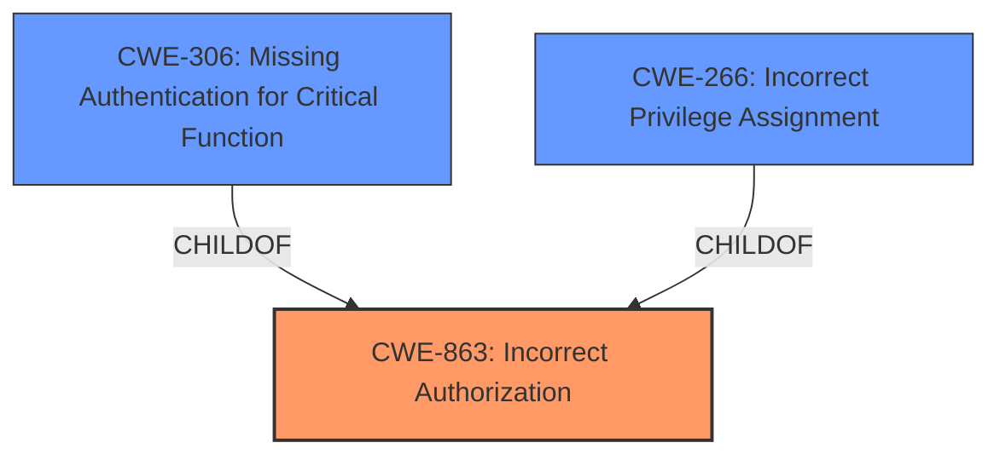

# Enhanced Analysis for CVE-2024-42759

# Summary
| CWE ID | CWE Name | Confidence | CWE Abstraction Level | CWE Vulnerability Mapping Label | CWE-Vulnerability Mapping Notes |
|---|---|---|---|---|---|
| CWE-863 | Incorrect Authorization | 0.9 | Class | Allowed-with-Review | Primary CWE: The application performs authorization checks but does so incorrectly. |
| CWE-306 | Missing Authentication for Critical Function | 0.6 | Base | Allowed | Secondary CWE: Authentication might be missing for the vulnerable endpoint |
| CWE-266 | Incorrect Privilege Assignment | 0.6 | Base | Allowed | Secondary CWE: The system might be assigning incorrect privileges. |

## Evidence and Confidence

*   **Confidence Score:** 0.8
*   **Evidence Strength:** HIGH

## Relationship Analysis
The primary CWE, CWE-863 Incorrect Authorization, is a class-level CWE. While it's encouraged to find a more specific, base-level CWE, in this case, the description focuses on the **incorrect** execution of an authorization check rather than a completely missing check (CWE-862). CWE-863 has child relationships to more specific authorization issues.



## Vulnerability Chain
The vulnerability chain starts with a flawed or missing authorization check, leading to privilege escalation and unauthorized access to functionalities.

1.  **Root Cause:** **Incorrect authorization** at the `/api/usuario/cadastrodesuplente` endpoint (CWE-863).
2.  **Weakness:** Allows users to define themselves as their own substitute approver, bypassing manager approval controls.
3.  **Impact:** Privilege escalation, unauthorized approval of tickets, and compromise of the ticket management system's integrity.

## Summary of Analysis
Based on the provided evidence, the primary weakness is **incorrect authorization** (CWE-863) at the API endpoint, which allows users to bypass approval controls and escalate privileges. The evidence clearly states, "The application fails to properly validate user privileges, allowing users to access and modify functionalities they shouldn't be authorized to use."

The guidance on privileges vs. permissions helped to solidify the choice of authorization-related CWEs. The vulnerability involves user roles and the ability to bypass intended approval processes, aligning more with privilege management than simple permission issues on resources.

While a more specific CWE would be ideal, the current description centers around the flawed authorization logic rather than a specific type of authorization failure. Therefore, CWE-863 is the most appropriate choice, given the available information. Other CWEs like CWE-306 and CWE-266 were also considered as contributing factors.

Relevant CWE Information:

# Enhanced Context (25 CWEs)
The following CWEs were identified as potentially relevant to this vulnerability:

## CWE-266: Incorrect Privilege Assignment
**Abstraction Level**: Base
**Similarity Score**: 0.80
**Source**: dense

**Description**:
A product incorrectly assigns a privilege to a particular actor, creating an unintended sphere of control for that actor.

**Mapping Guidance**:
- Usage: Allowed
- Rationale: This CWE entry is at the Base level of abstraction, which is a preferred level of abstraction for mapping to the root causes of vulnerabilities.

## CWE-306: Missing Authentication for Critical Function
**Abstraction Level**: base
**Similarity Score**: 2.40
**Source**: graph

**Description**:
CWE-306: Missing Authentication for Critical Function

**Mapping Guidance**:
- Usage: Allowed
- Rationale: This CWE entry is at the Base level of abstraction, which is a preferred level of abstraction for mapping to the root causes of vulnerabilities.

**Relationships**:
- PARENTOF -> CWE-322
- PARENTOF -> CWE-288
- CHILDOF -> CWE-287
- CHILDOF -> CWE-287
- CHILDOF -> CWE-306

## CWE-863: Incorrect Authorization
**Abstraction Level**: Class
**Similarity Score**: 1937.48
**Source**: sparse

**Description**:
The product performs an authorization check when an actor attempts to access a resource or perform an action, but it does not correctly perform the check.

**Mapping Guidance**:
- Usage: Allowed-with-Review
- Rationale: This CWE entry is a Class and might have Base-level children that would be more appropriate

## CWE-285: Improper Authorization
**Abstraction Level**: Class
**Similarity Score**: 1917.44
**Source**: sparse

**Description**:
The product does not perform or incorrectly performs an authorization check when an actor attempts to access a resource or perform an action.

**Mapping Guidance**:
- Usage: Discouraged
- Rationale: CWE-285 is high-level and lower-level CWEs can frequently be used instead. It is a level-1 Class (i.e., a child of a Pillar).

### CWEs Considered but Not Used:

*   **CWE-285 Improper Authorization:** This was considered but deemed less appropriate than CWE-863. CWE-285 covers cases where authorization is completely missing or incorrect. However, the vulnerability description suggests that some form of authorization is in place, but it's flawed, making CWE-863 a better fit.
*   **CWE-269 Improper Privilege Management:** While privilege escalation is the impact, the root cause is the authorization flaw, making CWE-269 less relevant.


## CWE Relationship Analysis

Current CWEs represent these abstraction levels: .


### Vulnerability Chain Analysis

**Chain starting from CWE-288:**
- 288 (Authentication Bypass Using an Alternate Path or Channel) - ROOT


**Chain starting from CWE-863:**
- 863 (Incorrect Authorization) - ROOT


### CWE Relationship Diagram

```mermaid
graph TD
    classDef primary fill:#f96,stroke:#333,stroke-width:2px
    classDef secondary fill:#69f,stroke:#333
    classDef tertiary fill:#9e9,stroke:#333
```