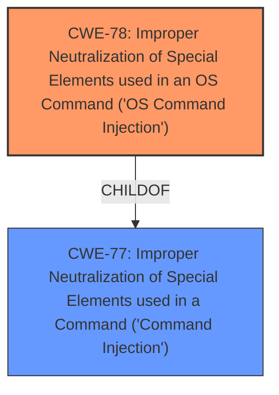

# Analysis for CVE-2024-42905

# Summary
| CWE ID | CWE Name | Confidence | CWE Abstraction Level | CWE Vulnerability Mapping Label | CWE-Vulnerability Mapping Notes |
|---|---|---|---|---|---|
| CWE-78 | Improper Neutralization of Special Elements used in an OS Command ('OS Command Injection') | 0.9 | Base | Primary | Allowed |
| CWE-266 | Incorrect Privilege Assignment | 0.5 | Base | Secondary Candidate | Allowed |

## Evidence and Confidence

*   **Confidence Score:** 0.7
*   **Evidence Strength:** MEDIUM

## Relationship Analysis
The primary relationship influencing the CWE selection is the parent-child relationship. CWE-78 is a base-level CWE, providing a specific description of the **improper neutralization** issue. The chain relationship is also considered, as **command injection** can lead to further exploitation. The abstraction level is crucial, as the base level provides sufficient detail without being overly generic.

## Vulnerability Chain
The vulnerability chain starts with **improper neutralization** of special elements in an OS command (CWE-78), which leads to command execution and ultimately, obtaining device administrator privileges.
  - Root Cause: CWE-78: Improper Neutralization of Special Elements used in an OS Command ('OS Command Injection')
  - Impact: Command Execution, Privilege Escalation (potentially related to CWE-266)

## Summary of Analysis
The initial analysis identified CWE-78 as the primary candidate due to the **command execution vulnerability** mentioned in the description. The **getVar function in the code/function/system/tool/ping.php file** allows for **command execution** and **obtaining device administrator privileges**. This aligns with the characteristics of CWE-78, where **improper neutralization** leads to the execution of unintended commands.

The relationship graph highlights the hierarchical relationship between CWE-78 and its parent, CWE-77. While CWE-77 provides a more general description of **command injection**, CWE-78 offers a more specific explanation related to **improper neutralization** of special elements.

The selection of CWE-78 is based on the evidence in the vulnerability description, combined with the understanding of CWE relationships and abstraction levels. The base level of CWE-78 provides sufficient detail to accurately represent the vulnerability.

Relevant CWE Information:

# Enhanced Context (25 CWEs)
The following CWEs were identified as potentially relevant to this vulnerability:

## CWE-78: Improper Neutralization of Special Elements used in an OS Command ('OS Command Injection')

**Abstraction Level**: base
**Similarity Score**: 4.33
**Source**: graph

**Description**:
CWE-78: Improper Neutralization of Special Elements used in an OS Command ('OS Command Injection')

**Mapping Guidance**:
- Usage: Allowed
- Rationale: This CWE entry is at the Base level of abstraction, which is a preferred level of abstraction for mapping to the root causes of vulnerabilities.

**Relationships**:
- CANFOLLOW -> CWE-184
- CANALSOBE -> CWE-88
- CHILDOF -> CWE-77
- CHILDOF -> CWE-77
- CHILDOF -> CWE-74
The vulnerability description clearly states that a **command execution vulnerability** exists, which aligns directly with CWE-78. The mention of the **getVar function in the code/function/system/tool/ping.php file** suggests that user-supplied input is being used to construct an OS command without proper sanitization.

# Enhanced Context (25 CWEs)

## CWE-266: Incorrect Privilege Assignment
**Abstraction Level**: Base
**Similarity Score**: 0.79
**Source**: dense

**Description**:
A product incorrectly assigns a privilege to a particular actor, creating an unintended sphere of control for that actor.

**Mapping Guidance**:
- Usage: Allowed
- Rationale: This CWE entry is at the Base level of abstraction, which is a preferred level of abstraction for mapping to the root causes of vulnerabilities.

The vulnerability description states that the exploit can "obtain device administrator privileges". This could suggest an **incorrect privilege assignment**, especially if the **command execution** results in assigning administrator privileges to an unauthorized user or process.