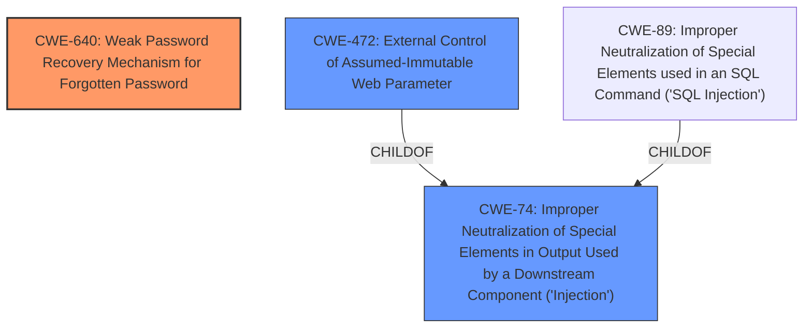

# Enhanced Analysis for CVE-2024-42914

# Summary
| CWE ID | CWE Name | Confidence | CWE Abstraction Level | CWE Vulnerability Mapping Label | CWE-Vulnerability Mapping Notes |
|---|---|---|---|---|---|
| CWE-640 | Weak Password Recovery Mechanism for Forgotten Password | 0.9 | Base | Allowed-with-Review | Primary CWE |
| CWE-472 | External Control of Assumed-Immutable Web Parameter | 0.7 | Base | Allowed | Secondary Candidate |
| CWE-74 | Improper Neutralization of Special Elements in Output Used by a Downstream Component ('Injection') | 0.6 | Class | Discouraged | Secondary Candidate |

## Evidence and Confidence

*   **Confidence Score:** 0.8
*   **Evidence Strength:** HIGH

## Relationship Analysis
The primary weakness, CWE-640 [Weak Password Recovery Mechanism for Forgotten Password], is a base-level CWE that directly relates to the vulnerability in the password reset functionality. While CWE-640 doesn't have direct parent-child relationships with other CWEs listed, its description aligns well with the **weakness** of improper handling of the "Host" header during password reset. CWE-472 [External Control of Assumed-Immutable Web Parameter] is a related weakness, as the Host header is an externally controlled parameter that is assumed to be properly handled, but isn't. CWE-74 [Improper Neutralization of Special Elements in Output Used by a Downstream Component ('Injection')] is a higher-level class that could apply, but CWE-640 and CWE-472 provide more specific classifications.



## Vulnerability Chain
The vulnerability chain starts with a **weakness** in the password recovery mechanism.
1.  **Root Cause:** CWE-640 [Weak Password Recovery Mechanism for Forgotten Password] due to **improper** handling of the Host header.
2.  The application fails to validate the Host header, an externally controlled parameter (CWE-472 [External Control of Assumed-Immutable Web Parameter]).
3.  The attacker injects a malicious Host header.
4.  The password reset email is sent with a link to the attacker's server.
5.  The user clicks the link, leaking the reset token.
6.  The attacker resets the user's password and takes over the account.

## Summary of Analysis
The initial analysis identified several candidate CWEs, with varying relevance scores. The final decision to focus on CWE-640 [Weak Password Recovery Mechanism for Forgotten Password] as the primary CWE is based on the following evidence:

*   The vulnerability description explicitly mentions the "forgot password functionality" and how it's vulnerable to host header injection.
*   The CVE Reference Links Content Summary confirms that the root cause lies in the application's failure to validate the Host header in the password reset request, leading to a manipulated password reset link. "The vulnerability lies in the fact that the 'Forgot Password' function does not sanitize the host header before generating a password reset link."
*   CWE-640 [Weak Password Recovery Mechanism for Forgotten Password] specifically addresses **weaknesses** in password recovery mechanisms, aligning with the vulnerability's core issue.
*   CWE-472 [External Control of Assumed-Immutable Web Parameter] applies to the external control of the Host header, an externally controlled parameter.
*   CWE-74 [Improper Neutralization of Special Elements in Output Used by a Downstream Component ('Injection')] is a broader, higher-level CWE, making it less specific than CWE-640 [Weak Password Recovery Mechanism for Forgotten Password] in this context. Its discouraged usage further supports not using it as primary.

The selected CWEs are at the optimal level of specificity because they directly address the **weakness** in the password recovery mechanism and the external control of the Host header, without being overly broad or abstract.

CWEs considered but not used as primary:

*   CWE-89 [Improper Neutralization of Special Elements used in an SQL Command ('SQL Injection')]: This CWE is not relevant as the vulnerability does not involve SQL injection.
*   CWE-346 [Origin Validation Error]: While related to header manipulation, it's not as directly relevant as CWE-640 [Weak Password Recovery Mechanism for Forgotten Password].
*   CWE-256 [Plaintext Storage of a Password]: This CWE is not relevant as there's no mention of passwords being stored in plaintext.
*   CWE-1390 [Weak Authentication] and CWE-287 [Improper Authentication]: These are too general and not specific to the password reset mechanism.
*   CWE-290 [Authentication Bypass by Spoofing]: This is not the primary issue, as the vulnerability focuses on manipulating the password reset process, not bypassing authentication directly.


## CWE Relationship Analysis

Current CWEs represent these abstraction levels: .


### Vulnerability Chain Analysis

**Chain starting from CWE-1390:**
- 1390 (Weak Authentication) - ROOT


**Chain starting from CWE-640:**
- 640 (Weak Password Recovery Mechanism for Forgotten Password) - ROOT


### CWE Relationship Diagram

```mermaid
graph TD
    classDef primary fill:#f96,stroke:#333,stroke-width:2px
    classDef secondary fill:#69f,stroke:#333
    classDef tertiary fill:#9e9,stroke:#333
```