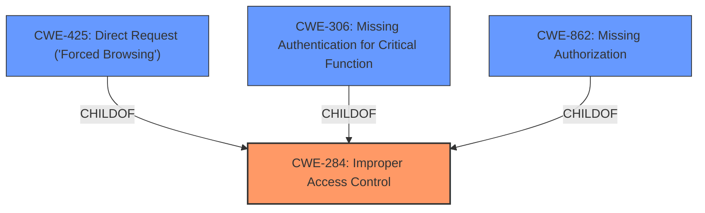

# Enhanced Analysis for CVE-2024-42919

# Summary
| CWE ID | CWE Name | Confidence | CWE Abstraction Level | CWE Vulnerability Mapping Label | CWE-Vulnerability Mapping Notes |
|---|---|---|---|---|---|
| CWE-284 | Improper Access Control | 0.8 | Pillar | Primary CWE | Discouraged |
| CWE-425 | Direct Request ('Forced Browsing') | 0.7 | Base | Secondary Candidate | Allowed |
| CWE-306 | Missing Authentication for Critical Function | 0.6 | Base | Secondary Candidate | Allowed |
| CWE-862 | Missing Authorization | 0.5 | Class | Secondary Candidate | Allowed |

## Evidence and Confidence

*   **Confidence Score:** 0.8
*   **Evidence Strength:** MEDIUM

## Relationship Analysis
The primary relationship that influenced the CWE selection was the hierarchical structure, particularly the parent-child relationship between CWE-284 (Improper Access Control), which is a Pillar, and its more specific children, such as CWE-862 (Missing Authorization) and CWE-306 (Missing Authentication for Critical Function). Since the vulnerability description indicates an **Incorrect Access Control** issue, CWE-284 serves as a general classification. However, because the reference link summary describes an endpoint accessible without authentication, CWE-306 (Missing Authentication for Critical Function) and CWE-425 (Direct Request ('Forced Browsing')) are considered as more specific potential classifications if more information becomes available. CWE-862, Missing Authorization, would be an option if authentication was present but authorization was missing.



## Vulnerability Chain
The vulnerability chain starts with the **Incorrect Access Control**, specifically the lack of authentication for the `acteScanAVReport` endpoint. This leads to the impact of an attacker being able to access the eScan AV Report without authentication.
  - **Root Cause:** **Incorrect Access Control** (CWE-284) due to missing authentication.
  - **Weakness:** The `acteScanAVReport` endpoint is accessible without authentication, potentially leading to unauthorized information disclosure.
  - **Impact:** An attacker can access the eScan AV Report without authentication.

## Summary of Analysis
The initial assessment identified **Incorrect Access Control** as the primary issue based on the vulnerability description. The retriever results also pointed to CWE-284 (Improper Access Control) and its related authorization and authentication CWEs as potential candidates.

The evidence provided states: "The `acteScanAVReport` endpoint in eScan Management Console is accessible without requiring any authentication." This statement strongly suggests a lack of authentication, making CWE-306 (Missing Authentication for Critical Function) and CWE-425 (Direct Request ('Forced Browsing')) relevant. However, the description's explicit mention of **Incorrect Access Control** leads to classifying CWE-284 as the primary issue.

The graph relationships highlight the hierarchical nature of access control weaknesses, with CWE-284 being a broader category encompassing more specific issues like missing authentication or authorization. The final selection of CWE-284 as the primary CWE is based on the explicit mention of "Incorrect Access Control" in the vulnerability description and the evidence that the endpoint is accessible without authentication. The evidence for selecting CWE-306 and CWE-425 is strong enough that they are considered as secondary candidates. CWE-862 is considered a less likely candidate given that there is no mention of authentication being present, but rather the opposite.

Relevant CWE Information:

# Enhanced Context (25 CWEs)
The following CWEs were identified as potentially relevant to this vulnerability:

## CWE-284: Improper Access Control
**Abstraction Level**: Pillar
**Similarity Score**: 0.090 (sparse)
**Description**: The software does not restrict access to resources or actions to only the intended privileged actors. This exposes resources to unintended actors.
**Mapping Guidance**: Discouraged: CWE-284 is high-level and lower-level CWEs can frequently be used instead. It is a level-1 Class (i.e., a child of a Pillar).
**Rationale**: This is the most general access control issue, applicable when the specific type of access control problem (authentication, authorization) is unclear or when multiple types of access control failures are present. Given the information, it is not clear whether this is specifically an authentication or authorization issue, making CWE-284 a reasonable starting point.

## CWE-425: Direct Request ('Forced Browsing')
**Abstraction Level**: Base
**Similarity Score**: 0.087 (sparse), 0.76 (dense), 2.24 (graph)
**Description**: The web application does not adequately enforce appropriate authorization on all restricted URLs, scripts, or files.
**Mapping Guidance**: Allowed
**Rationale**: This CWE applies because the `acteScanAVReport` endpoint is directly accessible without proper authorization checks.

## CWE-306: Missing Authentication for Critical Function
**Abstraction Level**: Base
**Similarity Score**: 1187.36
**Source**: sparse
**Description**:
The product does not perform any authentication for functionality that requires a provable user identity or consumes a significant amount of resources.
**Mapping Guidance**:
- Usage: Allowed
- Rationale: This CWE entry is at the Base level of abstraction, which is a preferred level of abstraction for mapping to the root causes of vulnerabilities.

## CWE-862: Missing Authorization
**Abstraction Level**: Class
**Similarity Score**: N/A
**Description**: The application does not perform any authorization checks before allowing the user to access a resource.
**Mapping Guidance**: N/A
**Rationale**: This CWE is suitable if, after authentication, the application fails to validate whether the authenticated user has the necessary permissions to access the resource.


## CWE Relationship Analysis

Current CWEs represent these abstraction levels: .


### Vulnerability Chain Analysis

**Chain starting from CWE-284:**
- 284 (Improper Access Control) - ROOT


**Chain starting from CWE-306:**
- 306 (Missing Authentication for Critical Function) - ROOT


### CWE Relationship Diagram

```mermaid
graph TD
    classDef primary fill:#f96,stroke:#333,stroke-width:2px
    classDef secondary fill:#69f,stroke:#333
    classDef tertiary fill:#9e9,stroke:#333
```