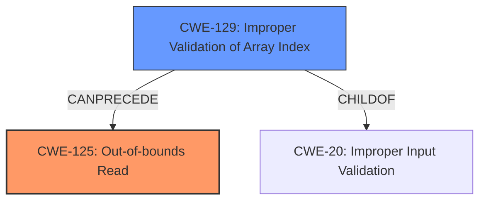

# Analysis for CVE-2024-42934

# Summary
| CWE ID | CWE Name | Confidence | CWE Abstraction Level | CWE Vulnerability Mapping Label | CWE-Vulnerability Mapping Notes |
|---|---|---|---|---|---|
| CWE-125 | Out-of-bounds Read | 0.9 | Base | Primary | Allowed |
| CWE-129 | Improper Validation of Array Index | 0.7 | Variant | Secondary | Allowed |

## Evidence and Confidence

*   **Confidence Score:** 0.8
*   **Evidence Strength:** HIGH

## Relationship Analysis
The primary CWE is CWE-125, Out-of-bounds Read, which is a Base level CWE and accurately reflects the vulnerability. CWE-129, Improper Validation of Array Index, is a variant and a child of CWE-20 (Improper Input Validation), can precede CWE-125. The relationship here shows that missing input validation on the array index (CWE-129) can lead to an out-of-bounds read (CWE-125).

## Vulnerability Chain
The vulnerability chain starts with **missing input validation** (potentially CWE-20 or CWE-129) of the array index, leading to an **out-of-bounds read** (CWE-125). The impact can be denial of service, authentication bypass, or code execution, although the last two are less likely.

## Summary of Analysis
The vulnerability description clearly states an "**out-of-bounds array access**" in OpenIPMI. The "CVE Reference Links Content Summary" confirms that the IPMI simulator lacks input validation on the authorization type of incoming LAN messages, which can lead to an out-of-bounds access.

Based on the provided evidence, the primary CWE is CWE-125 (Out-of-bounds Read), as the vulnerability directly involves reading data beyond the intended buffer. The "Retriever Results" also lists CWE-125 as the top candidate.

CWE-129 (Improper Validation of Array Index) is a secondary CWE because the root cause involves a failure to properly validate the array index before accessing it. The lack of validation allows the out-of-bounds read to occur.

The selection of CWE-125 and CWE-129 are at the optimal level of specificity because they directly address the root cause (missing validation) and the resulting vulnerability (out-of-bounds read).

CWE-787 (Out-of-bounds Write) was considered but not selected because the description explicitly mentions an "out-of-bounds array access", which aligns more closely with reading than writing. Also the content summary does not indicate any writing outside of the buffer bounds.
CWE-306 (Missing Authentication for Critical Function), CWE-862 (Missing Authorization), CWE-863 (Incorrect Authorization), and CWE-285 (Improper Authorization) were not selected because the vulnerability primarily involves improper handling of array indices and memory access, not authentication or authorization issues, even though "authentication bypass" is mentioned as a possible impact.

Relevant CWE Information: