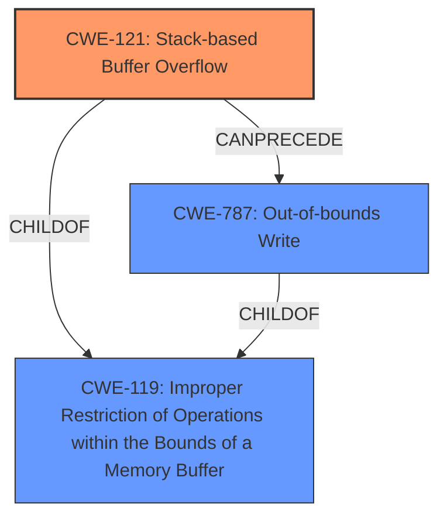

# Enhanced Analysis for CVE-2024-42943

# Summary
| CWE ID | CWE Name | Confidence | CWE Abstraction Level | CWE Vulnerability Mapping Label | CWE-Vulnerability Mapping Notes |
|---|---|---|---|---|---|
| CWE-121 | Stack-based Buffer Overflow | 1.0 | Variant | Primary CWE | Allowed |
| CWE-787 | Out-of-bounds Write | 0.7 | Base | Secondary Candidate | Allowed |
| CWE-119 | Improper Restriction of Operations within the Bounds of a Memory Buffer | 0.5 | Class | Secondary Candidate | Discouraged |

## Evidence and Confidence

*   **Confidence Score:** 0.9
*   **Evidence Strength:** HIGH

## Relationship Analysis
The primary CWE is CWE-121, which is a variant of CWE-119. CWE-787 represents the out-of-bounds write that occurs due to the stack-based buffer overflow. The hierarchical relationship guides the selection of the most specific CWE (CWE-121).



## Vulnerability Chain
The vulnerability chain starts with a **stack overflow** due to **improper bounds checking** when copying user-supplied data to a fixed-size buffer on the stack. This leads to an **out-of-bounds write**, which causes a denial-of-service. The root cause is the stack overflow, which has CWE-121 as its best match.

## Summary of Analysis
The analysis indicates a **stack overflow** vulnerability in Tenda FH1201. The `decodePwd` function copies the `PPPOEPassword` parameter to a stack buffer `v52` without proper bounds checking. If the `PPPOEPassword` is larger than `v52`, it overflows the buffer, leading to a denial of service.

The primary CWE is CWE-121 (Stack-based Buffer Overflow) because the overflow occurs on the stack. The "CWE for similar CVE Descriptions" section lists CWE-787 as the primary match, but since this a stack overflow, CWE-121 is preferred.

CWE-787 (Out-of-bounds Write) is considered as a secondary CWE, since it's the result of the stack overflow.

CWE-119 (Improper Restriction of Operations within the Bounds of a Memory Buffer) is a class-level CWE and a parent of CWE-121 and CWE-787. It is a broader category that encompasses buffer overflows and out-of-bounds writes.

The selection of CWE-121 is based on the specific location of the buffer overflow (stack), which makes it a more precise classification than CWE-787 or CWE-119.

Relevant CWE Information:

# Enhanced Context (25 CWEs)
The following CWEs were identified as potentially relevant to this vulnerability:

## CWE-121: Stack-based Buffer Overflow
**Abstraction Level**: Variant
**Similarity Score**: 0.74
**Source**: dense

**Description**:
A stack-based buffer overflow condition is a condition where the buffer being overwritten is allocated on the stack (i.e., is a local variable or, rarely, a parameter to a function).

**Mapping Guidance**:
- Usage: Allowed
- Rationale: This CWE entry is at the Variant level of abstraction, which is a preferred level of abstraction for mapping to the root causes of vulnerabilities.

## CWE-787: Out-of-bounds Write
**Abstraction Level**: base
**Similarity Score**: 3.30
**Source**: graph

**Description**:
CWE-787: Out-of-bounds Write

**Mapping Guidance**:
- Usage: Allowed
- Rationale: This CWE entry is at the Base level of abstraction, which is a preferred level of abstraction for mapping to the root causes of vulnerabilities.

**Relationships**:
- CANFOLLOW -> CWE-825
- CANFOLLOW -> CWE-824
- CANFOLLOW -> CWE-823
- CANFOLLOW -> CWE-822
- PARENTOF -> CWE-124

## CWE-119: Improper Restriction of Operations within the Bounds of a Memory Buffer
**Abstraction Level**: Class
**Similarity Score**: 0.216
**Source**: sparse

**Description**:
The product does not sufficiently control operations within the memory buffer, which could lead to read, write, or control operations outside of the intended boundaries of the buffer.

**Mapping Guidance**:
- Usage: Discouraged
- Rationale: This CWE entry is a Class and might have Base-level children that would be more appropriate

CWEs not selected:

- CWE-190: Integer Overflow or Wraparound: Not relevant as there is no integer overflow mentioned in the vulnerability description.
- CWE-674: Uncontrolled Recursion: Not relevant as there is no recursion mentioned in the vulnerability description.
- CWE-770: Allocation of Resources Without Limits or Throttling: Not relevant as the vulnerability is not related to resource allocation.
- CWE-122: Heap-based Buffer Overflow: Not relevant as the buffer overflow occurs on the stack, not the heap.
- CWE-1284: Improper Validation of Specified Quantity in Input: While the vulnerability involves a buffer overflow, the root cause is not the improper validation of the input size, but the lack of bounds checking during the copy operation.
- CWE-125: Out-of-bounds Read: Not relevant as the vulnerability involves an out-of-bounds write, not read.
- CWE-259: Use of Hard-coded Password: Not relevant as there are no hardcoded passwords in the description.
- CWE-128: Wrap-around Error: Not relevant as there is no wrap-around error in the description.


## CWE Relationship Analysis

Current CWEs represent these abstraction levels: .


### Vulnerability Chain Analysis

**Chain starting from CWE-121:**
- 121 (Stack-based Buffer Overflow) - ROOT


**Chain starting from CWE-1284:**
- 1284 (Improper Validation of Specified Quantity in Input) - ROOT


### CWE Relationship Diagram

```mermaid
graph TD
    classDef primary fill:#f96,stroke:#333,stroke-width:2px
    classDef secondary fill:#69f,stroke:#333
    classDef tertiary fill:#9e9,stroke:#333
```