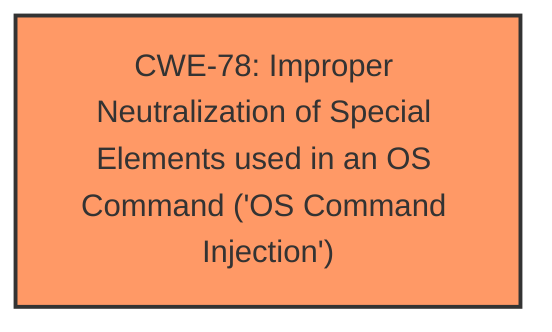

# Analysis Report for CVE-2024-42947

# Vulnerability Analysis Report: CVE-2024-42947

## Description

An issue in the handler function in /goform/telnet of Tenda FH1201 v1.2.0.14 (408) allows attackers to execute arbitrary commands via a crafted HTTP request.

## Vulnerability Description Key Phrases

- **Impact:** execute arbitrary commands
- **Vector:** crafted HTTP request
- **Attacker:** attackers
- **Product:** Tenda FH1201
- **Version:** v1.2.0.14 (408)
- **Component:** /goform/telnet

## Analysis (with Relationship Data)

# Summary
| CWE ID | CWE Name | Confidence | CWE Abstraction Level | CWE Vulnerability Mapping Label | CWE-Vulnerability Mapping Notes |
|---|---|---|---|---|---|
| CWE-78 | Improper Neutralization of Special Elements used in an OS Command ('OS Command Injection') | 0.9 | Base | Allowed | Primary CWE. The vulnerability allows attackers to execute arbitrary commands due to **improper neutralization** of special elements in the OS command. |

## Evidence and Confidence

*   **Confidence Score:** 0.9
*   **Evidence Strength:** MEDIUM

## Relationship Analysis
The primary CWE is CWE-78, which is a base level CWE. There are no child or parent relationships that strongly influence the selection in this case. The main factor is direct evidence of command injection.



## Vulnerability Chain
The vulnerability chain starts with the **improper neutralization** of special elements in the OS command, leading directly to the ability to execute arbitrary commands.

## Summary of Analysis
The vulnerability description clearly states that attackers can execute arbitrary commands via a crafted HTTP request, which points to command injection. The key phrase is "execute arbitrary commands". The retriever results also suggest CWE-78 as a possible match, with a score of 0.061.

The evidence from the vulnerability description is: "An issue in the handler function in /goform/telnet of Tenda FH1201 v1.2.0.14 (408) allows attackers to execute arbitrary commands via a crafted HTTP request."

CWE-78 (Improper Neutralization of Special Elements used in an OS Command ('OS Command Injection')) perfectly matches this scenario because it describes the situation where a product constructs an OS command using externally-influenced input but fails to neutralize special elements, leading to the execution of arbitrary commands.

CWE-74 (Improper Neutralization of Special Elements in Output Used by a Downstream Component ('Injection')) was considered but not chosen because it is a more general class of injection vulnerabilities. Since the vulnerability specifically involves OS command injection, CWE-78 is more appropriate.


## CWE Relationship Analysis

Current CWEs represent these abstraction levels: .


### Vulnerability Chain Analysis

**Chain starting from CWE-74:**
- 74 (Improper Neutralization of Special Elements in Output Used by a Downstream Component ('Injection')) - ROOT


**Chain starting from CWE-78:**
- 78 (Improper Neutralization of Special Elements used in an OS Command ('OS Command Injection')) - ROOT


### CWE Relationship Diagram

```mermaid
graph TD
    classDef primary fill:#f96,stroke:#333,stroke-width:2px
    classDef secondary fill:#69f,stroke:#333
    classDef tertiary fill:#9e9,stroke:#333
```


*Report generated on 2025-07-13 14:25:09*
