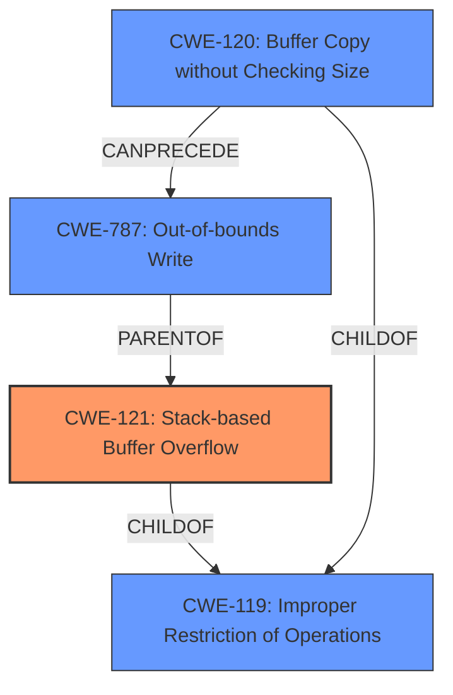

# Enhanced Analysis for CVE-2024-42948

# Summary
| CWE ID | CWE Name | Confidence | CWE Abstraction Level | CWE Vulnerability Mapping Label | CWE-Vulnerability Mapping Notes |
|---|---|---|---|---|---|
| CWE-121 | Stack-based Buffer Overflow | 1.0 | Variant |  Primary CWE | Allowed |
| CWE-787 | Out-of-bounds Write | 0.7 | Base | Secondary Candidate | Allowed |
| CWE-120 | Buffer Copy without Checking Size of Input ('Classic Buffer Overflow') | 0.6 | Base | Secondary Candidate | Allowed-with-Review |

## Evidence and Confidence

*   **Confidence Score:** 0.9
*   **Evidence Strength:** HIGH

## Relationship Analysis
The primary CWE identified is CWE-121 Stack-based Buffer Overflow, which is a variant of the more general CWE-119 Improper Restriction of Operations within the Bounds of a Memory Buffer. CWE-787 Out-of-bounds Write is a parent of CWE-121, representing a broader category of memory corruption issues. CWE-120 Buffer Copy without Checking Size is another child of CWE-119 that can lead to out-of-bounds writes. The relationship CANPRECEDE between CWE-120 and CWE-787 highlights how copying data without checking the size can lead to an out-of-bounds write.



## Vulnerability Chain
The vulnerability chain begins with the **improper** use of `sprintf` without bounds checking. This leads to a **buffer overflow** on the stack, specifically CWE-121 Stack-based Buffer Overflow. The overflow results in an out-of-bounds write, CWE-787. The final impact is a Denial of Service (DoS).

## Summary of Analysis
Based on the provided information, the primary weakness is a stack-based buffer overflow (CWE-121) caused by the **insecure** use of `sprintf` in the `fromPptpUserSetting` function. The `sprintf` function is used to format a string using user-controlled input from the `delno` parameter, and **no** bounds checking is performed. If the input is too large, it overwrites the buffer on the stack, leading to a denial of service.

The evidence for this includes:
*   The vulnerability description explicitly states "**stack overflow** via the delno parameter in the fromPptpUserSetting function."
*   The CVE Reference Links Content Summary states, "A stack buffer overflow vulnerability exists in the `fromPptpUserSetting` function... due to the insecure use of `sprintf`."
*   It further clarifies, "The `sprintf` function is used to format the string without proper bounds checking: `sprintf(v9, "vpn.ser.pptpuser%s", s);`. The size of `v9` is insufficient, leading to a buffer overflow if the user-provided input `s` (derived from `delno`) is too large."

The retriever results also support this, with CWE-121 having the highest similarity score.

CWE-787 Out-of-bounds Write is a closely related CWE, as the stack overflow leads to writing beyond the allocated buffer. However, CWE-121 is more specific in this case. CWE-120 Buffer Copy without Checking Size is also relevant, as `sprintf` is essentially copying data into the buffer without checking its size. However, the primary issue is the stack allocation and the resulting overflow on the stack, making CWE-121 the best fit.

The selection of CWE-121 is at the optimal level of specificity because it directly addresses the stack-based nature of the buffer overflow, which is a critical detail in understanding the vulnerability.

Relevant CWE Information:

# Enhanced Context (25 CWEs)
The following CWEs were identified as potentially relevant to this vulnerability:

## CWE-121: Stack-based Buffer Overflow
**Abstraction Level**: Variant
**Similarity Score**: 0.74
**Source**: dense

**Description**:
A stack-based buffer overflow condition is a condition where the buffer being overwritten is allocated on the stack (i.e., is a local variable or, rarely, a parameter to a function).

**Mapping Guidance**:
- Usage: Allowed
- Rationale: This CWE entry is at the Variant level of abstraction, which is a preferred level of abstraction for mapping to the root causes of vulnerabilities.


## CWE-755: Improper Handling of Exceptional Conditions
**Abstraction Level**: Class
**Similarity Score**: 0.70
**Source**: dense

**Description**:
The product does not handle or incorrectly handles an exceptional condition.

**Mapping Guidance**:
- Usage: Discouraged
- Rationale: This CWE entry is a level-1 Class (i.e., a child of a Pillar). It might have lower-level children that would be more appropriate


## CWE-78: Improper Neutralization of Special Elements used in an OS Command ('OS Command Injection')
**Abstraction Level**: Base
**Similarity Score**: 0.70
**Source**: dense

**Description**:
The product constructs all or part of an OS command using externally-influenced input from an upstream component, but it does not neutralize or incorrectly neutralizes special elements that could modify the intended OS command when it is sent to a downstream component.

**Mapping Guidance**:
- Usage: Allowed
- Rationale: This CWE entry is at the Base level of abstraction, which is a preferred level of abstraction for mapping to the root causes of vulnerabilities.


## CWE-1285: Improper Validation of Specified Index, Position, or Offset in Input
**Abstraction Level**: Base
**Similarity Score**: 0.70
**Source**: dense

**Description**:
The product receives input that is expected to specify an index, position, or offset into an indexable resource such as a buffer or file, but it does not validate or incorrectly validates that the specified index/position/offset has the required properties.

**Mapping Guidance**:
- Usage: Allowed
- Rationale: This CWE entry is at the Base level of abstraction, which is a preferred level of abstraction for mapping to the root causes of vulnerabilities.


## CWE-259: Use of Hard-coded Password
**Abstraction Level**: Variant
**Similarity Score**: 0.70
**Source**: dense

**Description**:
The product contains a hard-coded password, which it uses for its own inbound authentication or for outbound communication to external components.

**Mapping Guidance**:
- Usage: Allowed
- Rationale: This CWE entry is at the Variant level of abstraction, which is a preferred level of abstraction for mapping to the root causes of vulnerabilities.


## CWE-912: Hidden Functionality
**Abstraction Level**: Class
**Similarity Score**: 0.70
**Source**: dense

**Description**:
The product contains functionality that is not documented, not part of the specification, and not accessible through an interface or command sequence that is obvious to the product's users or administrators.

**Mapping Guidance**:
- Usage: Allowed-with-Review
- Rationale: This CWE entry is a Class and might have Base-level children that would be more appropriate


## CWE-288: Authentication Bypass Using an Alternate Path or Channel
**Abstraction Level**: Base
**Similarity Score**: 0.70
**Source**: dense

**Description**:
The product requires authentication, but the product has an alternate path or channel that does not require authentication.

**Mapping Guidance**:
- Usage: Allowed
- Rationale: This CWE entry is at the Base level of abstraction, which is a preferred level of abstraction for mapping to the root causes of vulnerabilities.


## CWE-134: Use of Externally-Controlled Format String
**Abstraction Level**: Base
**Similarity Score**: 0.70
**Source**: dense

**Description**:
The product uses a function that accepts a format string as an argument, but the format string originates from an external source.

**Mapping Guidance**:
- Usage: Allowed
- Rationale: This CWE entry is at the Base level of abstraction, which is a preferred level of abstraction for mapping to the root causes of vulnerabilities.


## CWE-131: Incorrect Calculation of Buffer Size
**Abstraction Level**: Base
**Similarity Score**: 0.69
**Source**: dense

**Description**:
The product does not correctly calculate


## CWE Relationship Analysis

Current CWEs represent these abstraction levels: .


### Vulnerability Chain Analysis

**Chain starting from CWE-288:**
- 288 (Authentication Bypass Using an Alternate Path or Channel) - ROOT


**Chain starting from CWE-121:**
- 121 (Stack-based Buffer Overflow) - ROOT


### CWE Relationship Diagram

```mermaid
graph TD
    classDef primary fill:#f96,stroke:#333,stroke-width:2px
    classDef secondary fill:#69f,stroke:#333
    classDef tertiary fill:#9e9,stroke:#333
```