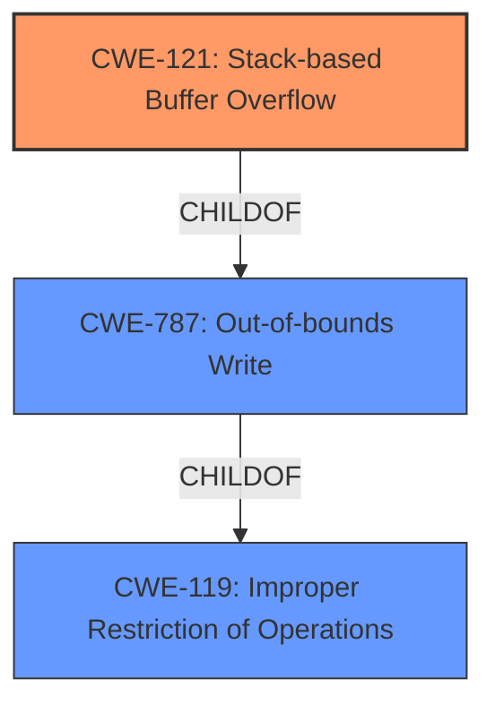

# Raw Analyzer Response for CVE-2024-42952

# Summary
| CWE ID | CWE Name | Confidence | CWE Abstraction Level | CWE Vulnerability Mapping Label | CWE-Vulnerability Mapping Notes |
|---|---|---|---|---|---|
| CWE-121 | Stack-based Buffer Overflow | 1.0 | Variant | Allowed | Primary CWE. Matches the vulnerability description and root cause evidence. |
| CWE-787 | Out-of-bounds Write | 0.8 | Base | Allowed | Secondary candidate. A more general form of the stack overflow. |
| CWE-119 | Improper Restriction of Operations within the Bounds of a Memory Buffer | 0.6 | Class | Discouraged | Secondary candidate. A very general description of memory corruption issues.|

## Evidence and Confidence

*   **Confidence Score:** 0.9
*   **Evidence Strength:** HIGH

## Relationship Analysis
The primary CWE is CWE-121 (Stack-based Buffer Overflow), which is a variant of the more general CWE-119 (Improper Restriction of Operations within the Bounds of a Memory Buffer). CWE-787 (Out-of-bounds Write) is also related, as a stack overflow is a specific type of out-of-bounds write.

## Vulnerability Chain
The vulnerability chain starts with the **stack overflow** (CWE-121). This is caused by using `sprintf` without proper bounds checking when handling the `page` parameter from a POST request. This leads to an out-of-bounds write (CWE-787), which allows an attacker to overwrite adjacent data on the stack and potentially gain arbitrary code execution, leading to a denial of service.

## Summary of Analysis
The initial assessment identified a **stack overflow** vulnerability in Tenda FH1201, caused by **improper** use of `sprintf` with user-controlled input. The vulnerability allows attackers to perform an out-of-bounds write, leading to a denial of service.

The evidence for the **stack overflow** is strong, based on the "Vulnerability Description Key Phrases" which has the **weakness** as "**stack overflow**" and the "CVE Reference Links Content Summary" which indicates:
*   "A stack-based buffer overflow vulnerability exists in the `fromqossetting` function of the Tenda FH1201 firmware."
*   "The `sprintf` function is used to construct a string using a user-supplied parameter without proper bounds checking. The statement `sprintf(v7, "qos_list.asp?page=%s", v4);`, where `v4` is derived from user-controlled input `page`, copies the user-provided data into a fixed-size buffer `v7`. If the size of `v4` exceeds the size of `v7`, a stack-based buffer overflow occurs."

The graph relationships confirm that CWE-121 (Stack-based Buffer Overflow) is a more specific type of CWE-119 (Improper Restriction of Operations within the Bounds of a Memory Buffer) and CWE-787 (Out-of-bounds Write), making it the most accurate choice.
The selection of CWE-121 is at the optimal level of specificity as it directly describes the stack-based nature of the buffer overflow.

The retriever results suggested CWE-787 (Out-of-bounds Write) which is a valid, but more general, description of the vulnerability. CWE-119 (Improper Restriction of Operations within the Bounds of a Memory Buffer) is too general and discouraged.

**CWE Considerations:**

*   **CWE-121 Stack-based Buffer Overflow:** This is the most specific and accurate CWE for this vulnerability. The vulnerability description explicitly mentions a **stack overflow**, and the root cause is the use of `sprintf` without proper bounds checking, leading to an out-of-bounds write on the stack.
*   **CWE-787 Out-of-bounds Write:** This is a valid CWE, as a stack overflow is a specific type of out-of-bounds write. However, CWE-121 is more specific and therefore preferred.
*   **CWE-119 Improper Restriction of Operations within the Bounds of a Memory Buffer:** This CWE is too general and discouraged, as it encompasses a wide range of memory corruption issues. CWE-121 and CWE-787 are more specific and provide a better description of the vulnerability.

Based on the analysis, the primary CWE is CWE-121 (Stack-based Buffer Overflow) with high confidence (1.0) due to the direct evidence in the vulnerability description and root cause analysis. CWE-787 (Out-of-bounds Write) is a secondary candidate with a confidence of 0.8. CWE-119 (Improper Restriction of Operations within the Bounds of a Memory Buffer) is a tertiary candidate with a confidence of 0.6, but is too general.