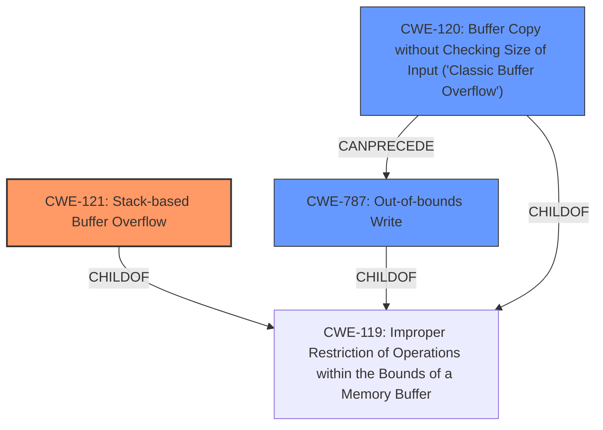

# Analysis for CVE-2024-42987

# Summary
| CWE ID  | CWE Name                                                      | Confidence | CWE Abstraction Level | CWE Vulnerability Mapping Label | CWE-Vulnerability Mapping Notes |
| :-------- | :------------------------------------------------------------ | :--------- | :---------------------- | :------------------------------ | :------------------------------ |
| CWE-121 | Stack-based Buffer Overflow                                   | 1.0        | Variant               | Allowed                       | Primary CWE                     |
| CWE-787 | Out-of-bounds Write                                           | 0.7        | Base                  | Allowed                       | Secondary Candidate             |
| CWE-120 | Buffer Copy without Checking Size of Input ('Classic Buffer Overflow') | 0.6        | Base                  | Allowed-with-Review           | Secondary Candidate             |

## Evidence and Confidence

*   **Confidence Score:** 0.9
*   **Evidence Strength:** HIGH

## Relationship Analysis

The primary CWE is CWE-121 Stack-based Buffer Overflow, which is a variant of the more general CWE-119 Improper Restriction of Operations within the Bounds of a Memory Buffer. CWE-787 Out-of-bounds Write is a parent of CWE-124 Buffer Underwrite. CWE-120 Buffer Copy without Checking Size of Input ('Classic Buffer Overflow') can precede CWE-416 Use After Free. CWE-121 is more specific than CWE-787 and CWE-120, aligning well with the vulnerability description.

## Vulnerability Chain

The vulnerability chain starts with the **stack overflow** due to the use of `sprintf` without proper bounds checking. This leads to an out-of-bounds write, potentially overwriting the return address on the stack, and ultimately causing a Denial of Service (DoS).
  - Root Cause: **Stack overflow** in `fromPptpUserAdd` function due to unbounded `sprintf`.
  - Weakness: Out-of-bounds write due to buffer overflow.
  - Impact: Denial of Service (DoS) via a crafted POST request.

## Summary of Analysis

The vulnerability description clearly indicates a **stack overflow** condition in the `fromPptpUserAdd` function, caused by using `sprintf` without proper bounds checking. The "CVE Reference Links Content Summary" explicitly states that "This vulnerability stems from the use of `sprintf` without proper bounds checking when handling user-supplied data." The primary CWE match from similar CVE descriptions is CWE-787, but the retriever results list CWE-121 Stack-based Buffer Overflow with the highest similarity score. Given the explicit mention of a "stack overflow" and the root cause being an unbounded write to a stack-allocated buffer, CWE-121 is the most appropriate and specific classification.

CWE-787 Out-of-bounds Write is considered as a secondary candidate because it represents the nature of the write operation that caused the overflow.

CWE-120 Buffer Copy without Checking Size of Input ('Classic Buffer Overflow') is also considered because the rootcause involves a buffer copy without size checking. However, since the overflow occurs on the stack, CWE-121 is the best fit.

The selected CWEs are at the optimal level of specificity, with CWE-121 being a Variant that accurately captures the stack-based nature of the overflow, while CWE-787 and CWE-120 represent the write operation and lack of size checking respectively.

Relevant CWE Information:

# Enhanced Context (25 CWEs)
The following CWEs were identified as potentially relevant to this vulnerability:

## CWE-121: Stack-based Buffer Overflow
**Abstraction Level**: Variant
**Similarity Score**: 0.74
**Source**: dense

**Description**:
A stack-based buffer overflow condition is a condition where the buffer being overwritten is allocated on the stack (i.e., is a local variable or, rarely, a parameter to a function).

**Mapping Guidance**:
- Usage: Allowed
- Rationale: This CWE entry is at the Variant level of abstraction, which is a preferred level of abstraction for mapping to the root causes of vulnerabilities.

**Justification:** This CWE is the best fit as the vulnerability is explicitly described as a **stack overflow**.

## CWE-134: Use of Externally-Controlled Format String
**Abstraction Level**: Base
**Similarity Score**: 0.71
**Source**: dense

**Description**:
The product uses a function that accepts a format string as an argument, but the format string originates from an external source.

**Mapping Guidance**:
- Usage: Allowed
- Rationale: This CWE entry is at the Base level of abstraction, which is a preferred level of abstraction for mapping to the root causes of vulnerabilities.

**Justification:** This CWE is not the best fit because the **stack overflow** is not caused by an externally controlled format string.

## CWE-755: Improper Handling of Exceptional Conditions
**Abstraction Level**: Class
**Similarity Score**: 0.70
**Source**: dense

**Description**:
The product does not handle or incorrectly handles an exceptional condition.

**Mapping Guidance**:
- Usage: Discouraged
- Rationale: This CWE entry is a level-1 Class (i.e., a child of a Pillar). It might have lower-level children that would be more appropriate

**Justification:** This CWE is too generic.

## CWE-191: Integer Underflow (Wrap or Wraparound)
**Abstraction Level**: Base
**Similarity Score**: 0.70
**Source**: dense

**Description**:
The product subtracts one value from another, such that the result is less than the minimum allowable integer value, which produces a value that is not equal to the correct result.

**Mapping Guidance**:
- Usage: Allowed
- Rationale: This CWE entry is at the Base level of abstraction, which is a preferred level of abstraction for mapping to the root causes of vulnerabilities.

**Justification:** This CWE is not related to the vulnerability.

## CWE-78: Improper Neutralization of Special Elements used in an OS Command ('OS Command Injection')
**Abstraction Level**: Base
**Similarity Score**: 0.70
**Source**: dense

**Description**:
The product constructs all or part of an OS command using externally-influenced input from an upstream component, but it does not neutralize or incorrectly neutralizes special elements that could modify the intended OS command when it is sent to a downstream component.

**Mapping Guidance**:
- Usage: Allowed
- Rationale: This CWE entry is at the Base level of abstraction, which is a preferred level of abstraction for mapping to the root causes of vulnerabilities.

**Justification:** This CWE is not related to the vulnerability.

## CWE-1285: Improper Validation of Specified Index, Position, or Offset in Input
**Abstraction Level**: Base
**Similarity Score**: 0.70
**Source**: dense

**Description**:
The product receives input that is expected to specify an index, position, or offset into an indexable resource such as a buffer or file, but it does not validate or incorrectly validates that the specified index/position/offset has the required properties.

**Mapping Guidance**:
- Usage: Allowed
- Rationale: This CWE entry is at the Base level of abstraction, which is a preferred level of abstraction for mapping to the root causes of vulnerabilities.

**Justification:** This CWE is not directly related, although the lack of bounds checking could be seen as a form of improper validation.

## CWE-912: Hidden Functionality
**Abstraction Level**: Class
**Similarity Score**: 0.69
**Source**: dense

**Description**:
The product contains functionality that is not documented, not part of the specification, and not accessible through an interface or command sequence that is obvious to the product's users or administrators.

**Mapping Guidance**:
- Usage: Allowed-with-Review
- Rationale: This CWE entry is a Class and might have Base-level children that would be more appropriate

**Justification:** This CWE is not related to the vulnerability.

## CWE-259: Use of Hard-coded Password
**Abstraction Level**: Variant
**Similarity Score**: 0.69
**Source**: dense

**Description**:
The product contains a hard-coded password, which it uses for its own inbound authentication or for outbound communication to external components.

**