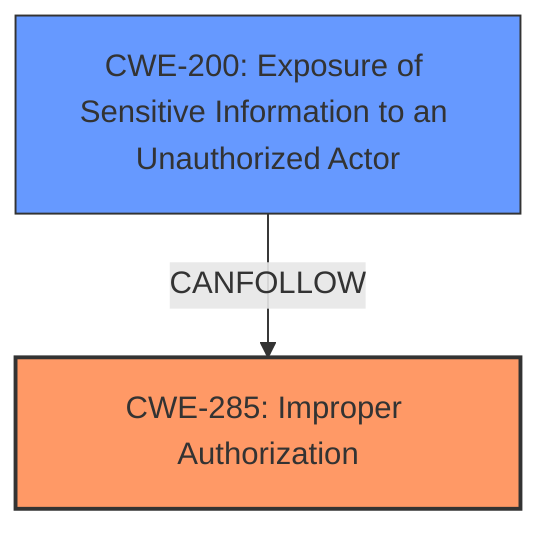

# Analysis Report for CVE-2024-42988

# Vulnerability Analysis Report: CVE-2024-42988

## Description

**Lack of access control** in ChallengeSolves (/api/v1/challenges//solves) of CTFd v2.0.0 - v3.7.2 allows authenticated users to retrieve a list of users who have solved the challenge, regardless of the Account Visibility settings. The issue is fixed in v3.7.3+.

## Vulnerability Description Key Phrases

- **Rootcause:** Lack of access control
- **Impact:** retrieve a list of users who have solved the challenge
- **Attacker:** authenticated users
- **Product:** CTFd
- **Version:** v2.0.0 - v3.7.2
- **Component:** ChallengeSolves (/api/v1/challenges//solves)

## Analysis (with Relationship Data)

# Summary

| CWE ID  | CWE Name                                                                      | Confidence | CWE Abstraction Level | CWE Vulnerability Mapping Label | CWE-Vulnerability Mapping Notes |
| :-------- | :----------------------------------------------------------------------------- | :---------- | :---------------------- | :------------------------------ | :----------------------------- |
| CWE-285 | Improper Authorization                                                              | 0.95       | Class                    | Primary CWE                    | Discouraged                  |
| CWE-200 | Exposure of Sensitive Information to an Unauthorized Actor                       | 0.75       | Class                    | Secondary Candidate             | Discouraged                  |

## Evidence and Confidence

*   **Confidence Score:** 0.85
*   **Evidence Strength:** HIGH

## Relationship Analysis

The primary relationship that impacted the decision was the parent-child relationship between CWE-285 (Improper Authorization) and its potential base-level children. While a more specific child CWE could theoretically exist, the provided information does not give enough detail to specify the exact authorization flaw. CWE-200 (Exposure of Sensitive Information to an Unauthorized Actor) is a potential impact of the authorization failure.



## Vulnerability Chain

The vulnerability chain starts with **lack of access control** (mapped to CWE-285 Improper Authorization), leading to the **impact** of retrieving a list of users who have solved the challenge (**Exposure of Sensitive Information** CWE-200), regardless of the Account Visibility settings.

## Summary of Analysis

The initial analysis focused on identifying the root cause of the vulnerability, which is the **lack of access control**. Based on the provided evidence, specifically the "Vulnerability Description Key Phrases" and the "CVE Reference Links Content Summary", the vulnerability stems from a failure to properly restrict access to challenge solve information. The mapping guidance suggests that if the issue involves improper or missing role checks, CWE-285 is a better choice than CWE-284. While CWE-285 is discouraged, it is a better fit than its parent CWE-284. The impact of this vulnerability is information disclosure, as an attacker could potentially discover the usernames of accounts that have solved specific challenges.

The provided evidence states:

*   "**Lack of access control** in ChallengeSolves (/api/v1/challenges//solves) of CTFd v2.0.0 - v3.7.2 allows authenticated users to retrieve a list of users who have solved the challenge, regardless of the Account Visibility settings."
*   "The vulnerability stems from an issue in CTFd where challenge solves and account names could be seen, despite the CTFd instance being configured to hide account information."
*   "**Inadequate Access Control/Data Filtering:** The primary weakness is the failure to properly restrict access to challenge solve information and associated account names when account visibility is set to hidden."

The retriever suggested CWE-285 (Improper Authorization), CWE-284 (Improper Access Control), and CWE-200 (Exposure of Sensitive Information to an Unauthorized Actor).

*   CWE-285 is selected as the primary weakness since it represents the **improper authorization** leading to the unauthorized access.
*   CWE-200 is selected as a secondary weakness because it represents the impact of the vulnerability.
*   CWE-284 was not selected because CWE-285 provides a more specific root cause.

The selected CWEs are at the optimal level of specificity given the available information. Further investigation may reveal a more specific Base-level CWE for the authorization issue, but based on the current evidence, CWE-285 is the most appropriate choice.

Relevant CWE Information:

## CWE-285: Improper Authorization

**Technical Explanation:** The application performs an authorization check, but the check is not correctly implemented, allowing users to bypass intended restrictions.

**Security Implications:** Unauthorized users can access resources or perform actions that should be restricted, potentially leading to information disclosure, data modification, or other security breaches.

**Relationship Analysis:** CWE-285 is a Class-level CWE.

**Mapping Guidance Analysis:** CWE-285 is "Discouraged" but is preferred over CWE-284 if the issue involves improper or missing role checks.

## CWE-200: Exposure of Sensitive Information to an Unauthorized Actor

**Technical Explanation:** The application exposes sensitive information to unauthorized actors due to inadequate access controls or data filtering.

**Security Implications:** Sensitive information, such as usernames, email addresses, or other personal data, can be disclosed to unauthorized users, leading to privacy violations or potential identity theft.

**Relationship Analysis:** CWE-200 is a Class-level CWE that can be a consequence of other vulnerabilities.

**Mapping Guidance Analysis:** CWE-200 is "Discouraged" as it represents a technical impact rather than a root cause. However, it is included here as a secondary CWE to represent the specific impact of the authorization failure.


## CWE Relationship Analysis

Current CWEs represent these abstraction levels: .


### Vulnerability Chain Analysis

**Chain starting from CWE-284:**
- 284 (Improper Access Control) - ROOT


**Chain starting from CWE-200:**
- 200 (Exposure of Sensitive Information to an Unauthorized Actor) - ROOT


### CWE Relationship Diagram

```mermaid
graph TD
    classDef primary fill:#f96,stroke:#333,stroke-width:2px
    classDef secondary fill:#69f,stroke:#333
    classDef tertiary fill:#9e9,stroke:#333
```


*Report generated on 2025-07-13 14:29:25*
