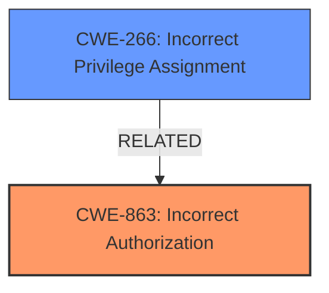

# Raw Analyzer Response for CVE-2024-42995

# Summary
| CWE ID | CWE Name | Confidence | CWE Abstraction Level | CWE Vulnerability Mapping Label | CWE-Vulnerability Mapping Notes |
|---|---|---|---|---|---|
| CWE-863 | Incorrect Authorization | 1.0 | Class | Primary CWE | Allowed-with-Review |
| CWE-266 | Incorrect Privilege Assignment | 0.7 | Base | Secondary Candidate | Allowed |

## Evidence and Confidence

*   **Confidence Score:** 0.85
*   **Evidence Strength:** HIGH

## Relationship Analysis
The primary CWE is CWE-863, which is a Class-level CWE. While it would be ideal to find a more specific Base or Variant CWE, the evidence points to an authorization issue where the check is present but **incorrect**. CWE-266 is also considered because the root cause involves privilege assignment. The relationship between CWE-863 and its possible child CWEs (which are not explicitly listed in the provided data, but exist in the full CWE hierarchy) would ideally lead to a more specific child CWE. Since no specific child CWE is provided, we will classify this as CWE-863.

## Vulnerability Chain
The vulnerability chain starts with the **incorrect authorization** in the `Migration_DisableModules_Action` class (CWE-863). Because there is **no** `checkPermission` function it falls back to default which gives any authenticated user access. This leads to the impact of a low-privileged user being able to disable arbitrary modules, causing a service disruption.

## Summary of Analysis
The vulnerability description clearly states that the VTiger CRM system does not correctly check user privileges, allowing low-privileged users to disable arbitrary modules. The key evidence is that the `Migration_DisableModules_Action` class **does not implement a specific `checkPermission` function**, thus falling back to the default implementation that grants access to every authenticated user.

The Retriever Results identified CWE-863 as a strong candidate, "The product performs an authorization check when an actor attempts to access a resource or perform an action, but it does not correctly perform the check." Although a `checkPermission` function is missing, the code still falls back to a default permission check, so this is an **incorrect authorization** rather than **missing authorization**. Therefore, CWE-863 is more appropriate than CWE-862 (Missing Authorization).

CWE-266 (Incorrect Privilege Assignment) is considered as a secondary candidate because the root cause involves privilege assignment, however, the **incorrect authorization** check is the primary weakness that allows the vulnerability to be exploited.

The selection of CWE-863 is at the optimal level of specificity given the available information. While a more specific child CWE of CWE-863 would be ideal, the current evidence supports CWE-863 as the most accurate classification.

Relevant CWE Information:

# Enhanced Context (25 CWEs)
The following CWEs were identified as potentially relevant to this vulnerability:

## CWE-266: Incorrect Privilege Assignment
**Abstraction Level**: Base
**Similarity Score**: 1386.74
**Source**: sparse

**Description**:
A product incorrectly assigns a privilege to a particular actor, creating an unintended sphere of control for that actor.

**Mapping Guidance**:
- Usage: Allowed
- Rationale: This CWE entry is at the Base level of abstraction, which is a preferred level of abstraction for mapping to the root causes of vulnerabilities.

## CWE-863: Incorrect Authorization
**Abstraction Level**: Class
**Similarity Score**: 1532.63
**Source**: sparse

**Description**:
The product performs an authorization check when an actor attempts to access a resource or perform an action, but it does not correctly perform the check.

**Mapping Guidance**:
- Usage: Allowed-with-Review
- Rationale: This CWE entry is a Class and might have Base-level children that would be more appropriate