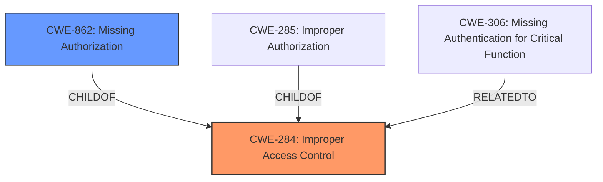

# Analysis Report for CVE-2024-43031

# Vulnerability Analysis Report: CVE-2024-43031

## Description

autMan v2.9.6 was discovered to contain an **access control issue**.

## Vulnerability Description Key Phrases

- **Rootcause:** access control issue
- **Product:** autMan
- **Version:** v2.9.6

## Analysis (with Relationship Data)

# Summary
| CWE ID | CWE Name | Confidence | CWE Abstraction Level | CWE Vulnerability Mapping Label | CWE-Vulnerability Mapping Notes |
|---|---|---|---|---|---|
| CWE-284 | Improper Access Control | 0.7 | Pillar | Primary CWE | Allowed |
| CWE-862 | Missing Authorization | 0.6 | Class | Secondary Candidate | Allowed-with-Review |

## Evidence and Confidence

*   **Confidence Score:** 0.7
*   **Evidence Strength:** LOW

## Relationship Analysis
The primary relationship influencing the CWE selection is the hierarchical structure. CWE-284 is a high-level class, while CWE-862 is a more specific child. Given the limited information, it's difficult to determine whether the issue is specifically related to missing authorization (CWE-862) or a more general access control problem (CWE-284). Therefore, CWE-284 is selected as the primary CWE due to the lack of specific root cause details. If more information were available on whether authentication occurred, or on the specific mechanisms in place, it could be possible to select a more specific CWE.



## Vulnerability Chain
The vulnerability chain is:
1.  **Improper Access Control (CWE-284)**: The system has an **access control issue**.
2.  **Potential Impact**: Unauthorized access to resources or functionalities.

The provided information does not allow for a more detailed chain, as it only identifies a general access control issue.

## Summary of Analysis
The analysis is based on the limited information provided in the vulnerability description, which states that the software has an **access control issue**. Without further details, it is difficult to pinpoint the exact nature of the weakness.

The selection of CWE-284 is justified by the lack of specific information. If the issue were clearly related to missing authentication or authorization, a more specific CWE like CWE-306 or CWE-862 would be more appropriate. However, the general nature of the description suggests that CWE-284 is the most suitable choice.

The provided evidence is: "autMan v2.9.6 was discovered to contain an **access control issue**."

The graph relationships influenced the decision to consider CWE-862 as a secondary candidate, but the lack of information about authentication or authorization mechanisms led to the selection of the more general CWE-284.

The selected CWE is at the optimal level of specificity given the available information. More detailed information would be needed to justify the selection of a more specific CWE.

Relevant CWE Information:

# Enhanced Context (25 CWEs)

## CWE-284: Improper Access Control
**Abstraction Level**: Pillar
**Similarity Score**: 0.083 (sparse)
**Description**: The product does not adequately control access to resources or functions, allowing unintended access.
**Mapping Guidance**: Discouraged as a primary mapping if more specific CWEs are available.

## CWE-862: Missing Authorization
**Abstraction Level**: Class
**Similarity Score**: 0.534 (dense)
**Description**: The application doesn't check whether the user is authorized at all.
**Mapping Guidance**: Allowed-with-Review, consider base-level children for more specificity.

## CWE-285: Improper Authorization
**Abstraction Level**: Class
**Similarity Score**: 0.081 (sparse)
**Description**: The product does not perform or incorrectly performs an authorization check when an actor attempts to access a resource or perform an action.
**Mapping Guidance**: Discouraged, lower-level CWEs can frequently be used instead.

## CWE-306: Missing Authentication for Critical Function
**Abstraction Level**: Base
**Similarity Score**: 0.083 (sparse)
**Description**: The product does not perform any authentication for functionality that requires a provable user identity or consumes a significant amount of resources.
**Mapping Guidance**: Allowed.

## CWE-280: Improper Handling of Insufficient Permissions or Privileges
**Abstraction Level**: Base
**Similarity Score**: 0.085 (sparse), 2.48 (graph)
**Description**: The product does not handle or incorrectly handles when it has insufficient privileges to access resources or functionality as specified by their permissions.
**Mapping Guidance**: Allowed.

CWEs considered but not used:

*   CWE-306: Missing Authentication for Critical Function: While possible, there's no specific mention of missing authentication, so it's less likely than a general access control issue.
*   CWE-862: Missing Authorization: Considered, but chosen as a secondary candidate due to the lack of information on whether authentication occurs.
*   CWE-285: Improper Authorization: Similar to CWE-862, but less specific.
*   CWE-280: Improper Handling of Insufficient Permissions or Privileges: Similar to CWE-284, but focuses on insufficient permissions, which is not explicitly mentioned.


## CWE Relationship Analysis

Current CWEs represent these abstraction levels: .


### Vulnerability Chain Analysis

**Chain starting from CWE-280:**
- 280 (Improper Handling of Insufficient Permissions or Privileges ) - ROOT


**Chain starting from CWE-862:**
- 862 (Missing Authorization) - ROOT


### CWE Relationship Diagram

```mermaid
graph TD
    classDef primary fill:#f96,stroke:#333,stroke-width:2px
    classDef secondary fill:#69f,stroke:#333
    classDef tertiary fill:#9e9,stroke:#333
```


*Report generated on 2025-07-13 14:30:22*
