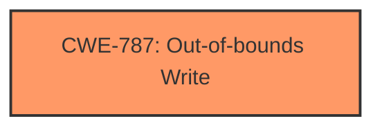

# Analysis Report for CVE-2024-43049

# Vulnerability Analysis Report: CVE-2024-43049

## Description

**Memory corruption** while invoking IOCTL calls from user space to set generic private command inside WLAN driver.

## Vulnerability Description Key Phrases

- **Weakness:** Memory corruption
- **Component:** WLAN driver

## Analysis (with Relationship Data)

# Summary
| CWE ID | CWE Name | Confidence | CWE Abstraction Level | CWE Vulnerability Mapping Label | CWE-Vulnerability Mapping Notes |
|---|---|---|---|---|---|
| CWE-787 | Out-of-bounds Write | 0.9 | Base | Allowed | Primary CWE.  The vulnerability description mentions "**Memory corruption**" which can be caused by an out-of-bounds write. |

## Evidence and Confidence

*   **Confidence Score:** 0.9
*   **Evidence Strength:** MEDIUM

## Relationship Analysis
The primary identified weakness is CWE-787 [CWE-787: Out-of-bounds Write], which is a base-level CWE. There are no clear hierarchical or chain relationships that would suggest a more specific or related CWE in this case based on the limited information.



## Vulnerability Chain
The vulnerability chain starts with the IOCTL call from user space, leading to a generic private command inside the WLAN driver, and ultimately resulting in **memory corruption** due to an out-of-bounds write (CWE-787).

## Summary of Analysis
Based on the provided information, the most relevant CWE appears to be CWE-787 [CWE-787: Out-of-bounds Write]. The vulnerability description explicitly mentions "**Memory corruption**" while invoking IOCTL calls within the WLAN driver, which aligns well with the characteristics of an out-of-bounds write.

The retriever results also list CWE-787 [CWE-787: Out-of-bounds Write] as the top candidate with a score of 1.000, further supporting this classification.

Other CWEs, such as CWE-782 [CWE-782: Exposed IOCTL with Insufficient Access Control], CWE-704 [CWE-704: Incorrect Type Conversion or Cast], and CWE-823 [CWE-823: Use of Out-of-range Pointer Offset], were considered but ultimately deemed less relevant. While the vulnerability involves IOCTL calls, the primary issue is the resulting memory corruption, not necessarily the exposure or access control of the IOCTL itself. Similarly, while type conversions or pointer offsets could potentially contribute to memory corruption, the description doesn't provide enough evidence to support those specific weaknesses.

The selection of CWE-787 [CWE-787: Out-of-bounds Write] is at the base level of abstraction, which is appropriate given the available information. A more specific variant might exist, but the current description doesn't provide sufficient details to identify it.

Relevant CWE Information:

# Enhanced Context (25 CWEs)
The following CWEs were identified as potentially relevant to this vulnerability:

## CWE-782: Exposed IOCTL with Insufficient Access Control
**Abstraction Level**: Variant
**Similarity Score**: 0.73
**Source**: dense

**Description**:
The product implements an IOCTL with functionality that should be restricted, but it does not properly enforce access control for the IOCTL.

**Mapping Guidance**:
- Usage: Allowed
- Rationale: This CWE entry is at the Variant level of abstraction, which is a preferred level of abstraction for mapping to the root causes of vulnerabilities.

## CWE-704: Incorrect Type Conversion or Cast
**Abstraction Level**: Class
**Similarity Score**: 0.69
**Source**: dense

**Description**:
The product does not correctly convert an object, resource, or structure from one type to a different type.

**Mapping Guidance**:
- Usage: Allowed-with-Review
- Rationale: This CWE entry is a Class and might have Base-level children that would be more appropriate

## CWE-823: Use of Out-of-range Pointer Offset
**Abstraction Level**: Base
**Similarity Score**: 0.68
**Source**: dense

**Description**:
The product performs pointer arithmetic on a valid pointer, but it uses an offset that can point outside of the intended range of valid memory locations for the resulting pointer.

**Mapping Guidance**:
- Usage: Allowed
- Rationale: This CWE entry is at the Base level of abstraction, which is a preferred level of abstraction for mapping to the root causes of vulnerabilities.


## CWE Relationship Analysis

Current CWEs represent these abstraction levels: .


### Vulnerability Chain Analysis

**Chain starting from CWE-704:**
- 704 (Incorrect Type Conversion or Cast) - ROOT


**Chain starting from CWE-787:**
- 787 (Out-of-bounds Write) - ROOT


### CWE Relationship Diagram

```mermaid
graph TD
    classDef primary fill:#f96,stroke:#333,stroke-width:2px
    classDef secondary fill:#69f,stroke:#333
    classDef tertiary fill:#9e9,stroke:#333
```


*Report generated on 2025-07-13 14:30:58*
