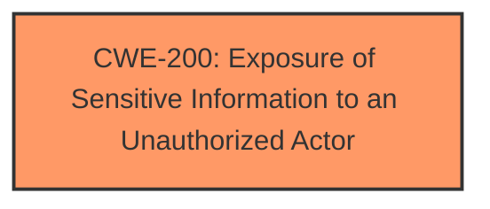

# Enhanced Analysis for CVE-2024-43051

# Summary

| CWE ID | CWE Name | Confidence | CWE Abstraction Level | CWE Vulnerability Mapping Label | CWE-Vulnerability Mapping Notes |
|---|---|---|---|---|---|
| CWE-200 | Exposure of Sensitive Information to an Unauthorized Actor | 0.7 | Class | Discouraged | The vulnerability description indicates an information disclosure, which aligns with the characteristics of CWE-200. However, CWE-200 is a high-level category, and more specific CWEs might be applicable if more details about the root cause were known. |

## Evidence and Confidence

*   **Confidence Score:** 0.7
*   **Evidence Strength:** LOW

## Relationship Analysis
The primary relationship considered was the parent-child relationship. CWE-200 is a class-level CWE, and there might be more specific child CWEs that could be applicable if more information were available. However, based on the limited information provided, CWE-200 is the most suitable choice.



## Vulnerability Chain
The vulnerability chain starts with the **root cause**, which is not explicitly stated in the description, and leads to the **impact**, which is information disclosure. The chain is:
`[Root Cause] -> Information Disclosure (CWE-200)`
Without further details, it is challenging to determine the specific root cause.

## Summary of Analysis
The analysis is based on the limited information provided in the vulnerability description, which states "Information disclosure while deriving keys for a session for any Widevine use case." The key phrase is "**impact:** Information disclosure".

The Retriever Results list CWE-200 "Exposure of Sensitive Information to an Unauthorized Actor" as the top result with a score of 0.800. Although CWE-200 is discouraged as it is a high-level class, the lack of root cause information makes it the most appropriate choice currently.

Other CWEs from the Retriever Results were considered but not used:

*   CWE-459 "Incomplete Cleanup", CWE-1295 "Debug Messages Revealing Unnecessary Information", CWE-330 "Use of Insufficiently Random Values", CWE-941 "Incorrectly Specified Destination in a Communication Channel", CWE-201 "Insertion of Sensitive Information Into Sent Data", CWE-540 "Inclusion of Sensitive Information in Source Code", CWE-1240 "Use of a Cryptographic Primitive with a Risky Implementation", CWE-1291 "Public Key Re-Use for Signing both Debug and Production Code", CWE-202 "Exposure of Sensitive Information Through Data Queries": These CWEs were not selected because they require more specific information about the **root cause** of the vulnerability than is provided in the description.

The decision to use CWE-200 is based on the explicit mention of information disclosure as the **impact** of the vulnerability. Without additional details, a more specific CWE cannot be selected with confidence.


## CWE Relationship Analysis

Current CWEs represent these abstraction levels: .


### Vulnerability Chain Analysis

**Chain starting from CWE-1240:**
- 1240 (Use of a Cryptographic Primitive with a Risky Implementation) - ROOT


**Chain starting from CWE-540:**
- 540 (Inclusion of Sensitive Information in Source Code) - ROOT


### CWE Relationship Diagram

```mermaid
graph TD
    classDef primary fill:#f96,stroke:#333,stroke-width:2px
    classDef secondary fill:#69f,stroke:#333
    classDef tertiary fill:#9e9,stroke:#333
```