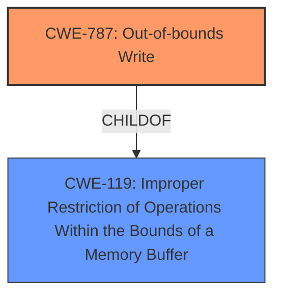

# Analysis Report for CVE-2024-43060

# Vulnerability Analysis Report: CVE-2024-43060

## Description

Memory corruption during voice activation, when sound model parameters are loaded from HLOS to ADSP.

## Vulnerability Description Key Phrases

- **Weakness:** memory corruption

## Analysis (with Relationship Data)

# Summary
| CWE ID | CWE Name | Confidence | CWE Abstraction Level | CWE Vulnerability Mapping Label | CWE-Vulnerability Mapping Notes |
|---|---|---|---|---|---|
| CWE-787 | Out-of-bounds Write | 0.9 | Base | Primary | Allowed |

## Evidence and Confidence

*   **Confidence Score:** 0.9
*   **Evidence Strength:** MEDIUM

## Relationship Analysis
The primary weakness is an out-of-bounds write (CWE-787). This is a child of the more general CWE-119 (Improper Restriction of Operations Within the Bounds of a Memory Buffer). There are no explicit chain relationships mentioned in the description but typically CWE-787 can be preceded by integer overflows (CWE-190) or incorrect buffer size calculations (CWE-131) although there is no mention of this in the description.. The base level of CWE-787 is the most appropriate level of abstraction.



## Vulnerability Chain
The vulnerability chain is relatively simple. The root cause is a **memory corruption**, which leads to an out-of-bounds write when sound model parameters are loaded.

## Summary of Analysis
The vulnerability description clearly indicates a **memory corruption** issue leading to an out-of-bounds write when loading sound model parameters. The retriever results strongly suggest CWE-787 (Out-of-bounds Write) as the primary candidate. Given that the description explicitly mentions "memory corruption," and the operation involves loading sound model parameters (suggesting a write operation), CWE-787 is the most appropriate and specific choice.

CWE-190 (Integer Overflow or Wraparound), CWE-415 (Double Free), CWE-822 (Untrusted Pointer Dereference), CWE-134 (Use of Externally-Controlled Format String), CWE-908 (Use of Uninitialized Resource), CWE-823 (Use of Out-of-range Pointer Offset), and CWE-843 (Access of Resource Using Incompatible Type ('Type Confusion')) were considered but not selected. None of these adequately capture the specific **memory corruption** during a write operation described in the vulnerability.
The evidence for selecting CWE-787 is based on the **memory corruption** during a write operation as described in the "Vulnerability Description".

Relevant CWE Information:
*   CWE-787: Out-of-bounds Write


## CWE Relationship Analysis

Current CWEs represent these abstraction levels: .


### Vulnerability Chain Analysis

**Chain starting from CWE-823:**
- 823 (Use of Out-of-range Pointer Offset) - ROOT


**Chain starting from CWE-131:**
- 131 (Incorrect Calculation of Buffer Size) - ROOT


### CWE Relationship Diagram

```mermaid
graph TD
    classDef primary fill:#f96,stroke:#333,stroke-width:2px
    classDef secondary fill:#69f,stroke:#333
    classDef tertiary fill:#9e9,stroke:#333
```


*Report generated on 2025-07-13 14:32:19*
