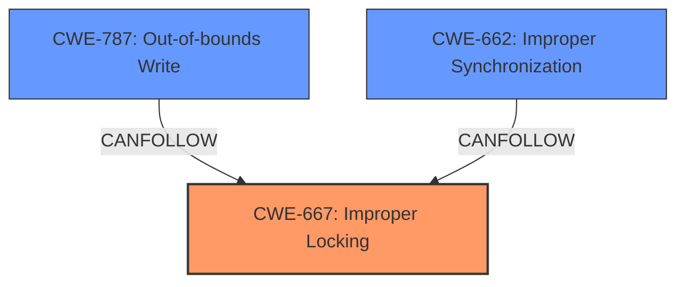

# Enhanced Analysis for CVE-2024-43062

# Summary
| CWE ID | CWE Name | Confidence | CWE Abstraction Level | CWE Vulnerability Mapping Label | CWE-Vulnerability Mapping Notes |
|---|---|---|---|---|---|
| CWE-667 | Improper Locking | 0.8 | Class | Primary | Allowed-with-Review |
| CWE-787 | Out-of-bounds Write | 0.6 | Base | Secondary | Allowed |
| CWE-662 | Improper Synchronization | 0.6 | Class | Secondary | Discouraged |

## Evidence and Confidence

*   **Confidence Score:** 0.7
*   **Evidence Strength:** MEDIUM

## Relationship Analysis
The primary weakness is identified as CWE-667 Improper Locking, which is a Class-level CWE. While a more specific Base-level CWE would be ideal, the description explicitly mentions "missing locks," making CWE-667 the most relevant choice. CWE-787 Out-of-bounds Write is considered a secondary weakness due to the resulting "memory corruption." CWE-662 Improper Synchronization is also considered as a secondary weakness because of the vulnerability description stating "improper synchronization".



## Vulnerability Chain
The vulnerability chain starts with **missing locks and checks** (CWE-667 Improper Locking) and **improper synchronization** (CWE-662 Improper Synchronization), leading to **memory corruption** (CWE-787 Out-of-bounds Write). The root cause is the improper locking and synchronization, and the impact is memory corruption.

## Summary of Analysis
The initial analysis focused on identifying the root cause of the vulnerability based on the description: "**Memory corruption** caused by **missing locks and checks on the DMA fence and improper synchronization**." The key phrases point to concurrency issues and memory corruption.

CWE-667 (Improper Locking) was selected as the primary CWE because the description explicitly mentions "**missing locks**." While it is a Class-level CWE, it is the most accurate representation of the root cause.

CWE-787 (Out-of-bounds Write) was selected as a secondary CWE because the description mentions "**Memory corruption**," which is a typical result of out-of-bounds writes.

CWE-662 (Improper Synchronization) was selected as a secondary CWE because the description mentions "**improper synchronization**".

The graph relationships helped visualize the chain of events, with improper locking/synchronization potentially leading to memory corruption.

The final selection prioritizes the root cause (improper locking/synchronization) while also acknowledging the resulting memory corruption. The CWEs are at an adequate level of specificity, given the information provided in the vulnerability description.


## CWE Relationship Analysis

Current CWEs represent these abstraction levels: .


### Vulnerability Chain Analysis

**Chain starting from CWE-662:**
- 662 (Improper Synchronization) - ROOT


**Chain starting from CWE-667:**
- 667 (Improper Locking) - ROOT


### CWE Relationship Diagram

```mermaid
graph TD
    classDef primary fill:#f96,stroke:#333,stroke-width:2px
    classDef secondary fill:#69f,stroke:#333
    classDef tertiary fill:#9e9,stroke:#333
```