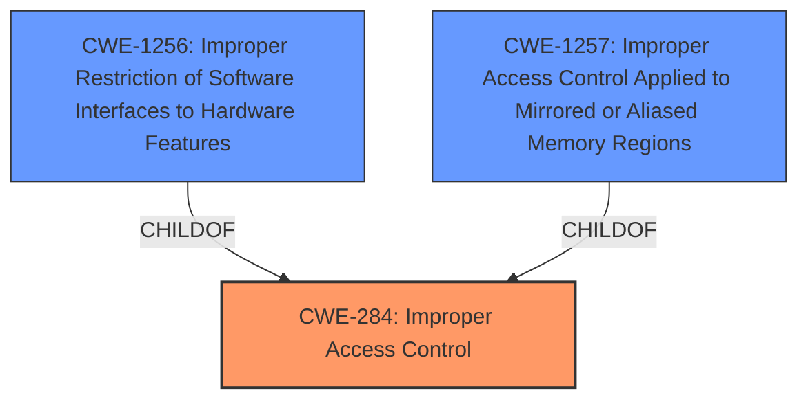

# Analysis Report for CVE-2024-43101

# Vulnerability Analysis Report: CVE-2024-43101

## Description

**Improper access control** for some Intel(R) Data Center GPU Flex Series for Windows driver software before version 31.0.101.4255 may allow an authenticated user to potentially enable denial of service via local access.

## Vulnerability Description Key Phrases

- **Rootcause:** Improper access control
- **Impact:** denial of service
- **Vector:** local access
- **Attacker:** authenticated user
- **Product:** Intel(R) Data Center GPU Flex Series for Windows driver software
- **Version:** before version 31.0.101.4255

## Analysis (with Relationship Data)

# Summary
| CWE ID | CWE Name | Confidence | CWE Abstraction Level | CWE Vulnerability Mapping Label | CWE-Vulnerability Mapping Notes |
|---|---|---|---|---|---|
| CWE-284 | Improper Access Control | 0.8 | Pillar | Primary CWE | Allowed |
| CWE-1256 | Improper Restriction of Software Interfaces to Hardware Features | 0.4 | Base | Secondary Candidate | Allowed |
| CWE-1257 | Improper Access Control Applied to Mirrored or Aliased Memory Regions | 0.4 | Base | Secondary Candidate | Allowed |

## Evidence and Confidence

*   **Confidence Score:** 0.8
*   **Evidence Strength:** HIGH

## Relationship Analysis
The primary relationship impacting the decision is the hierarchical structure with CWE-284 as a high-level **Improper Access Control**, and CWE-1256 and CWE-1257 as more specific base level options. Ultimately, due to lack of specific details in the vulnerability description, CWE-284 is chosen, with CWE-1256 and CWE-1257 as secondary candidates.



## Vulnerability Chain
The vulnerability chain starts with **improper access control**, leading to a potential denial of service.
  - **Root Cause:** **Improper Access Control** (CWE-284)
  - **Impact:** Denial of Service

## Summary of Analysis
The initial assessment focuses on **improper access control** as the root cause, as highlighted in the vulnerability description. The evidence from the CVE Reference Links Content Summary confirms this, stating "Root cause of vulnerability: **Improper access control**." The description explicitly mentions that an authenticated user can potentially enable denial of service via local access.

The retriever results suggest several CWEs, including CWE-691 (Insufficient Control Flow Management), CWE-284 (Improper Access Control), and CWE-119 (Improper Restriction of Operations within the Bounds of a Memory Buffer). Given the explicit mention of **improper access control**, CWE-284 is the most directly relevant.

The CWE Classification Guidance emphasizes that if the root cause is clearly **improper access control**, CWE-284 should be considered. More specific child CWEs should be used if more information is available.

CWE-1256 (Improper Restriction of Software Interfaces to Hardware Features) and CWE-1257 (Improper Access Control Applied to Mirrored or Aliased Memory Regions) are also considered as possible more specific options based on the retriever results. However, the vulnerability description lacks sufficient detail to definitively confirm that the access control issue is specifically related to software interfaces to hardware features or mirrored/aliased memory regions. Therefore, the decision favors the higher-level CWE-284, with CWE-1256 and CWE-1257 noted as secondary candidates.

The final decision is based on the evidence directly stating **improper access control** as the root cause. While more specific CWEs might be applicable, the lack of detail in the description makes CWE-284 the most appropriate choice.

Relevant CWE Information:

# Enhanced Context (25 CWEs)
The following CWEs were identified as potentially relevant to this vulnerability:

## CWE-703: Improper Check or Handling of Exceptional Conditions
**Abstraction Level**: Pillar
**Similarity Score**: 0.76
**Source**: dense

**Description**:
The product does not properly anticipate or handle exceptional conditions that rarely occur during normal operation of the product.

**Mapping Guidance**:
- Usage: Discouraged
- Rationale: This CWE entry is extremely high-level, a Pillar.

*Not Used:* This CWE focuses on exceptional conditions and doesn't align with the described access control issue.

## CWE-280: Improper Handling of Insufficient Permissions or Privileges 
**Abstraction Level**: Base
**Similarity Score**: 0.76
**Source**: dense

**Description**:
The product does not handle or incorrectly handles when it has insufficient privileges to access resources or functionality as specified by their permissions. This may cause it to follow unexpected code paths that may leave the product in an invalid state.

**Mapping Guidance**:
- Usage: Allowed
- Rationale: This CWE entry is at the Base level of abstraction, which is a preferred level of abstraction for mapping to the root causes of vulnerabilities.

*Not Used:* While related to access control, the description doesn't specify insufficient privileges as the root cause, making CWE-284 a better general fit.

## CWE-41: Improper Resolution of Path Equivalence
**Abstraction Level**: Base
**Similarity Score**: 0.76
**Source**: dense

**Description**:
The product is vulnerable to file system contents disclosure through path equivalence. Path equivalence involves the use of special characters in file and directory names. The associated manipulations are intended to generate multiple names for the same object.

**Mapping Guidance**:
- Usage: Allowed
- Rationale: This CWE entry is at the Base level of abstraction, which is a preferred level of abstraction for mapping to the root causes of vulnerabilities.

*Not Used:* Not related to the reported vulnerability.

## CWE-345: Insufficient Verification of Data Authenticity
**Abstraction Level**: Class
**Similarity Score**: 0.76
**Source**: dense

**Description**:
The product does not sufficiently verify the origin or authenticity of data, in a way that causes it to accept invalid data.

**Mapping Guidance**:
- Usage: Discouraged
- Rationale: This CWE entry is a level-1 Class (i.e., a child of a Pillar). It might have lower-level children that would be more appropriate

*Not Used:* Not related to the reported vulnerability.

## CWE-691: Insufficient Control Flow Management
**Abstraction Level**: Pillar
**Similarity Score**: 0.76
**Source**: dense

**Description**:
The code does not sufficiently manage its control flow during execution, creating conditions in which the control flow can be modified in unexpected ways.

**Mapping Guidance**:
- Usage: Discouraged
- Rationale: This CWE entry is extremely high-level, a Pillar. However, classification research is limited for weaknesses of this type, so there can be gaps or organizational difficulties within CWE that force use of this weakness, even at such a high level of abstraction.

*Not Used:* While control flow might be involved, the specific issue is **improper access control**, making CWE-284 a more direct match.

## CWE-274: Improper Handling of Insufficient Privileges
**Abstraction Level**: Base
**Similarity Score**: 0.76
**Source**: dense

**Description**:
The product does not handle or incorrectly handles when it has insufficient privileges to perform an operation, leading to resultant weaknesses.

**Mapping Guidance**:
- Usage: Discouraged
- Rationale: This CWE entry could be deprecated in a future version of CWE.

*Not Used:* Similar to CWE-280, the vulnerability description doesn't explicitly state insufficient privileges as the root cause.

## CWE-497: Exposure of Sensitive System Information to an Unauthorized Control Sphere
**Abstraction Level**: Base
**Similarity Score**: 0.76
**Source**: dense

**Description**:
The product does not properly prevent sensitive system-level information from being accessed by unauthorized actors who do not have the same level of access to the underlying system as the product does.

**Mapping Guidance**:
- Usage: Allowed
- Rationale: This CWE entry is at the Base level of abstraction, which is a preferred level of abstraction for mapping to the root causes of vulnerabilities.

*Not Used:* The vulnerability description focuses on **improper access control** leading to denial of service, not information exposure.

## CWE-668: Exposure of Resource to Wrong Sphere
**Abstraction Level**: Class
**Similarity Score**: 0.75
**Source**: dense

**Description**:
The product exposes a resource to the wrong control sphere, providing unintended actors with inappropriate access to the resource.

**Mapping Guidance**:
- Usage: Discouraged
- Rationale: CWE-668 is high-level and is often misused as a catch-all when lower-level CWE IDs might be applicable. It is sometimes used for low-information vulnerability reports [REF-1287]. It is a level-1 Class (i.e., a child of a Pillar). It is not useful for trend analysis.

*Not Used:* While related to access control, CWE-284 is a more direct and preferred option.

## CWE-755: Improper Handling of Exceptional Conditions
**Abstraction Level**: Class
**Similarity Score**: 0.


## CWE Relationship Analysis

Current CWEs represent these abstraction levels: .


### Vulnerability Chain Analysis

**Chain starting from CWE-274:**
- 274 (Improper Handling of Insufficient Privileges) - ROOT


**Chain starting from CWE-280:**
- 280 (Improper Handling of Insufficient Permissions or Privileges ) - ROOT


### CWE Relationship Diagram

```mermaid
graph TD
    classDef primary fill:#f96,stroke:#333,stroke-width:2px
    classDef secondary fill:#69f,stroke:#333
    classDef tertiary fill:#9e9,stroke:#333
```


*Report generated on 2025-07-13 14:34:46*
