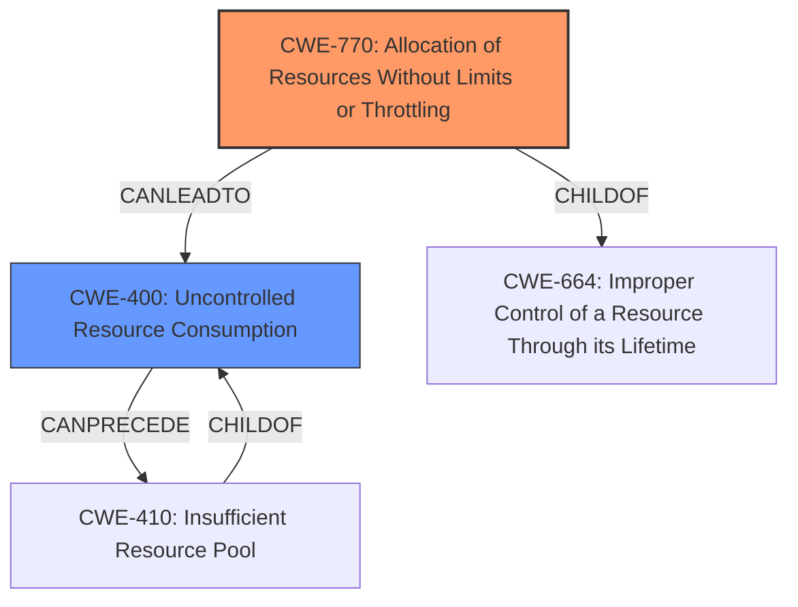

# Analysis Report for CVE-2024-43105

# Vulnerability Analysis Report: CVE-2024-43105

## Description

Mattermost Plugin Channel Export versions <=1.0.0 **fail to restrict concurrent runs of the /export command** which allows a user to consume excessive resource by running the /export command multiple times at once.

## Vulnerability Description Key Phrases

- **Rootcause:** fail to restrict concurrent runs of the /export command
- **Impact:** consume excessive resource
- **Attacker:** user
- **Product:** Mattermost Plugin Channel Export
- **Version:** <=1.0.0
- **Component:** /export command

## Analysis (with Relationship Data)

# Summary
| CWE ID | CWE Name | Confidence | CWE Abstraction Level | CWE Vulnerability Mapping Label | CWE-Vulnerability Mapping Notes |
|---|---|---|---|---|---|
| CWE-770 | Allocation of Resources Without Limits or Throttling | 0.9 | Base | Allowed | Primary CWE: The vulnerability stems from the application's **failure to restrict concurrent runs of the /export command**, which allows excessive resource allocation. |
| CWE-400 | Uncontrolled Resource Consumption | 0.6 | Class | Discouraged | Secondary: The **impact** of the vulnerability is that a user can **consume excessive resources**, leading to resource exhaustion. While CWE-400 describes this outcome, CWE-770 more accurately reflects the root cause. |

## Evidence and Confidence

*   **Confidence Score:** 0.8
*   **Evidence Strength:** MEDIUM

## Relationship Analysis
The primary CWE is CWE-770, which is a Base level CWE. CWE-400 is a Class level CWE and represents the impact of the vulnerability. CWE-770 is a child of CWE-664 (Improper Control of a Resource Through its Lifetime). CWE-400 is a parent of CWE-410 (Insufficient Resource Pool).


## Vulnerability Chain
The vulnerability chain starts with the **failure to restrict concurrent runs of the /export command** (CWE-770), which leads to **excessive resource consumption** (CWE-400).

## Summary of Analysis
The vulnerability description clearly indicates that the root cause is the **failure to restrict concurrent runs of the /export command**, which leads to **excessive resource consumption**. The retriever results also point to CWE-770 as a strong candidate.

*   CWE-770 (Allocation of Resources Without Limits or Throttling): This CWE accurately reflects the **root cause** of the vulnerability, where the application **fails to limit the allocation of resources** when the /export command is run concurrently. The description states that the plugin **fails to restrict concurrent runs of the /export command** which directly leads to excessive resource usage.
*   CWE-400 (Uncontrolled Resource Consumption): This CWE describes the **impact** of the vulnerability, which is that a user can **consume excessive resources**. While this is a relevant consequence, it is not the **root cause**. The mapping guidance for CWE-400 discourages its use when a more specific CWE is available.

I considered the other CWEs from the Retriever Results, but they did not accurately represent the vulnerability:

*   CWE-401 (Missing Release of Memory after Effective Lifetime): This CWE is related to memory leaks, which is not the primary issue described in the vulnerability.
*   CWE-799 (Improper Control of Interaction Frequency): This CWE could be considered. However, CWE-770 more accurately identifies the specific resource allocation issue.
*   CWE-95 (Improper Neutralization of Directives in Dynamically Evaluated Code ('Eval Injection')): This CWE is related to code injection, which is not relevant to the vulnerability.
*   CWE-306 (Missing Authentication for Critical Function): This CWE is related to missing authentication, which is not relevant to the vulnerability.
*   CWE-250 (Execution with Unnecessary Privileges): This CWE is related to excessive privileges, which is not relevant to the vulnerability.
*   CWE-23 (Relative Path Traversal): This CWE is related to path traversal, which is not relevant to the vulnerability.
*   CWE-926 (Improper Export of Android Application Components): This CWE is specific to Android applications, which is not relevant to the vulnerability.
*   CWE-390 (Detection of Error Condition Without Action): This CWE is related to error handling, which is not the primary issue described in the vulnerability.

Based on the evidence and analysis, CWE-770 is the most appropriate CWE to represent the **root cause** of the vulnerability, and CWE-400 represents the **impact**.


## CWE Relationship Analysis

Current CWEs represent these abstraction levels: .


### Vulnerability Chain Analysis

**Chain starting from CWE-390:**
- 390 (Detection of Error Condition Without Action) - ROOT


**Chain starting from CWE-400:**
- 400 (Uncontrolled Resource Consumption) - ROOT


### CWE Relationship Diagram

```mermaid
graph TD
    classDef primary fill:#f96,stroke:#333,stroke-width:2px
    classDef secondary fill:#69f,stroke:#333
    classDef tertiary fill:#9e9,stroke:#333
```


*Report generated on 2025-07-13 14:35:05*
