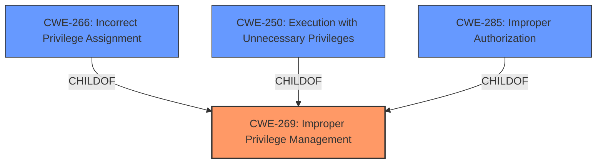

# Analysis Report for CVE-2024-43121

# Vulnerability Analysis Report: CVE-2024-43121

## Description

**Improper Privilege Management** vulnerability in realmag777 HUSKY allows Privilege Escalation.This issue affects HUSKY from n/a through 1.3.6.1.

## Vulnerability Description Key Phrases

- **Rootcause:** Improper Privilege Management
- **Impact:** Privilege Escalation
- **Product:** realmag777 HUSKY
- **Version:** n/a through 1.3.6.1

## Analysis (with Relationship Data)

# Summary
| CWE ID    | CWE Name                                                    | Confidence | CWE Abstraction Level | CWE Vulnerability Mapping Label | CWE-Vulnerability Mapping Notes |
| :-------- | :---------------------------------------------------------- | :--------- | :-------------------- | :------------------------------ | :------------------------------ |
| CWE-269   | Improper Privilege Management                             | 0.9        | Class                 | Primary                         | Discouraged                   |
| CWE-266   | Incorrect Privilege Assignment                              | 0.7        | Base                  | Secondary                       | Allowed                         |
| CWE-250   | Execution with Unnecessary Privileges                      | 0.6        | Base                  | Secondary                       | Allowed                         |
| CWE-285   | Improper Authorization                                      | 0.5        | Class                 | Secondary                       | Discouraged                   |

## Evidence and Confidence

*   **Confidence Score:** 0.8
*   **Evidence Strength:** HIGH

## Relationship Analysis
The primary weakness identified is CWE-269, **Improper Privilege Management**. This is a class-level CWE, and while it captures the general problem, it is often considered too broad. The retriever results and vulnerability description key phrases also suggest more specific CWEs like CWE-266 (**Incorrect Privilege Assignment**) and CWE-250 (**Execution with Unnecessary Privileges**). CWE-266 is related to assigning the wrong privileges to a user, while CWE-250 is about executing code with more privileges than necessary. These are both base-level CWEs and children of CWE-269. Also considered was CWE-285 (**Improper Authorization**), which is related to incorrect authorization checks. Choosing CWE-269 as primary allows for the inclusion of multiple root causes, while also acknowledging that more specific information could refine this selection in the future.



## Vulnerability Chain
The vulnerability chain starts with **Improper Privilege Management** (CWE-269), which leads to a Privilege Escalation impact. The root cause could be due to Incorrect Privilege Assignment (CWE-266) or Execution with Unnecessary Privileges (CWE-250), or a combination of them. The attacker exploits this vulnerability to gain higher-level privileges, potentially leading to full control of the website.

## Summary of Analysis
The initial analysis identified **Improper Privilege Management** as the primary weakness, which is supported by the vulnerability description key phrases. The retriever results also highlight this CWE as the top match.

The vulnerability description states "**Improper Privilege Management** vulnerability in realmag777 HUSKY allows Privilege Escalation. This issue affects HUSKY from n/a through 1.3.6.1."

While CWE-269 is a class-level CWE and is generally discouraged, it serves as an umbrella for the specific issues. The supporting CWEs, such as CWE-266 and CWE-250, represent possible root causes that contribute to the improper privilege management. The selection of CWE-269 is justified because the available information does not pinpoint a single, specific root cause.

Other CWEs considered but not used:

*   CWE-20 (**Improper Input Validation**): While input validation issues can lead to privilege escalation, the primary issue described is related to privilege management, not input handling.
*   CWE-284 (**Improper Access Control**): Similar to CWE-269, this is a high-level class and less descriptive than the chosen CWEs.
*   CWE-287 (**Improper Authentication**): While the CVE Reference Links mention an identification and authentication failure, the core issue revolves around what happens *after* authentication, specifically the management of privileges.
*   CWE-862 (**Missing Authorization**): The issue is not necessarily a *missing* authorization check, but a flawed management of privileges.

The chosen CWEs are at the optimal level of specificity given the available information. As more details emerge, the mapping could be refined to focus on a specific root cause instead of the general CWE-269.


## CWE Relationship Analysis

Current CWEs represent these abstraction levels: .


### Vulnerability Chain Analysis

**Chain starting from CWE-862:**
- 862 (Missing Authorization) - ROOT


**Chain starting from CWE-269:**
- 269 (Improper Privilege Management) - ROOT


### CWE Relationship Diagram

```mermaid
graph TD
    classDef primary fill:#f96,stroke:#333,stroke-width:2px
    classDef secondary fill:#69f,stroke:#333
    classDef tertiary fill:#9e9,stroke:#333
```


*Report generated on 2025-07-13 14:35:41*
