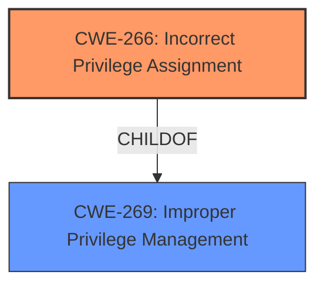

# Analysis for CVE-2024-43153

# Summary
| CWE ID  | CWE Name | Confidence | CWE Abstraction Level | CWE Vulnerability Mapping Label | CWE-Vulnerability Mapping Notes |
| ------------- | ------------- | ------------- | ------------- | ------------- | ------------- |
| CWE-266 | Incorrect Privilege Assignment | 0.75 | Base | Allowed | Primary CWE |
| CWE-269 | Improper Privilege Management | 0.5 | Class | Discouraged | Secondary Candidate |

## Evidence and Confidence

*   **Confidence Score:** 0.7
*   **Evidence Strength:** MEDIUM

## Relationship Analysis
The primary CWE identified is CWE-266, which is a Base level CWE, preferred for root cause analysis. It is related to the broader Class CWE-269, Improper Privilege Management, as a specific type of privilege management issue. The vulnerability description explicitly mentions **Improper Privilege Management** and the potential for privilege escalation, which aligns with the characteristics of both CWE-266 and CWE-269. However, CWE-266 provides a more specific classification by focusing on the incorrect assignment of privileges, which is a likely cause for privilege escalation.

## Vulnerability Chain
The vulnerability chain starts with an **incorrect privilege assignment** (CWE-266), which leads to the ability to perform actions that should not be allowed, ultimately resulting in privilege escalation.

## Summary of Analysis
The initial analysis identified **Improper Privilege Management** as the key weakness, aligning with CWE-269. However, further analysis, guidance, and the retriever results suggested that CWE-266, **Incorrect Privilege Assignment**, is a more precise classification. The vulnerability description key phrases highlight **Improper Privilege Management** as the root cause. The CVE Reference Links Content Summary mentions privilege escalation, indicating a potential impact. The retriever results list CWE-269 as the top result, but also include CWE-266 with a high density score. The "Privileges vs Permissions Guidance" section strongly suggests using CWE-266 when there is a role misassignment.
The selection of CWE-266 is at the optimal level of specificity because it directly addresses the root cause of the vulnerability - the incorrect assignment of privileges - rather than the more general category of improper privilege management. This is supported by the vulnerability description and the provided mapping guidance.

Relevant CWE Information:
- **Vulnerability Description Key Phrases:** **rootcause:** **Improper Privilege Management**
- **Privileges vs Permissions Guidance:** Suggests using CWE-266 when there is a role misassignment.
- **Retriever Results:** Lists CWE-266 with a high density score.

**CWE-266: Incorrect Privilege Assignment**
*   **Technical Explanation:** The vulnerability arises from a flaw in the system's logic that results in a user being assigned incorrect privileges. For example, a new user might be incorrectly assigned administrator privileges instead of a standard user role.
*   **Security Implications:** This can lead to unauthorized access to sensitive data, system configuration changes, or other high-privilege actions.
*   **Relationship Analysis:** CWE-266 is a base-level CWE that is a child of CWE-269 (Improper Privilege Management).
*   **Mapping Guidance Influence:** The "Privileges vs Permissions Guidance" section suggests that CWE-266 is appropriate when there is a role misassignment.
*   **Confidence:** 0.75

**CWE-269: Improper Privilege Management**
*   **Technical Explanation:** The product does not properly assign, modify, track, or check privileges for an actor, creating an unintended sphere of control for that actor.
*   **Security Implications:** This can lead to privilege escalation, unauthorized access, and other security breaches.
*   **Relationship Analysis:** CWE-269 is a class-level CWE.
*   **Mapping Guidance Influence:** CWE-269 is discouraged because it's often misused.
*   **Confidence:** 0.5

CWEs considered but not used:

*   CWE-285 (Improper Authorization): While authorization issues can be related, the root cause here is specifically the incorrect assignment of privileges, not a failure in the authorization check itself.
*   CWE-863 (Incorrect Authorization): Similar to CWE-285, this focuses on flaws in the authorization logic rather than the initial privilege assignment.
*   CWE-284 (Improper Access Control): This is a more general category and less specific than CWE-266, which directly addresses the privilege assignment issue.