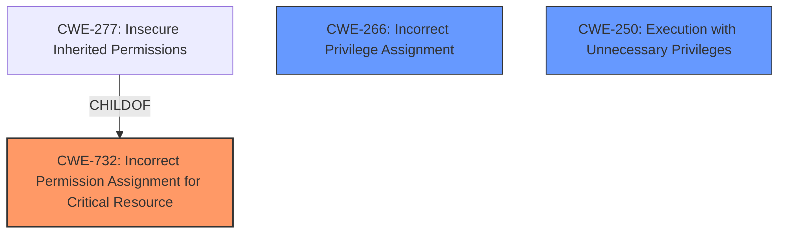

# Enhanced Analysis for CVE-2024-43199

# Summary
| CWE ID | CWE Name | Confidence | CWE Abstraction Level | CWE Vulnerability Mapping Label | CWE-Vulnerability Mapping Notes |
|---|---|---|---|---|---|
| CWE-732 | Incorrect Permission Assignment for Critical Resource | 0.9 | Class | Allowed-with-Review | Primary CWE |
| CWE-266 | Incorrect Privilege Assignment | 0.6 | Base | Allowed | Secondary Candidate |
| CWE-250 | Execution with Unnecessary Privileges | 0.5 | Base | Allowed | Secondary Candidate |

## Evidence and Confidence

*   **Confidence Score:** 0.8
*   **Evidence Strength:** HIGH

## Relationship Analysis
The primary relationship influencing the CWE selection is the hierarchical one. CWE-732 "Incorrect Permission Assignment for Critical Resource" is a Class-level CWE. While more specific CWEs exist, such as CWE-277 "Insecure Inherited Permissions" (a Variant of CWE-732), the provided evidence doesn't strongly suggest insecure inheritance as the root cause, but rather the initial **incorrect assignment** of permissions. CWE-266 "Incorrect Privilege Assignment" was considered, but it focuses more on assigning the wrong privileges to a user, whereas this vulnerability is about the permissions of the *executable file* itself. CWE-250 "Execution with Unnecessary Privileges" could be a related issue if the affected executables run with higher privileges than they need, but it is a secondary consideration.



## Vulnerability Chain
The vulnerability chain starts with the **incorrect assignment** of file ownership and permissions during the installation process. This leads to a situation where a less privileged user can modify executables that might be run by a privileged user (root), creating an opportunity for privilege escalation and arbitrary code execution.
  - The root cause is **CWE-732** (Incorrect Permission Assignment for Critical Resource).
  - Potential secondary issues are CWE-266 and CWE-250.
  - The impact is privilege escalation to root and arbitrary code execution.

## Summary of Analysis
The vulnerability lies in the **incorrect permission assignment** of critical executables, allowing a less privileged user to potentially modify these files and escalate privileges to root.

The assessment is primarily based on the **CVE Reference Links Content Summary**, which clearly states:

> "The vulnerability stems from the way executables within the `ndoutils` project were being installed. Specifically, the `configure.ac` script was adding flags to `INSTALL_OPTS` that changed the owner and group of all installed files to `ndo2db_user:ndo2db_group`."
> "The core issue was that executables were being installed with ownership by the `ndo2db_user` instead of `root`, which is typical for system binaries."

The graph relationships highlight that while other CWEs like CWE-277 exist as more specific variants, the initial **incorrect assignment** is the most prominent factor.

CWE-732 is the optimal level of specificity because it directly addresses the root cause of the vulnerability: the **incorrect assignment** of permissions for critical resources, leading to potential privilege escalation.

Relevant CWE Information:
# Enhanced Context (25 CWEs)
The following CWEs were identified as potentially relevant to this vulnerability:

## CWE-266: Incorrect Privilege Assignment
**Abstraction Level**: Base
**Similarity Score**: 0.79
**Source**: dense

**Description**:
A product incorrectly assigns a privilege to a particular actor, creating an unintended sphere of control for that actor.

**Mapping Guidance**:
- Usage: Allowed
- Rationale: This CWE entry is at the Base level of abstraction, which is a preferred level of abstraction for mapping to the root causes of vulnerabilities.

*Technical Explanation:*

CWE-732: Incorrect Permission Assignment for Critical Resource

*   **How the vulnerability's details match the CWE's characteristics:** The vulnerability involves executables being installed with ownership by the `ndo2db_user` instead of `root`. This is a direct instance of **incorrectly assigning permissions** to a critical resource (the executables), allowing unintended actors (the `ndo2db_user`) potential control.
*   **The security implications and potential impact:** The security implication is privilege escalation. The `ndo2db_user` can potentially modify the executables, and if root executes them, the malicious code injected by `ndo2db_user` will run as root, leading to a full system compromise.
*   **Any parent-child relationships or chain patterns that influenced your mapping:** CWE-732 is a Class-level CWE, and while more specific variants exist (e.g., CWE-277), the initial **incorrect assignment** of permissions is the most prominent factor.
*   **Whether the weakness is primary or secondary in the vulnerability:** This is the primary weakness.
*   **How the official MITRE mapping guidance influenced your decision:** The description of CWE-732 directly aligns with the vulnerability description.

CWE-266: Incorrect Privilege Assignment

*   **How the vulnerability's details match the CWE's characteristics:** This CWE describes **incorrectly assigning a privilege** to a particular actor. While related, it's not as direct a match as CWE-732, which focuses on resource permissions rather than user privileges. The issue is not so much about the nagios user being *assigned* the wrong privilege, but that the nagios user *owns* the executable files.
*   **The security implications and potential impact:** Similar to CWE-732, this can lead to privilege escalation.
*   **Any parent-child relationships or chain patterns that influenced your mapping:** Considered as a contributing factor but not the primary cause.
*   **Whether the weakness is primary or secondary in the vulnerability:** Secondary.
*   **How the official MITRE mapping guidance influenced your decision:** Considered but deemed less accurate than CWE-732 because the issue is more about file permissions than user privileges.

CWE-250: Execution with Unnecessary Privileges

*   **How the vulnerability's details match the CWE's characteristics:** This CWE addresses the scenario where code runs with higher privileges than necessary. If the affected executables are indeed running with root privileges but don't need them, then this CWE could apply.
*   **The security implications and potential impact:** This can broaden the attack surface and increase the potential for damage if the executables are compromised.
*   **Any parent-child relationships or chain patterns that influenced your mapping:** Could be related if the impacted files run with elevated privileges.
*   **Whether the weakness is primary or secondary in the vulnerability:** Secondary.
*   **How the official MITRE mapping guidance influenced your decision:** Needs further investigation to determine if the executables require elevated privileges.

CWEs considered but not used:

*   CWE-269: Improper Privilege Management - Discouraged because it is too general and commonly misused. CWE-732 is more specific.
*   CWE-285: Improper Authorization - This vulnerability does not involve an authorization check, but rather an **incorrect assignment** of file permissions, making it an inappropriate choice.
*   CWE-306: Missing Authentication for Critical Function and CWE-863: Incorrect Authorization - The vulnerability is not related to authentication or authorization, but rather to the **incorrect assignment** of file permissions.
*   CWE-59: Improper Link Resolution Before File Access ('Link Following'), CWE-363: Race Condition Enabling Link Following - The vulnerability is not about symlink issues.
*   CWE-427: Uncontrolled Search Path Element - The vulnerability is not about issues with the search path.
*   CWE-96: Improper Neutralization of Directives in Statically Saved Code ('Static Code Injection') - The vulnerability is not about code injection
*   CWE-277: Insecure Inherited Permissions - While file permissions are inherited, the root cause is more about the **incorrect assignment** of permissions to the file in the first place.
*   CWE-280: Improper Handling of Insufficient Permissions or Privileges - This is about insufficient privileges, not about incorrectly assigned permissions.


## CWE Relationship Analysis

Current CWEs represent these abstraction levels: .


### Vulnerability Chain Analysis

**Chain starting from CWE-863:**
- 863 (Incorrect Authorization) - ROOT


**Chain starting from CWE-280:**
- 280 (Improper Handling of Insufficient Permissions or Privileges ) - ROOT


### CWE Relationship Diagram

```mermaid
graph TD
    classDef primary fill:#f96,stroke:#333,stroke-width:2px
    classDef secondary fill:#69f,stroke:#333
    classDef tertiary fill:#9e9,stroke:#333
```