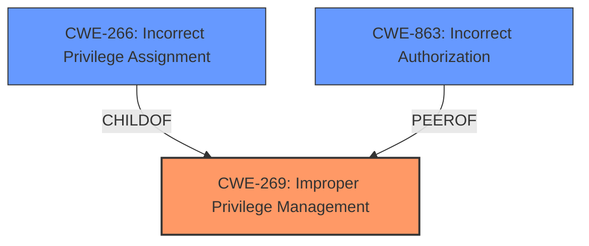

# Analysis Report for CVE-2024-43240

# Vulnerability Analysis Report: CVE-2024-43240

## Description

**Improper Privilege Management** vulnerability in azzaroco Ultimate Membership Pro allows Privilege Escalation.This issue affects Ultimate Membership Pro from n/a through 12.6.

## Vulnerability Description Key Phrases

- **Rootcause:** Improper Privilege Management
- **Impact:** Privilege Escalation
- **Product:** azzaroco Ultimate Membership Pro
- **Version:** n/a through 12.6

## Analysis (with Relationship Data)

# Summary
| CWE ID | CWE Name | Confidence | CWE Abstraction Level | CWE Vulnerability Mapping Label | CWE-Vulnerability Mapping Notes |
|---|---|---|---|---|---|
| CWE-269 | Improper Privilege Management | 0.75 | Class | Primary CWE | Discouraged |
| CWE-266 | Incorrect Privilege Assignment | 0.65 | Base | Secondary Candidate | Allowed |
| CWE-863 | Incorrect Authorization | 0.5 | Class | Secondary Candidate | Allowed-with-Review |

## Evidence and Confidence

*   **Confidence Score:** 0.7
*   **Evidence Strength:** MEDIUM

## Relationship Analysis
The primary relationship considered was the hierarchical structure of CWEs related to access control and privilege management. While CWE-269 is a Class-level CWE, the vulnerability description explicitly mentions "**Improper Privilege Management**". Therefore, it serves as the initial and most direct mapping. CWE-266, a Base-level CWE, represents a more specific case of incorrect privilege assignment, thus considered as a secondary candidate since the specifics of the improper privilege management aren't elaborated upon. CWE-863 relates to incorrect authorization checks, which could be a potential mechanism for privilege escalation, but is less directly stated in the description.



## Vulnerability Chain
The vulnerability chain starts with **Improper Privilege Management** (CWE-269), potentially leading to **Incorrect Privilege Assignment** (CWE-266) or **Incorrect Authorization** (CWE-863), ultimately resulting in Privilege Escalation.

## Summary of Analysis
The initial assessment based on the vulnerability description and key phrases pointed to **CWE-269 (Improper Privilege Management)** as the primary weakness. The description explicitly mentions "**Improper Privilege Management**" as the root cause, making it the most direct and relevant mapping. The **CVE Reference Links Content Summary** further supports this by highlighting the privilege escalation issue. However, the specific details of how the privilege management is improper are lacking.

The retriever results also list CWE-269 as the top result. However, CWE-269 is discouraged because it is a class-level CWE. More specific CWEs at the base or variant level are preferred.

Given that the available evidence is not specific enough to determine the exact mechanism of **Improper Privilege Management**, I'm retaining CWE-269 as the primary, but acknowledge the need for more specific classification with additional information. CWE-266 and CWE-863 are secondary candidates.

Relevant CWE Information:

# Enhanced Context (25 CWEs)
The following CWEs were identified as potentially relevant to this vulnerability:

## CWE-266: Incorrect Privilege Assignment
**Abstraction Level**: Base
**Similarity Score**: 0.80
**Source**: dense

**Description**:
A product incorrectly assigns a privilege to a particular actor, creating an unintended sphere of control for that actor.

**Mapping Guidance**:
- Usage: Allowed
- Rationale: This CWE entry is at the Base level of abstraction, which is a preferred level of abstraction for mapping to the root causes of vulnerabilities.

## CWE-269: Improper Privilege Management
**Abstraction Level**: Class
**Similarity Score**: 0.74
**Source**: dense

**Description**:
The product does not properly assign, modify, track, or check privileges for an actor, creating an unintended sphere of control for that actor.

**Mapping Guidance**:
- Usage: Discouraged
- Rationale: CWE-269 is commonly misused. It can be conflated with "privilege escalation," which is a technical impact that is listed in many low-information vulnerability reports [REF-1287]. It is not useful for trend analysis.

## CWE-863: Incorrect Authorization
**Abstraction Level**: Class
**Similarity Score**: 1556.20
**Source**: sparse

**Description**:
The product performs an authorization check when an actor attempts to access a resource or perform an action, but it does not correctly perform the check.

**Mapping Guidance**:
- Usage: Allowed-with-Review
- Rationale: This CWE entry is a Class and might have Base-level children that would be more appropriate

## CWE-266: Incorrect Privilege Assignment
**Abstraction Level**: Base
**Similarity Score**: 1465.56
**Source**: sparse

**Description**:
A product incorrectly assigns a privilege to a particular actor, creating an unintended sphere of control for that actor.

**Mapping Guidance**:
- Usage: Allowed
- Rationale: This CWE entry is at the Base level of abstraction, which is a preferred level of abstraction for mapping to the root causes of vulnerabilities.

### Detailed Analysis of Selected CWEs:

*   **CWE-269: Improper Privilege Management**
    *   **Technical Explanation:** This CWE describes a situation where the product fails to properly manage privileges for an actor, leading to an unintended sphere of control. This aligns directly with the vulnerability description, which identifies "**Improper Privilege Management**" as the root cause.
    *   **Security Implications:** The impact is privilege escalation, allowing an attacker to gain unauthorized access and control over the system.
    *   **Relationships:** It is a class-level CWE, with more specific base-level CWEs like CWE-266 as children.
    *   **Mapping Guidance:** While the mapping guidance discourages its use due to its high-level nature, the explicit mention of "**Improper Privilege Management**" in the description justifies its selection as the primary CWE, given the limited information.
*   **CWE-266: Incorrect Privilege Assignment**
    *   **Technical Explanation:** This CWE represents a more specific scenario where a product incorrectly assigns privileges to an actor. This could be a potential underlying cause of the **Improper Privilege Management**.
    *   **Security Implications:** Similar to CWE-269, the impact is privilege escalation.
    *   **Relationships:** It is a child of CWE-269, representing a more specific case.
    *   **Mapping Guidance:** The mapping guidance allows its use, as it is a base-level CWE.
*   **CWE-863: Incorrect Authorization**
    *   **Technical Explanation:** This CWE describes a scenario where the product incorrectly performs an authorization check. This could also lead to a privilege escalation if an attacker bypasses the authorization check.
    *   **Security Implications:** The impact is unauthorized access and potential privilege escalation.
    *   **Relationships:** It is a class-level CWE.
    *   **Mapping Guidance:** The mapping guidance allows its use with review, as it is a class-level CWE.

### Considered but not used:
*   **CWE-862: Missing Authorization**: This CWE was considered but not selected because the vulnerability description and summary suggest there's **Improper Privilege Management**, implying the existence of some form of authorization or privilege management, rather than a complete absence of it.
*   **CWE-284: Improper Access Control:** Similar to CWE-862, this is a very general CWE. While access control is related, privilege management is more specific to the vulnerability.
*   **CWE-306: Missing Authentication for Critical Function:** While the attacker needs to be unauthenticated to exploit the vulnerability, the **rootcause** is **Improper Privilege Management**. So this CWE is not selected.


## CWE Relationship Analysis

Current CWEs represent these abstraction levels: .


### Vulnerability Chain Analysis

**Chain starting from CWE-863:**
- 863 (Incorrect Authorization) - ROOT


**Chain starting from CWE-862:**
- 862 (Missing Authorization) - ROOT


### CWE Relationship Diagram

```mermaid
graph TD
    classDef primary fill:#f96,stroke:#333,stroke-width:2px
    classDef secondary fill:#69f,stroke:#333
    classDef tertiary fill:#9e9,stroke:#333
```


*Report generated on 2025-07-13 14:38:35*
