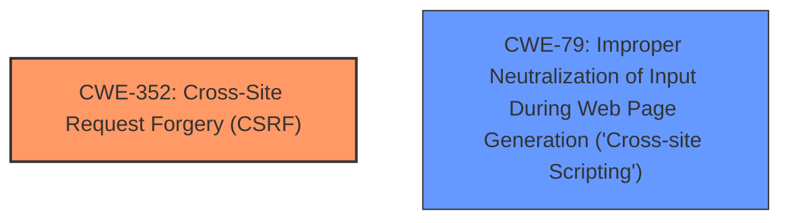

# Analysis for CVE-2024-43255

# Summary
| CWE ID | CWE Name | Confidence | CWE Abstraction Level | CWE Vulnerability Mapping Label | CWE-Vulnerability Mapping Notes |
|---|---|---|---|---|---|
| CWE-352 | Cross-Site Request Forgery (CSRF) | 1.0 | Compound | Primary | Allowed |
| CWE-79 | Improper Neutralization of Input During Web Page Generation ('Cross-site Scripting') | 1.0 | Base | Secondary | Allowed |

## Evidence and Confidence

*   **Confidence Score:** 1.0
*   **Evidence Strength:** HIGH

## Relationship Analysis
The primary weakness is the **lack of CSRF protection**, leading to a Cross-Site Request Forgery (CSRF) vulnerability (CWE-352). The description also mentions Cross-Site Scripting (XSS), which is a separate but related vulnerability (CWE-79). CWE-352 is a compound weakness, while CWE-79 is a base weakness. There isn't a direct parent-child relationship between the two, but they often appear together in web application vulnerabilities.

## Vulnerability Chain
The vulnerability chain begins with the **lack of CSRF protection** (CWE-352). This allows an attacker to potentially inject malicious scripts into the application. If the application doesn't properly neutralize input, the injected scripts can then be executed in the user's browser, leading to Cross-Site Scripting (XSS) (CWE-79).

## Summary of Analysis
The analysis is based on the vulnerability description and the CVE reference summary. The **rootcause** is the **lack of CSRF protection**, as stated in both the vulnerability description key phrases and the CVE reference summary. This leads to the primary CWE mapping of CWE-352. The presence of Cross-Site Scripting (XSS) is also noted, leading to the secondary CWE mapping of CWE-79. The retriever results also list CWE-352 and CWE-79 as top candidates, further supporting the mapping decision. Both CWEs are at appropriate levels of specificity, with CWE-352 being a compound weakness and CWE-79 being a base weakness.

Relevant CWE Information:

# Enhanced Context (25 CWEs)
The following CWEs were identified as potentially relevant to this vulnerability:

## CWE-352: Cross-Site Request Forgery (CSRF)
**Abstraction Level**: Compound
**Similarity Score**: 0.74
**Source**: dense

**Description**:
The web application does not, or can not, sufficiently verify whether a well-formed, valid, consistent request was intentionally provided by the user who submitted the request.

**Mapping Guidance**:
- Usage: Allowed
- Rationale: This is a well-known Composite of multiple weaknesses that must all occur simultaneously, although it is attack-oriented in nature.

**Rationale**: The primary **rootcause** identified is the **lack of CSRF protection**. This aligns directly with the description of CWE-352, which describes the failure to verify that a request was intentionally provided by the user. The CVE reference summary confirms this by stating that the plugin lacks proper CSRF protection.

## CWE-79: Improper Neutralization of Input During Web Page Generation ('Cross-site Scripting')
**Abstraction Level**: Base
**Similarity Score**: 0.69
**Source**: dense

**Description**:
The product does not neutralize or incorrectly neutralizes user-controllable input before it is placed in output that is used as a web page that is served to other users.

**Mapping Guidance**:
- Usage: Allowed
- Rationale: This CWE entry is at the Base level of abstraction, which is a preferred level of abstraction for mapping to the root causes of vulnerabilities.

**Rationale**: The vulnerability description explicitly mentions Cross-Site Scripting (XSS). This aligns with the description of CWE-79, which describes the failure to neutralize user-controllable input before it is placed in a web page.

## CWE-425: Direct Request ('Forced Browsing')
**Abstraction Level**: Base
**Similarity Score**: 0.72
**Source**: dense

**Description**:
The web application does not adequately enforce appropriate authorization on all restricted URLs, scripts, or files.

**Mapping Guidance**:
- Usage: Allowed
- Rationale: This CWE entry is at the Base level of abstraction, which is a preferred level of abstraction for mapping to the root causes of vulnerabilities.

**Rationale**: While CSRF can be seen as a form of authorization bypass, it's more specific. CWE-425 is too general for this case.

## CWE-434: Unrestricted Upload of File with Dangerous Type
**Abstraction Level**: Base
**Similarity Score**: 0.69
**Source**: dense

**Description**:
The product allows the upload or transfer of dangerous file types that are automatically processed within its environment.

**Mapping Guidance**:
- Usage: Allowed
- Rationale: This CWE entry is at the Base level of abstraction, which is a preferred level of abstraction for mapping to the root causes of vulnerabilities.

**Rationale**: This CWE is irrelevant as there is no mention of file uploads.

## CWE-89: Improper Neutralization of Special Elements used in an SQL Command ('SQL Injection')
**Abstraction Level**: Base
**Similarity Score**: 0.66
**Source**: sparse

**Description**:
The product constructs all or part of an SQL command using externally-influenced input from an upstream component, but it does not neutralize or incorrectly neutralizes special elements that could modify the intended SQL command when it is sent to a downstream component. Without sufficient removal or quoting of SQL syntax in user-controllable inputs, the generated SQL query can cause those inputs to be interpreted as SQL instead of ordinary user data.

**Rationale**: This CWE is irrelevant as there is no mention of SQL injection.