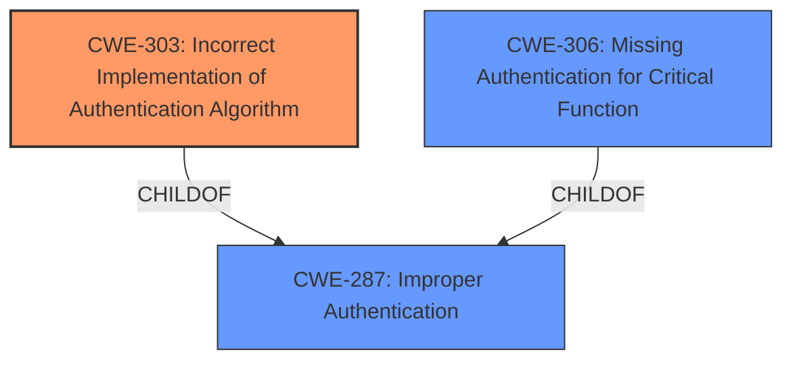

# Analysis for CVE-2024-4332

# Summary
| CWE ID | CWE Name | Confidence | CWE Abstraction Level | CWE Vulnerability Mapping Label | CWE-Vulnerability Mapping Notes |
|---|---|---|---|---|---|
| CWE-303 | Incorrect Implementation of Authentication Algorithm | 0.9 | Base | Primary CWE | Allowed |
| CWE-287 | Improper Authentication | 0.7 | Class | Secondary Candidate | Discouraged |
| CWE-306 | Missing Authentication for Critical Function | 0.6 | Base | Secondary Candidate | Allowed |

## Evidence and Confidence

*   **Confidence Score:** 0.8
*   **Evidence Strength:** HIGH

## Relationship Analysis
The primary CWE selected is CWE-303, which describes the root cause of the vulnerability as an incorrect implementation of the authentication algorithm. This is a Base-level CWE, which is preferred for root cause analysis. CWE-287, Improper Authentication, is a Class-level CWE and a parent of CWE-306, Missing Authentication for Critical Function. While CWE-306 could be considered because it is an authentication bypass, CWE-303 is more precise because the issue is not a complete lack of authentication, but rather a flawed implementation. CWE-287 is too general and discouraged by MITRE when more specific CWEs are applicable.

## Vulnerability Chain
The vulnerability chain starts with the **incorrect implementation of the authentication algorithm (CWE-303)** when Tripwire Enterprise is configured to use LDAP/Active Directory SAML authentication and its optional Auto-synchronize LDAP Users, Roles, and Groups feature is enabled. This leads to an **authentication bypass**, allowing unauthenticated attackers to gain privileged access to the APIs. This privileged access can then lead to **unauthorized information disclosure and modification**.

## Summary of Analysis
The analysis is primarily based on the provided vulnerability description and the "CVE Reference Links Content Summary". The key phrase "authentication bypass" initially suggested CWE-306 or CWE-287. However, the detailed description in the "CVE Reference Links Content Summary" explicitly mentions "**Improper Authentication:** The core issue is that the authentication mechanism in the APIs is flawed" and "**CWE-303: Incorrect Implementation of Authentication Algorithm:** This CWE describes the specific **weakness** in the authentication implementation." This direct evidence strongly supports the selection of CWE-303 as the primary root cause. The hierarchical relationships influenced the decision by confirming that while CWE-287 and CWE-306 are related, CWE-303 provides a more specific and accurate representation of the vulnerability. CWE-303 is at the optimal level of specificity because it directly addresses the **incorrect implementation** aspect, which is the core flaw.

Relevant CWE Information:

# Enhanced Context (25 CWEs)
The following CWEs were identified as potentially relevant to this vulnerability:

## CWE-303: Incorrect Implementation of Authentication Algorithm
**Abstraction Level**: Base
**Similarity Score**: 0.77
**Source**: dense

**Description**:
The requirements for the product dictate the use of an established authentication algorithm, but the implementation of the algorithm is incorrect.

**Mapping Guidance**:
- Usage: Allowed
- Rationale: This CWE entry is at the Base level of abstraction, which is a preferred level of abstraction for mapping to the root causes of vulnerabilities.

## CWE-287: Improper Authentication
**Abstraction Level**: class
**Similarity Score**: 2.55
**Source**: graph

**Description**:
CWE-287: Improper Authentication

**Mapping Guidance**:
- Usage: Discouraged
- Rationale: This CWE entry might be misused when lower-level CWE entries are likely to be applicable. It is a level-1 Class (i.e., a child of a Pillar).

## CWE-306: Missing Authentication for Critical Function
**Abstraction Level**: base
**Similarity Score**: 2.47
**Source**: graph

**Description**:
CWE-306: Missing Authentication for Critical Function

**Mapping Guidance**:
- Usage: Allowed
- Rationale: This CWE entry is at the Base level of abstraction, which is a preferred level of abstraction for mapping to the root causes of vulnerabilities.