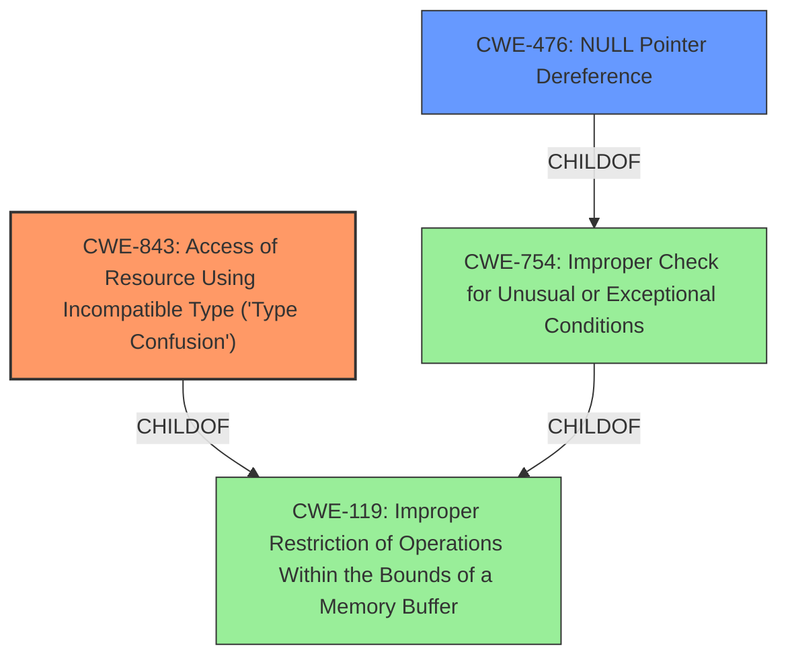

# Enhanced Analysis for CVE-2024-43357

# Summary

| CWE ID    | CWE Name                                                                                                     | Confidence | CWE Abstraction Level | CWE Vulnerability Mapping Label | CWE-Vulnerability Mapping Notes |
| --------- | ------------------------------------------------------------------------------------------------------------- | ---------- | ----------------------- | ------------------------------- | --------------------------------- |
| CWE-843   | Access of Resource Using Incompatible Type ('Type Confusion')                                                | 0.85      | Base                    | Primary CWE                     | Allowed                           |
| CWE-476   | NULL Pointer Dereference                                                                                      | 0.70      | Base                    | Secondary Candidate            | Allowed                           |

## Evidence and Confidence

*   **Confidence Score:** 0.75
*   **Evidence Strength:** MEDIUM

## Relationship Analysis

The primary weakness is **CWE-843 [Access of Resource Using Incompatible Type ('Type Confusion')]**, a Base level CWE which accurately reflects the **type confusion** that leads to issues in the ECMAScript specification. **CWE-476 [NULL Pointer Dereference]** is considered as a secondary weakness, as pointer dereferences could be a possible consequence of the **type confusion**. Both are child of **CWE-119 [Improper Restriction of Operations Within the Bounds of a Memory Buffer]**.



## Vulnerability Chain

The vulnerability chain starts with a **mis-implementation** in the ECMAScript specification of async generators, leading to **type confusion**. This **type confusion** can then cause a pointer to be dereferenced incorrectly, potentially leading to a **NULL pointer dereference** or other memory access errors, and resulting in **arbitrary behavior**.

## Summary of Analysis

The primary focus is on the **type confusion** aspect of the vulnerability. The vulnerability description explicitly mentions **type confusion** as a root cause.

The evidence supporting **CWE-843 [Access of Resource Using Incompatible Type ('Type Confusion')]** is the vulnerability description stating that a problem in the ECMAScript specification "may lead to **type confusion**." This aligns directly with the CWE-843 description, where a resource is accessed using an incompatible type.

**CWE-476 [NULL Pointer Dereference]** is considered because the description mentions "pointer dereference" as a potential consequence. This could occur if the **type confusion** leads to a pointer being assigned a NULL value and subsequently dereferenced.

The selected CWEs are at the optimal level of specificity because they directly address the root cause (**type confusion**) and a potential consequence (**NULL pointer dereference**) described in the vulnerability.

Relevant CWE Information:

*   CWE-787, CWE-1333, CWE-1284, CWE-335, CWE-1321 and CWE-1188 were not chosen as they did not accurately reflect the **type confusion** and **pointer dereference** issues described in the vulnerability.
*   CWE-822 was considered, but **CWE-476 [NULL Pointer Dereference]** was prefered as a more specific potential outcome of the **type confusion**.
*   CWE-824 was not choosen because the **pointer dereference** was a secondary effect not the primary **rootcause**.


## CWE Relationship Analysis

Current CWEs represent these abstraction levels: .


### Vulnerability Chain Analysis

**Chain starting from CWE-1284:**
- 1284 (Improper Validation of Specified Quantity in Input) - ROOT


**Chain starting from CWE-476:**
- 476 (NULL Pointer Dereference) - ROOT


### CWE Relationship Diagram

```mermaid
graph TD
    classDef primary fill:#f96,stroke:#333,stroke-width:2px
    classDef secondary fill:#69f,stroke:#333
    classDef tertiary fill:#9e9,stroke:#333
```