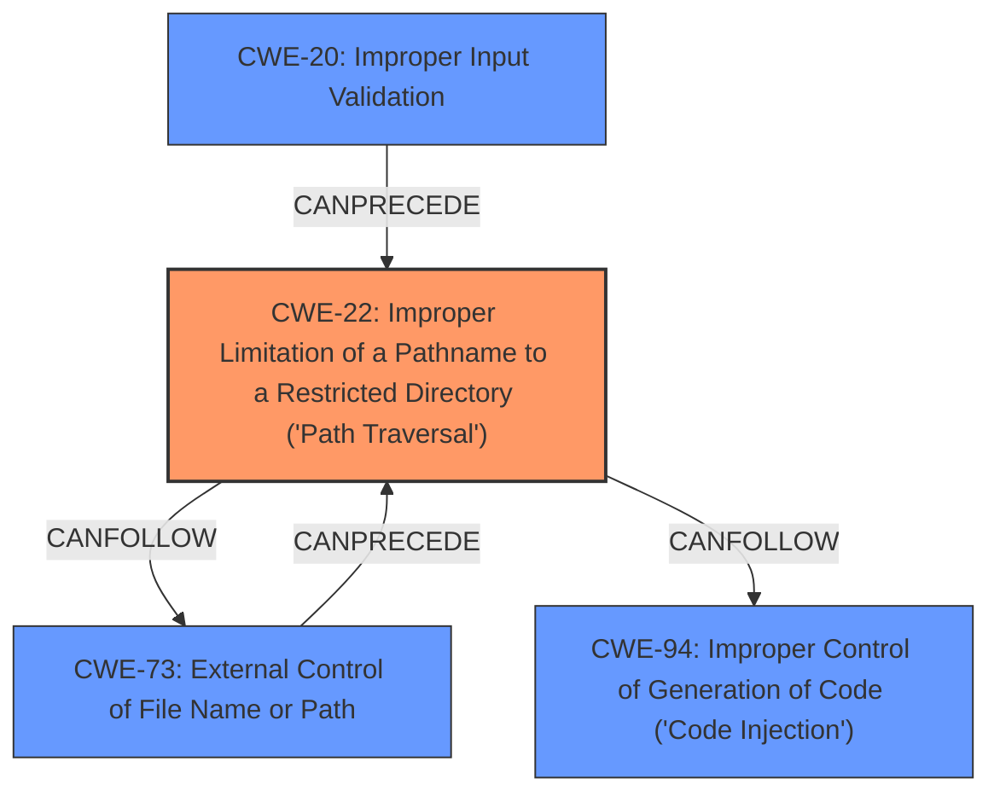

# Analysis Report for CVE-2024-43373

# Vulnerability Analysis Report: CVE-2024-43373

## Description

webcrack is a tool for reverse engineering javascript. An arbitrary file write vulnerability exists in the webcrack module when processing specifically crafted malicious code on Windows systems. This vulnerability is triggered when using the unpack bundles feature in conjunction with the saving feature. If a module name includes a **path traversal** sequence with Windows path separators, an attacker can exploit this to overwrite files on the host system. This vulnerability allows an attacker to write arbitrary `.js` files to the host system, which can be leveraged to hijack legitimate Node.js modules to gain arbitrary code execution. This vulnerability has been patched in version 2.14.1.

## Vulnerability Description Key Phrases

- **Rootcause:** improper input sanitization
- **Weakness:** path traversal
- **Impact:** ['arbitrary code execution', 'arbitrary file write', 'overwrite files']
- **Vector:** specifically crafted malicious code
- **Attacker:** attacker
- **Product:** webcrack
- **Version:** before 2.14.1
- **Component:** unpack bundles feature and saving feature

## Analysis (with Relationship Data)

# Summary
| CWE ID | CWE Name | Confidence | CWE Abstraction Level | CWE Vulnerability Mapping Label | CWE-Vulnerability Mapping Notes |
|---|---|---|---|---|---|
| CWE-22 | Improper Limitation of a Pathname to a Restricted Directory ('Path Traversal') | 1.0 | Base | Allowed | Primary CWE. The vulnerability involves a **path traversal** issue where the software **improperly limits a pathname** to a restricted directory, allowing access to resources outside the intended scope. |
| CWE-73 | External Control of File Name or Path | 0.7 | Base | Allowed | Secondary CWE. The vulnerability involves **external control of file name or path** by allowing user input to control or influence paths or file names that are used in filesystem operations. |
| CWE-94 | Improper Control of Generation of Code ('Code Injection') | 0.6 | Base | Allowed-with-Review | Secondary CWE. By writing arbitrary `.js` files to the host system, the attacker can hijack legitimate Node.js modules to gain arbitrary code execution. |
| CWE-20 | Improper Input Validation | 0.5 | Class | Discouraged | Secondary CWE. The application **does not properly sanitize** module paths. |

## Evidence and Confidence

*   **Confidence Score:** 0.9
*   **Evidence Strength:** HIGH

## Relationship Analysis
The primary weakness is CWE-22, which describes the **improper limitation of a pathname to a restricted directory**, leading to **path traversal**. CWE-22 is a base-level CWE. CWE-73 (External Control of File Name or Path) is related because the vulnerability involves user-controlled input influencing file paths, which can precede the **path traversal**. CWE-94 is related because the impact of the vulnerability can lead to arbitrary code execution. CWE-20 is related because the root cause is **improper input validation**.



## Vulnerability Chain
The vulnerability chain starts with **improper input validation (CWE-20)**, which allows for **external control of file name or path (CWE-73)**. This leads to an **improper limitation of a pathname to a restricted directory ('Path Traversal') (CWE-22)**, ultimately resulting in **improper control of generation of code ('Code Injection') (CWE-94)**.

## Summary of Analysis
The analysis is based on the vulnerability description and the provided CVE reference links content summary. The primary weakness is clearly a **path traversal (CWE-22)** vulnerability, supported by the description of **improper input sanitization** and the ability to overwrite files outside the intended directory. The relationship graph helped visualize the connections between CWEs, confirming the chain of events. The selected CWEs are at the appropriate level of specificity, accurately representing the root cause and impact of the vulnerability. The vulnerability description clearly indicates a **path traversal** issue due to **improper input sanitization**, making CWE-22 the most appropriate primary CWE. Other CWEs such as CWE-59 (Improper Link Resolution Before File Access ('Link Following')) and CWE-41 (Improper Resolution of Path Equivalence) were considered but deemed less relevant as the primary issue is related to path traversal and not symlink handling or path equivalence. CWE-94 is used since the end result is the ability to inject Javascript code. CWE-20 is used since the rootcause of the problem is based on **improper input validation**.

Relevant CWE Information:

# Enhanced Context (25 CWEs)
The following CWEs were identified as potentially relevant to this vulnerability:

## CWE-178: Improper Handling of Case Sensitivity
**Abstraction Level**: Base
**Similarity Score**: 0.75
**Source**: dense

**Description**:
The product does not properly account for differences in case sensitivity when accessing or determining the properties of a resource, leading to inconsistent results.

**Mapping Guidance**:
- Usage: Allowed
- Rationale: This CWE entry is at the Base level of abstraction, which is a preferred level of abstraction for mapping to the root causes of vulnerabilities.


## CWE-427: Uncontrolled Search Path Element
**Abstraction Level**: Base
**Similarity Score**: 0.75
**Source**: dense

**Description**:
The product uses a fixed or controlled search path to find resources, but one or more locations in that path can be under the control of unintended actors.

**Mapping Guidance**:
- Usage: Allowed
- Rationale: This CWE entry is at the Base level of abstraction, which is a preferred level of abstraction for mapping to the root causes of vulnerabilities.


## CWE-116: Improper Encoding or Escaping of Output
**Abstraction Level**: Class
**Similarity Score**: 0.74
**Source**: dense

**Description**:
The product prepares a structured message for communication with another component, but encoding or escaping of the data is either missing or done incorrectly. As a result, the intended structure of the message is not preserved.

**Mapping Guidance**:
- Usage: Allowed-with-Review
- Rationale: This CWE entry is a Class and might have Base-level children that would be more appropriate


## CWE-59: Improper Link Resolution Before File Access ('Link Following')
**Abstraction Level**: Base
**Similarity Score**: 0.74
**Source**: dense

**Description**:
The product attempts to access a file based on the filename, but it does not properly prevent that filename from identifying a link or shortcut that resolves to an unintended resource.

**Mapping Guidance**:
- Usage: Allowed
- Rationale: This CWE entry is at the Base level of abstraction, which is a preferred level of abstraction for mapping to the root causes of vulnerabilities.


## CWE-41: Improper Resolution of Path Equivalence
**Abstraction Level**: Base
**Similarity Score**: 0.74
**Source**: dense

**Description**:
The product is vulnerable to file system contents disclosure through path equivalence. Path equivalence involves the use of special characters in file and directory names. The associated manipulations are intended to generate multiple names for the same object.

**Mapping Guidance**:
- Usage: Allowed
- Rationale: This CWE entry is at the Base level of abstraction, which is a preferred level of abstraction for mapping to the root causes of vulnerabilities.


## CWE-23: Relative Path Traversal
**Abstraction Level**: Base
**Similarity Score**: 0.74
**Source**: dense

**Description**:
The product uses external input to construct a pathname that should be within a restricted directory, but it does not properly neutralize sequences such as ".." that can resolve to a location that is outside of that directory.

**Mapping Guidance**:
- Usage: Allowed
- Rationale: This CWE entry is at the Base level of abstraction, which is a preferred level of abstraction for mapping to the root causes of vulnerabilities.


## CWE-425: Direct Request ('Forced Browsing')
**Abstraction Level**: Base
**Similarity Score**: 0.74
**Source**: dense

**Description**:
The web application does not adequately enforce appropriate authorization on all restricted URLs, scripts, or files.

**Mapping Guidance**:
- Usage: Allowed
- Rationale: This CWE entry is at the Base level of abstraction, which is a preferred level of abstraction for mapping to the root causes of vulnerabilities.


## CWE-88: Improper Neutralization of Argument Delimiters in a Command ('Argument Injection')
**Abstraction Level**: Base
**Similarity Score**: 0.74
**Source**: dense

**Description**:
The product constructs a string for a command to be executed by a separate component
in another control sphere, but it does not properly delimit the
intended arguments, options, or switches within that command string.

**Mapping Guidance**:
- Usage: Allowed
- Rationale: This CWE entry is at the Base level of abstraction, which is a preferred level of abstraction for mapping to the root causes of vulnerabilities.


## CWE-73: External Control of File Name or Path
**Abstraction Level**: Base
**Similarity Score**: 0.74
**Source**: dense

**Description**:
The product allows user input to control or influence paths or file names that are used in filesystem operations.

**Mapping Guidance**:
- Usage: Allowed
- Rationale: This CWE entry is at the Base level of abstraction, which is a preferred level of abstraction for mapping to the root causes of vulnerabilities.


## CWE-923: Improper Restriction


## CWE Relationship Analysis

Current CWEs represent these abstraction levels: .


### Vulnerability Chain Analysis

**Chain starting from CWE-427:**
- 427 (Uncontrolled Search Path Element) - ROOT


**Chain starting from CWE-94:**
- 94 (Improper Control of Generation of Code ('Code Injection')) - ROOT


### CWE Relationship Diagram

```mermaid
graph TD
    classDef primary fill:#f96,stroke:#333,stroke-width:2px
    classDef secondary fill:#69f,stroke:#333
    classDef tertiary fill:#9e9,stroke:#333
```


*Report generated on 2025-07-13 14:44:32*
