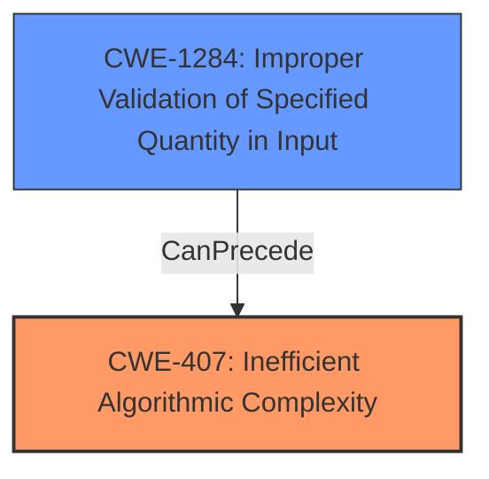

# Analysis for CVE-2024-43380

# Summary
| CWE ID | CWE Name | Confidence | CWE Abstraction Level | CWE Vulnerability Mapping Label | CWE-Vulnerability Mapping Notes |
|---|---|---|---|---|---|
| CWE-407 | Inefficient Algorithmic Complexity | 0.9 | Class | Primary | Allowed-with-Review |
| CWE-1284 | Improper Validation of Specified Quantity in Input | 0.7 | Base | Secondary | Allowed |

## Evidence and Confidence

*   **Confidence Score:** 0.8
*   **Evidence Strength:** HIGH

## Relationship Analysis
The primary relationship influencing the decision is that CWE-407 is a Class-level CWE, which can have more specific Base-level children. However, in this case, CWE-407 directly addresses the algorithmic inefficiency that is the root cause. CWE-1284 is related as it shows how the lack of validation leads to the algorithmic complexity.

## Vulnerability Chain
The vulnerability chain starts with the **improper validation** of the input string length (CWE-1284), leading to the **inefficient algorithmic complexity** (CWE-407) when parsing the overly long input, ultimately resulting in a denial-of-service.

## Summary of Analysis
The primary weakness is the inefficient algorithm used to parse natural language cron expressions. The `Fugit.parse` function accepts any length of input and attempts to parse it, leading to excessive resource consumption.

Evidence:

*   "The fugit natural parser, that turns every wednesday at 5pm into 0 17 * * 3, accepted any length of input and went on attempting to parse it, not returning promptly, as expected."
*   "The parse call could hold the thread with no end in sight."
*   "The vulnerability stems from the `Fugit.parse` and related functions in the `fugit` gem (Ruby library) having poor time complexity when parsing "natural" language cron expressions."

CWE-407 (Inefficient Algorithmic Complexity) is the most appropriate because it directly addresses the root cause of the vulnerability. The algorithm's inefficiency allows an attacker to cause a denial of service by providing a long, crafted input string.

CWE-1284 (Improper Validation of Specified Quantity in Input) is a secondary weakness because the parser did not check the length of the input string. This lack of validation allows an attacker to provide an arbitrarily long input string, which then triggers the inefficient algorithm.

The selected CWEs are at the optimal level of specificity because they accurately represent the weaknesses present in the vulnerability. CWE-407 is a Class, but captures the main weakness. CWE-1284 being Base level elaborates on the lack of validation.

**CWEs Considered But Not Used:**

*   CWE-1333 (Inefficient Regular Expression Complexity): While regular expressions are often associated with parsing, the vulnerability description does not explicitly mention the use of inefficient regular expressions. Therefore, this CWE is not as accurate as CWE-407.
*   CWE-789 (Memory Allocation with Excessive Size Value): This CWE is related to allocating memory based on untrusted size values. While the inefficient algorithm may lead to excessive memory allocation, the core issue is the algorithmic complexity itself, not the memory allocation.
*   CWE-409 (Improper Handling of Highly Compressed Data (Data Amplification)): This CWE is not applicable because the vulnerability does not involve highly compressed data.
*   CWE-476 (NULL Pointer Dereference): This CWE is not applicable because the vulnerability is not related to null pointer dereferences.
*   CWE-125 (Out-of-bounds Read) and CWE-126 (Buffer Over-read): These are related to memory access issues, but the core weakness is algorithmic complexity, not memory access.
* CWE-193 (Off-by-one Error): This is not applicable as there are no off by one errors involved.
* CWE-295 (Improper Certificate Validation): This is not applicable because it is not a certificate validation issue.
* CWE-863 (Incorrect Authorization): This is not applicable because it is not an authorization issue.
* CWE-1390 (Weak Authentication): This is not applicable because it is not an authentication issue.