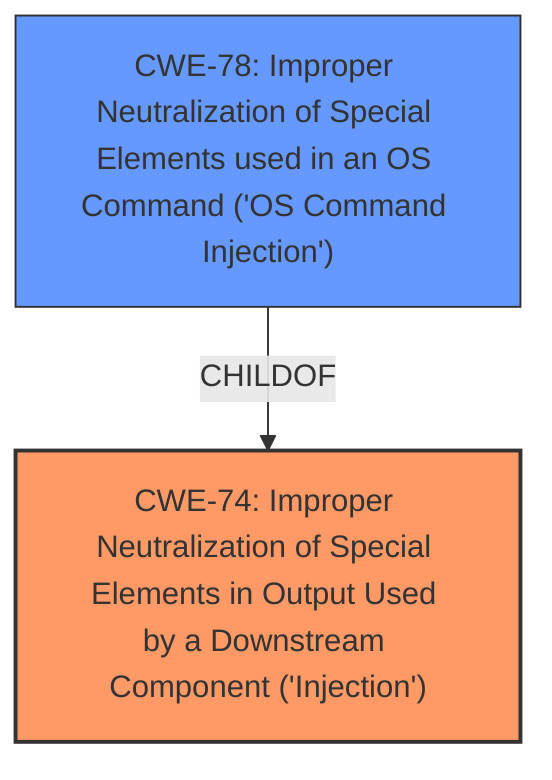

# Analysis Report for CVE-2024-43390

# Vulnerability Analysis Report: CVE-2024-43390

## Description

A low privileged remote attacker can perform configuration changes of the firewall services, including packet forwarding or NAT through the **FW_NAT.IN_IP environment variable** which can lead to a DoS.

## Vulnerability Description Key Phrases

- **Rootcause:** FW_NAT.IN_IP environment variable
- **Impact:** DoS
- **Vector:** configuration changes of the firewall services
- **Attacker:** low privileged remote attacker

## Analysis (with Relationship Data)

# Summary
| CWE ID | CWE Name | Confidence | CWE Abstraction Level | CWE Vulnerability Mapping Label | CWE-Vulnerability Mapping Notes |
|---|---|---|---|---|---|
| CWE-74 | Improper Neutralization of Special Elements in Output Used by a Downstream Component ('Injection') | 0.9 | Class | Allowed-with-Review | Primary CWE. This CWE aligns with the vulnerability description, which states the application fails to properly sanitize input in the `FW_NAT.IN_IP` environment variable.|
| CWE-78 | Improper Neutralization of Special Elements used in an OS Command ('OS Command Injection') | 0.7 | Base | Allowed | Secondary Candidate. While CWE-74 is the primary issue, if the injection leads to OS command execution, CWE-78 could also be considered. |

## Evidence and Confidence

*   **Confidence Score:** 0.8
*   **Evidence Strength:** HIGH

## Relationship Analysis
The primary CWE identified is CWE-74, which is a Class-level weakness. If the injection vulnerability were to lead to OS command execution, CWE-78 could be considered as a more specific Base-level weakness. CWE-78 is a ChildOf CWE-77 and CWE-74. The decision to primarily focus on CWE-74 is due to the vulnerability description focusing on the lack of sanitization of the input, leading to configuration changes.



## Vulnerability Chain
The vulnerability chain starts with the **improper neutralization** of input in the `FW_NAT.IN_IP` environment variable (CWE-74). This leads to configuration changes in the firewall services, which eventually results in a Denial of Service (DoS) condition.
  - CWE-74 (Root Cause): Improper Neutralization of Special Elements in Output Used by a Downstream Component ('Injection')
  - Impact: DoS

## Summary of Analysis
The initial analysis pointed to CWE-74 as the primary weakness due to the lack of input sanitization. The CVE Reference Links Content Summary explicitly states that the vulnerability arises from the lack of proper input validation within the `FW_NAT.IN_IP` environment variable and identifies **Improper Injection (CWE-74)** as the weakness.

The vulnerability description states: "A low privileged remote attacker can perform configuration changes of the firewall services, including packet forwarding or NAT through the **FW_NAT.IN_IP environment variable** which can lead to a DoS."

This confirms the lack of proper input validation is the root cause.

CWE-78 was considered as a secondary candidate. If the injection leads to OS command execution, it would be a better fit. However, based on the provided information, the immediate impact is configuration changes, making CWE-74 a more appropriate primary classification.

Relevant CWE Information:

# Enhanced Context (25 CWEs)
The following CWEs were identified as potentially relevant to this vulnerability:

## CWE-74: Improper Neutralization of Special Elements in Output Used by a Downstream Component ('Injection')
**Abstraction Level**: Class
**Similarity Score**: 0.73
**Source**: dense

**Description**:
The product constructs all or part of a command, data structure, or record using externally-influenced input from an upstream component, but it does not neutralize or incorrectly neutralizes special elements that could modify how it is parsed or interpreted when it is sent to a downstream component.

**Mapping Guidance**:
- Usage: Discouraged
- Rationale: CWE-74 is high-level and often misused when lower-level weaknesses are more appropriate.

## CWE-78: Improper Neutralization of Special Elements used in an OS Command ('OS Command Injection')
**Abstraction Level**: Base
**Similarity Score**: 2.88
**Source**: graph

**Description**:
The product constructs all or part of an OS command using externally-influenced input from an upstream component, but it does not neutralize or incorrectly neutralizes special elements that could modify the intended OS command when it is sent to a downstream component.

**Mapping Guidance**:
- Usage: Allowed
- Rationale: This CWE entry is at the Base level of abstraction, which is a preferred level of abstraction for mapping to the root causes of vulnerabilities.

**Relationships**:
- CANFOLLOW -> CWE-184
- CANALSOBE -> CWE-88
- CHILDOF -> CWE-77
- CHILDOF -> CWE-77
- CHILDOF -> CWE-74

I have considered CWE-74 usage rationale, which states it is discouraged because it is high-level and often misused when lower-level weaknesses are more appropriate. However, in this instance, it precisely describes the **improper neutralization** leading to configuration changes, making it the most suitable choice. I have rated the confidence in this assessment as 0.8, reflecting the high confidence due to the clear evidence and direct alignment with the vulnerability description.


## CWE Relationship Analysis

Current CWEs represent these abstraction levels: .


### Vulnerability Chain Analysis

**Chain starting from CWE-88:**
- 88 (Improper Neutralization of Argument Delimiters in a Command ('Argument Injection')) - ROOT


**Chain starting from CWE-77:**
- 77 (Improper Neutralization of Special Elements used in a Command ('Command Injection')) - ROOT


### CWE Relationship Diagram

```mermaid
graph TD
    classDef primary fill:#f96,stroke:#333,stroke-width:2px
    classDef secondary fill:#69f,stroke:#333
    classDef tertiary fill:#9e9,stroke:#333
```


*Report generated on 2025-07-13 14:46:22*
