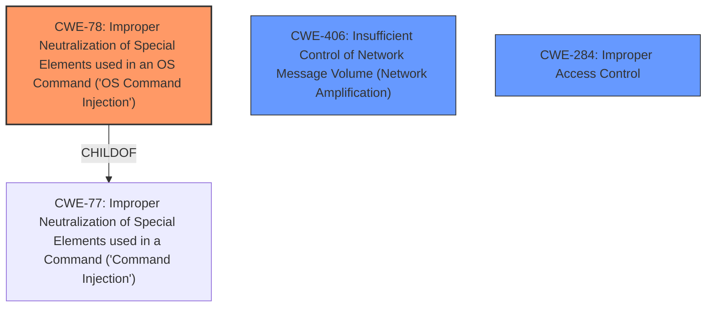

# Analysis Report for CVE-2024-43391

# Vulnerability Analysis Report: CVE-2024-43391

## Description

A low privileged remote attacker can perform configuration changes of the firewall services, including packet filter, packet forwarding, network access control or NAT through the FW_PORTFORWARDING.SRC_IP environment variable which can lead to a DoS.

## Vulnerability Description Key Phrases

- **Impact:** DoS
- **Attacker:** low privileged remote attacker
- **Component:** FW_PORTFORWARDING.SRC_IP environment variable

## Analysis (with Relationship Data)

# Summary
| CWE ID | CWE Name | Confidence | CWE Abstraction Level | CWE Vulnerability Mapping Label | CWE-Vulnerability Mapping Notes |
|---|---|---|---|---|---|
| CWE-78 | Improper Neutralization of Special Elements used in an OS Command ('OS Command Injection') | 0.8 | Base | Allowed | Primary CWE - This is the root cause of the vulnerability. |
| CWE-406 | Insufficient Control of Network Message Volume (Network Amplification) | 0.6 | Class | Allowed-with-Review | Secondary Candidate - Possible impact due to configuration changes. |
| CWE-284 | Improper Access Control | 0.5 | Pillar | Discouraged | Secondary Candidate - High level access control problem |

## Evidence and Confidence

*   **Confidence Score:** 0.7
*   **Evidence Strength:** MEDIUM

## Relationship Analysis
The primary CWE is CWE-78, which represents the root cause. It is a base level CWE and is a child of CWE-77. CWE-406 is a Class-level CWE and describes a potential impact of exploiting the root cause. CWE-284 is a Pillar-level CWE and describes general access control problem.



## Vulnerability Chain
The vulnerability chain starts with **improper neutralization of special elements** (CWE-78) within the `FW_PORTFORWARDING.SRC_IP` environment variable. A low privileged remote attacker exploits this weakness by injecting malicious commands. Successful exploitation leads to configuration changes in firewall services which can lead to network amplification (CWE-406) resulting in a denial-of-service (DoS).

## Summary of Analysis
The primary weakness is CWE-78, **Improper Neutralization of Special Elements used in an OS Command ('OS Command Injection')**. The "CVE Reference Links Content Summary" explicitly states "The vulnerability lies in the **improper handling of special characters** within the `FW_PORTFORWARDING.SRC_IP` environment variable, which is used to configure firewall services.". This statement directly supports the selection of CWE-78 as the root cause. The vulnerability description also mentions the attacker can make configuration changes to firewall services which can lead to a DoS. This impact could be related to CWE-406 **Insufficient Control of Network Message Volume (Network Amplification)**, as unauthorized configuration changes might lead to network amplification. CWE-284, **Improper Access Control** is a high-level CWE and is not as precise as CWE-78.

Relevant CWE Information:
- CWE-78: Improper Neutralization of Special Elements used in an OS Command ('OS Command Injection')
- CWE-406: Insufficient Control of Network Message Volume (Network Amplification)
- CWE-284: Improper Access Control


## CWE Relationship Analysis

Current CWEs represent these abstraction levels: .


### Vulnerability Chain Analysis

**Chain starting from CWE-406:**
- 406 (Insufficient Control of Network Message Volume (Network Amplification)) - ROOT


**Chain starting from CWE-77:**
- 77 (Improper Neutralization of Special Elements used in a Command ('Command Injection')) - ROOT


### CWE Relationship Diagram

```mermaid
graph TD
    classDef primary fill:#f96,stroke:#333,stroke-width:2px
    classDef secondary fill:#69f,stroke:#333
    classDef tertiary fill:#9e9,stroke:#333
```


*Report generated on 2025-07-13 14:46:42*
