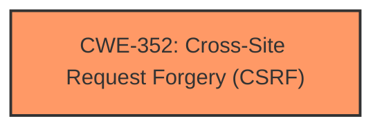

# Enhanced Analysis for CVE-2024-43434

# Summary
| CWE ID | CWE Name | Confidence | CWE Abstraction Level | CWE Vulnerability Mapping Label | CWE-Vulnerability Mapping Notes |
|---|---|---|---|---|---|
| CWE-352 | Cross-Site Request Forgery (CSRF) | 1.0 | Compound | Primary CWE | Allowed |

## Evidence and Confidence

*   **Confidence Score:** 1.0
*   **Evidence Strength:** HIGH

## Relationship Analysis
The primary identified weakness is CWE-352 [Cross-Site Request Forgery (CSRF)], which is a compound weakness. This means it is composed of multiple underlying weaknesses that must occur simultaneously for the vulnerability to be present. There are relationships to other CWEs that represent contributing factors or prerequisites for CSRF, but in this case, the description points directly to the CSRF vulnerability itself.



## Vulnerability Chain
The vulnerability chain starts with an **incorrect CSRF token check**, leading directly to a **CSRF vulnerability**.

## Summary of Analysis
The vulnerability description clearly states that the root cause is an **incorrect CSRF token check**, resulting in a **CSRF vulnerability**. The CVE Reference Links Content Summary also confirms this, stating that "The bulk message sending feature for the Feedback module's non-respondents report had an incorrect CSRF token check" and that the weaknesses include "CSRF (Cross-Site Request Forgery)". Given this evidence, CWE-352 [Cross-Site Request Forgery (CSRF)] is the most appropriate mapping.

CWE-352 is a compound weakness describing the conditions under which a CSRF attack is possible. While there may be underlying causes for the **incorrect CSRF token check**, the description focuses on the CSRF vulnerability itself. The retriever results also list CWE-352 as the top candidate with a good score.

I considered other CWEs like CWE-346 [Origin Validation Error], CWE-472 [External Control of Assumed-Immutable Web Parameter], and CWE-613 [Insufficient Session Expiration], but these are more related to potential causes or related issues that could contribute to CSRF but are not directly the described vulnerability. Therefore, CWE-352 [Cross-Site Request Forgery (CSRF)] is the most accurate and specific representation of the vulnerability based on the provided information.


## CWE Relationship Analysis

Current CWEs represent these abstraction levels: .


### Vulnerability Chain Analysis

**Chain starting from CWE-352:**
- 352 (Cross-Site Request Forgery (CSRF)) - ROOT


**Chain starting from CWE-613:**
- 613 (Insufficient Session Expiration) - ROOT


### CWE Relationship Diagram

```mermaid
graph TD
    classDef primary fill:#f96,stroke:#333,stroke-width:2px
    classDef secondary fill:#69f,stroke:#333
    classDef tertiary fill:#9e9,stroke:#333
```