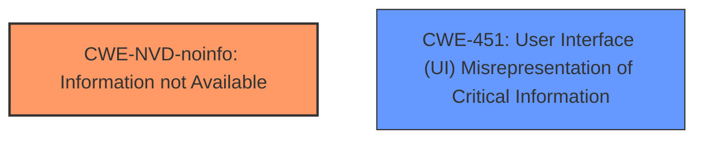

# Raw Analyzer Response for CVE-2024-43487

# Summary
| CWE ID        | CWE Name                                                                 | Confidence | CWE Abstraction Level | CWE Vulnerability Mapping Label | CWE-Vulnerability Mapping Notes |
|---------------|--------------------------------------------------------------------------|------------|-----------------------|---------------------------------|-----------------------------------|
| CWE-NVD-noinfo | Information not Available                                             | 0.7        | N/A                   | Primary                         | Allowed                          |
| CWE-451       | User Interface (UI) Misrepresentation of Critical Information           | 0.4        | Class                   | Secondary                       | Allowed-with-Review              |

## Evidence and Confidence

*   **Confidence Score:** 0.7
*   **Evidence Strength:** LOW

## Relationship Analysis
The primary assigned CWE is CWE-NVD-noinfo, which indicates a lack of specific information to categorize the vulnerability further. CWE-451 is a class-level CWE that could be applicable if more information about the UI misrepresentation were available. CWE-451 has child CWEs, but none are selected due to the limited information.

## Vulnerability Chain
The vulnerability chain starts with the **Mark of the Web Security Feature Bypass**, leading to a **Security Feature Bypass impact**. The information is very limited, but there's an implied misrepresentation of security information in the UI that leads to the bypass.

## Summary of Analysis
The initial assessment, based on the provided evidence, strongly points towards CWE-NVD-noinfo due to the lack of detailed information about the vulnerability. The primary match from similar CVE descriptions also supports this. However, the vulnerability description does mention "Security Feature Bypass," which suggests that the user is not properly informed about the security implications, potentially involving the UI. This consideration led to the inclusion of CWE-451 as a secondary candidate, although with lower confidence due to the limited evidence.

The selection is based on the understanding that the root cause is currently unknown. If more details were available, a more specific CWE might be chosen, potentially a child of CWE-451. The evidence is weak, but "Security Feature Bypass" hints at UI-related issues; therefore, I've added it to the report.

Relevant CWE Information:

# Enhanced Context (25 CWEs)
The following CWEs were identified as potentially relevant to this vulnerability:

## CWE-451: User Interface (UI) Misrepresentation of Critical Information
**Abstraction Level**: Class
**Similarity Score**: 0.75
**Source**: dense

**Description**:
The user interface (UI) does not properly represent critical information to the user, allowing the information - or its source - to be obscured or spoofed. This is often a component in phishing attacks.

**Mapping Guidance**:
- Usage: Allowed-with-Review
- Rationale: This CWE entry is a Class and might have Base-level children that would be more appropriate

### Detailed Analysis of Candidate CWEs and Decision Rationale:

*   **CWE-NVD-noinfo:** This is the primary CWE match for similar CVE descriptions. It indicates that there isn't enough information available to pinpoint a specific CWE. Given the limited details in the vulnerability description and CVE Reference Links Content Summary, this is a reasonable starting point.
*   **CWE-451: User Interface (UI) Misrepresentation of Critical Information:** While the description mentions "Security Feature Bypass," this might involve a misrepresentation of security information in the UI. This CWE is considered as a secondary mapping, but with low confidence due to lack of specific evidence. The "Allowed-with-Review" usage aligns with this cautious approach.
*   **CWE-356: Product UI does not Warn User of Unsafe Actions:** This is related to CWE-451 and could be a more specific option if there were evidence that the UI fails to warn the user. However, there isn't enough information to support this.
*   **CWE-1007: Insufficient Visual Distinction of Homoglyphs Presented to User:** This is not relevant because the vulnerability description doesn't suggest any visual misrepresentation issues.
*   **CWE-184: Incomplete List of Disallowed Inputs, CWE-183: Permissive List of Allowed Inputs, CWE-434: Unrestricted Upload of File with Dangerous Type:** These CWEs don't align with the vulnerability description, as they relate to input validation and file handling, respectively. There is no mention of these aspects in the description.
*   **CWE-274: Improper Handling of Insufficient Privileges:** This is not directly applicable, as the issue is more related to a security feature bypass rather than privilege handling.
*   **CWE-807: Reliance on Untrusted Inputs in a Security Decision, CWE-472: External Control of Assumed-Immutable Web Parameter, CWE-59: Improper Link Resolution Before File Access ('Link Following'), CWE-288: Authentication Bypass Using an Alternate Path or Channel, CWE-497: Exposure of Sensitive System Information to an Unauthorized Control Sphere, CWE-80: Improper Neutralization of Script-Related HTML Tags in a Web Page (Basic XSS):** These are not applicable, as the vulnerability description doesn't relate to input handling, file access, authentication, or information exposure.