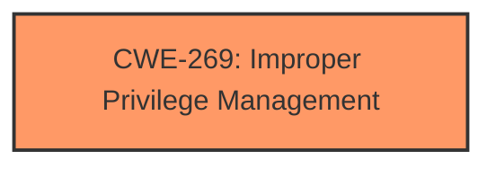

# Analysis Report for CVE-2024-43492

# Vulnerability Analysis Report: CVE-2024-43492

## Description

Microsoft AutoUpdate (MAU) Elevation of Privilege Vulnerability

## Vulnerability Description Key Phrases

- **Impact:** Elevation of Privilege
- **Product:** Microsoft AutoUpdate

## Analysis (with Relationship Data)

# Summary
| CWE ID  | CWE Name                                                                 | Confidence | CWE Abstraction Level | CWE Vulnerability Mapping Label | CWE-Vulnerability Mapping Notes |
| :-------- | :----------------------------------------------------------------------- | :--------- | :-------------------- | :------------------------------ | :------------------------------ |
| CWE-269 | Improper Privilege Management                                            | 0.6        | Class                 | Primary                           | Discouraged                     |

## Evidence and Confidence

*   **Confidence Score:** 0.6
*   **Evidence Strength:** LOW

## Relationship Analysis
The primary consideration is the parent-child relationship between CWE-269 and its potential children. The choice hinges on whether a more specific cause can be identified. The retriever results suggest several potential child CWEs, but without more information the generic CWE-269 seems most appropriate.



## Vulnerability Chain
The chain starts with **Improper Privilege Management (CWE-269)** which leads to the impact of Elevation of Privilege.

## Summary of Analysis
The assessment is primarily based on the vulnerability description key phrases, specifically "Elevation of Privilege" and "Microsoft AutoUpdate." The lack of detail in the CVE reference links necessitates reliance on these phrases. The best fit, given the limited information, is **CWE-269**, Improper Privilege Management.

The retriever results suggested several other CWEs. However, none of these can be selected with any real confidence due to the lack of evidence. Specifically:

*   CWE-59, CWE-65, CWE-426, CWE-191, CWE-1204, CWE-266, CWE-1386, CWE-123, and CWE-98 were considered, but discarded due to lack of specific information about the root cause.

The selection of **CWE-269** is at the Class level because there isn't enough information to select a more specific Base or Variant level CWE.

Relevant CWE Information:

# Enhanced Context (25 CWEs)
The following CWEs were identified as potentially relevant to this vulnerability:

## CWE-269: Improper Privilege Management
**Abstraction Level**: Class
**Similarity Score**: 1197.59
**Source**: sparse

**Description**:
The product does not properly assign, modify, track, or check privileges for an actor, creating an unintended sphere of control for that actor.

**Mapping Guidance**:
- Usage: Discouraged
- Rationale: CWE-269 is commonly misused. It can be conflated with "privilege escalation," which is a technical impact that is listed in many low-information vulnerability reports [REF-1287]. It is not useful for trend analysis.


## CWE Relationship Analysis

Current CWEs represent these abstraction levels: .


### Vulnerability Chain Analysis

**Chain starting from CWE-123:**
- 123 (Write-what-where Condition) - ROOT


**Chain starting from CWE-426:**
- 426 (Untrusted Search Path) - ROOT


### CWE Relationship Diagram

```mermaid
graph TD
    classDef primary fill:#f96,stroke:#333,stroke-width:2px
    classDef secondary fill:#69f,stroke:#333
    classDef tertiary fill:#9e9,stroke:#333
```


*Report generated on 2025-07-13 14:54:36*
