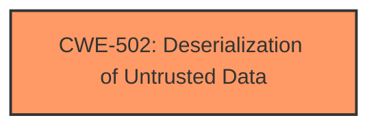

# Raw Analyzer Response for CVE-2024-43497

# Summary
| CWE ID | CWE Name | Confidence | CWE Abstraction Level | CWE Vulnerability Mapping Label | CWE-Vulnerability Mapping Notes |
|---|---|---|---|---|---|
| CWE-502 | Deserialization of Untrusted Data | 1.0 | Base | Primary | Allowed |

## Evidence and Confidence

*   **Confidence Score:** 1.0
*   **Evidence Strength:** HIGH

## Relationship Analysis
The primary CWE identified is CWE-502, which is a Base level CWE. This is the preferred level of abstraction. There are no child or parent relationships that are relevant in this case. There are also no chain relationships to consider since this is the root cause.

## Vulnerability Chain
The vulnerability chain starts with **insecure deserialization of untrusted data** (CWE-502), which leads to arbitrary code execution.

## Summary of Analysis
The vulnerability description clearly states that the **root cause** is **insecure deserialization of untrusted data**, which directly corresponds to CWE-502. The impact is remote code execution, which is a consequence of the deserialization vulnerability.

The retriever results also lists CWE-502 as the top candidate with a similarity score of 0.73 (dense) and 0.080 (sparse).

The evidence supporting this mapping is:
- "**rootcause:** **Insecure deserialization of untrusted data**"
- "**weakness:** **Deserialization of untrusted data allows for arbitrary code execution.**"

This is sufficient to confidently assign CWE-502 as the primary CWE.

# Enhanced Context (25 CWEs)
The following CWEs were identified as potentially relevant to this vulnerability:

## CWE-502: Deserialization of Untrusted Data
**Abstraction Level**: Base
**Similarity Score**: 0.73
**Source**: dense

**Description**:
The product deserializes untrusted data without sufficiently ensuring that the resulting data will be valid.

**Mapping Guidance**:
- Usage: Allowed
- Rationale: This CWE entry is at the Base level of abstraction, which is a preferred level of abstraction for mapping to the root causes of vulnerabilities.

## CWE-294: Authentication Bypass by Capture-replay
**Abstraction Level**: Base
**Similarity Score**: 0.71
**Source**: dense

**Description**:
A capture-replay flaw exists when the design of the product makes it possible for a malicious user to sniff network traffic and bypass authentication by replaying it to the server in question to the same effect as the original message (or with minor changes).

**Mapping Guidance**:
- Usage: Allowed
- Rationale: This CWE entry is at the Base level of abstraction, which is a preferred level of abstraction for mapping to the root causes of vulnerabilities.

(Skipping other CWEs for brevity as they are not selected and the analysis focuses on the selected one)