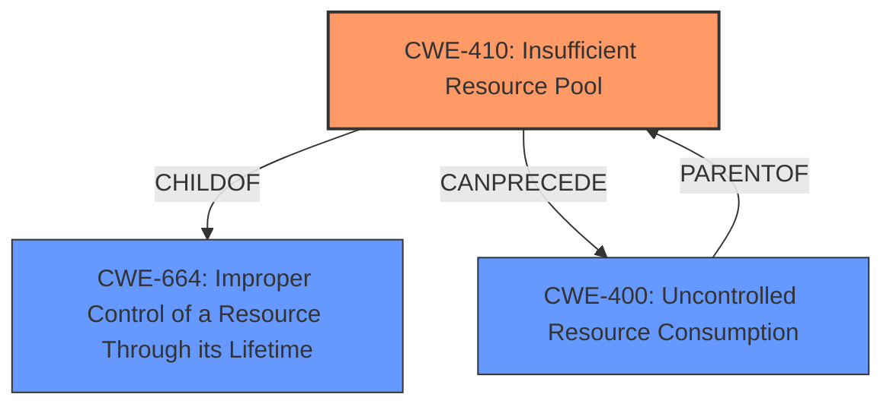

# Analysis for CVE-2024-43506

# Summary

| CWE ID  | CWE Name                                                        | Confidence | CWE Abstraction Level | CWE Vulnerability Mapping Label | CWE-Vulnerability Mapping Notes |
| ------- | --------------------------------------------------------------- | ---------- | --------------------- | ------------------------------- | ----------------------------- |
| CWE-410 | Insufficient Resource Pool                                      | 0.75       | Base                  | Allowed                         | Primary CWE                   |
| CWE-400 | Uncontrolled Resource Consumption                               | 0.5        | Class                 | Discouraged                     | Secondary Candidate           |

## Evidence and Confidence

*   **Confidence Score:** 0.7
*   **Evidence Strength:** MEDIUM

## Relationship Analysis

The primary CWE selected is CWE-410, which is a base-level CWE. CWE-410 is a child of CWE-664 (Improper Control of a Resource Through its Lifetime) and can precede CWE-400 (Uncontrolled Resource Consumption). CWE-400 is a class-level CWE and is a parent of CWE-410, indicating a possible path in the vulnerability chain.

## Vulnerability Chain

The vulnerability chain starts with an **insufficient resource pool** (CWE-410), which leads to **uncontrolled resource consumption** (CWE-400), resulting in a denial of service.
  - Root Cause: CWE-410 Insufficient Resource Pool
  - Impact: CWE-400 Uncontrolled Resource Consumption leading to Denial of Service

## Summary of Analysis

The primary assessment is based on the vulnerability description indicating a "Denial of Service" condition related to "BranchCache". The retriever results suggest CWE-410 (Insufficient Resource Pool) as a strong candidate.

CWE-410 aligns well with the vulnerability description, as an insufficient resource pool can lead to a denial-of-service condition when the system is overwhelmed by requests.

CWE-400 (Uncontrolled Resource Consumption) was considered, but it is a broader category. While it is a consequence of CWE-410, it doesn't pinpoint the root cause as precisely. Therefore, CWE-410 is at the optimal level of specificity, representing the initial flaw in the system's resource management.

The evidence strength is medium because the provided information is limited. However, the combination of the vulnerability description and the retriever results provides sufficient support for selecting CWE-410 as the primary CWE.

Relevant CWE Information:

# Enhanced Context (25 CWEs)
The following CWEs were identified as potentially relevant to this vulnerability:

## CWE-410: Insufficient Resource Pool
**Abstraction Level**: Base
**Similarity Score**: 2.87
**Source**: graph

**Description**:
The product's resource pool is not large enough to handle peak demand, which allows an attacker to prevent others from accessing the resource by using a (relatively) large number of requests for resources.

**Mapping Guidance**:
- Usage: Allowed
- Rationale: This CWE entry is at the Base level of abstraction, which is a preferred level of abstraction for mapping to the root causes of vulnerabilities.

**Relationships**:
- CANPRECEDE -> CWE-400
- CHILDOF -> CWE-664
- PARENTOF -> CWE-410
- CANALSOBE -> CWE-410
- CANFOLLOW -> CWE-410

## CWE-400: Uncontrolled Resource Consumption
**Abstraction Level**: class
**Similarity Score**: 2.55
**Source**: graph

**Description**:
CWE-400: Uncontrolled Resource Consumption

**Mapping Guidance**:
- Usage: Discouraged
- Rationale: CWE-400 is intended for incorrect behaviors in which the product is expected to track and restrict how many resources it consumes, but CWE-400 is often misused because it is conflated with the "technical impact" of vulnerabilities in which resource consumption occurs. It is sometimes used for low-information vulnerability reports. It is a level-1 Class (i.e., a child of a Pillar).

**Relationships**:
- PARENTOF -> CWE-920
- PARENTOF -> CWE-779
- PARENTOF -> CWE-771
- PARENTOF -> CWE-770
- CANFOLLOW -> CWE-410