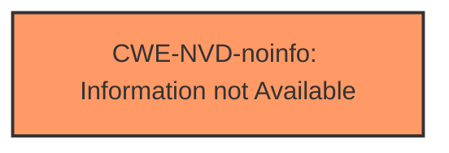

# Enhanced Analysis for CVE-2024-43513

# Summary
| CWE ID | CWE Name | Confidence | CWE Abstraction Level | CWE Vulnerability Mapping Label | CWE-Vulnerability Mapping Notes |
|---|---|---|---|---|---|
| **CWE-NVD-noinfo** | Information not Available | 1.0 |  | Primary | |

## Evidence and Confidence

*   **Confidence Score:** 1.0
*   **Evidence Strength:** LOW

## Relationship Analysis
There is no relationship analysis possible with `CWE-NVD-noinfo` because it is a placeholder when no information is available.



## Vulnerability Chain
There is no vulnerability chain possible with `CWE-NVD-noinfo` because it is a placeholder when no information is available.

## Summary of Analysis
The vulnerability description indicates a "BitLocker Security Feature Bypass Vulnerability." However, the provided information contains no details regarding the root cause or mechanism of the bypass. The "CVE Reference Links Content Summary" is marked as "UNRELATED," and the "Vulnerability Description Key Phrases" only indicates the **impact** (Security Feature Bypass) and the **product** (BitLocker), but not the underlying weakness.

Given the absence of any specific details about the vulnerability, the most appropriate CWE is `CWE-NVD-noinfo` (Information not Available), which is the Primary CWE Match for similar **Vulnerability Descriptions**.

The Retriever Results offer several CWEs, but none can be confidently mapped without further information:
*   CWE-274, CWE-302, CWE-447, CWE-183, CWE-356, CWE-357, CWE-289, CWE-451, CWE-1233 and CWE-434: These CWEs might potentially be related if there was additional information about the **root cause** of the vulnerability.

Therefore, the assessment relies entirely on the provided evidence, or lack thereof, leading to the selection of `CWE-NVD-noinfo` due to insufficient information.

Relevant CWE Information:
`CWE-NVD-noinfo` - Information not Available


## CWE Relationship Analysis

Current CWEs represent these abstraction levels: .


### Vulnerability Chain Analysis

**Chain starting from CWE-274:**
- 274 (Improper Handling of Insufficient Privileges) - ROOT


**Chain starting from CWE-183:**
- 183 (Permissive List of Allowed Inputs) - ROOT


### CWE Relationship Diagram

```mermaid
graph TD
    classDef primary fill:#f96,stroke:#333,stroke-width:2px
    classDef secondary fill:#69f,stroke:#333
    classDef tertiary fill:#9e9,stroke:#333
```